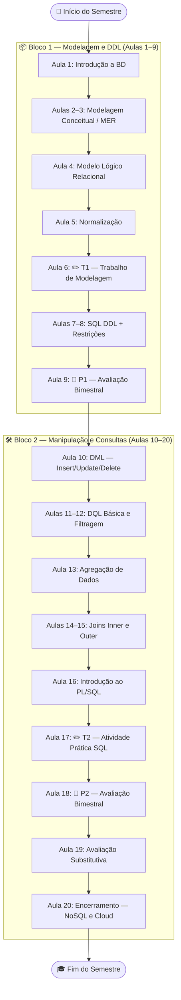

# 📚 Banco de Dados e Aplicações — IBD951

<div align="center">


</div>

---

## 🏫 Informações da Disciplina

| Campo | Informação |
|---|---|
| **Instituição** | Fatec Jahu — Centro Paula Souza |
| **Curso** | Tecnologia em Gestão da Tecnologia da Informação |
| **Disciplina** | Banco de Dados e Aplicações |
| **Sigla** | IBD951 |
| **Semestre/Ano** | 1º Semestre / 2026 |
| **Professor** | Ronan Adriel Zenatti |
| **E-mail** | ronan.zenatti@cps.sp.gov.br |
| **Carga Horária Semanal** | 4 horas (2 teóricas + 2 práticas) |
| **Carga Horária Semestral** | 80 horas |

---

## 📋 Ementa

Esta disciplina abrange os principais fundamentos e tecnologias relacionados a Bancos de Dados, desde os conceitos mais básicos até a implementação prática. Os tópicos cobertos incluem:

Sistemas de Arquivos e Sistemas de Gerenciamento de Banco de Dados (SGBD) com sua arquitetura e aspectos operacionais. Aplicações e tecnologias emergentes em Banco de Dados. Técnicas e ferramentas de gerenciamento. Storage. Controle de concorrência. Segurança e integridade. Modelagem de dados a partir do modelo de negócios. Modelo Entidade-Relacionamento (MER) e suas extensões. Mapeamento do MER para o modelo relacional. Formas Normais. Linguagem de Manipulação (DML/DQL) e de Descrição de dados (DDL). Projeto e Implementação de Banco de Dados com uso de ferramentas de produtividade.

---

## 🎯 Objetivo

Entender fundamentos e arquitetura de sistemas de bancos de dados, bem como técnicas de projeto e implementação de banco de dados com o uso de ferramentas.

---

## 🗺️ Visão Geral da Trilha de Aprendizado

O semestre está organizado em dois grandes blocos, como ilustrado a seguir:



---

## 📊 Critérios de Avaliação

A nota final é calculada pela fórmula:

> **Nota Final = (T1 + P1 + T2 + P2) × 1 + R**

| Avaliação | Descrição |
|---|---|
| **T1** | Atividade Avaliativa: Modelagem conceitual e lógica completa |
| **P1** | Avaliação Bimestral — todo o conteúdo de Modelagem e DDL |
| **T2** | Atividade Prática: SQL com Joins, Filtros e Agregações |
| **P2** | Avaliação Bimestral — DML, DQL e Junções |
| **R** | Avaliação Substitutiva — recuperação de nota ou conteúdo não fixado |

---

## 📂 Estrutura do Repositório

```
ibd951/
├── README.md                        ← Você está aqui
├── aulas/
│   ├── Aula_01_Introducao_BD.md
│   ├── Aula_02_Modelagem_Entidades.md
│   ├── Aula_03_Relacionamentos_Cardinalidade.md
│   ├── Aula_04_Modelo_Logico_Relacional.md
│   ├── Aula_05_Normalizacao.md
│   ├── Aula_06_Atividade_Modelagem.md
│   ├── Aula_07_SQL_DDL.md
│   ├── Aula_08_Restricoes_Integridade.md
│   ├── Aula_09_Avaliacao_P1.md
│   ├── Aula_10_SQL_DML.md
│   ├── Aula_11_Consultas_Basicas_DQL.md
│   ├── Aula_12_Filtragem_Avancada.md
│   ├── Aula_13_Agregacao_Dados.md
│   ├── Aula_14_Inner_Join.md
│   ├── Aula_15_Outer_Join.md
│   ├── Aula_16_Introducao_PLSQL.md
│   ├── Aula_17_Atividade_SQL.md
│   ├── Aula_18_Avaliacao_P2.md
│   ├── Aula_19_Avaliacao_Substitutiva.md
│   └── Aula_20_Encerramento.md
├── atividades/
│   ├── T1_Modelagem_Conceitual_Logica.md
│   └── T2_Pratica_SQL.md
└── imgs/
    └── (imagens de apoio das aulas)
```

---

## 📑 Sumário de Aulas

### 🔵 Bloco 1 — Modelagem e DDL

| # | Aula | Conteúdo Principal |
|---|---|---|
| 01 | [Introdução a Banco de Dados](aulas/Aula_01_Introducao_BD.md) | Sistemas de Arquivos vs. SGBD; Dados, Informação e Conhecimento; Arquitetura de SGBD |
| 02 | [Modelagem Conceitual: Entidades](aulas/Aula_02_Modelagem_Entidades.md) | Modelo Entidade-Relacionamento (MER), Entidades e Atributos |
| 03 | [Relacionamentos e Cardinalidade](aulas/Aula_03_Relacionamentos_Cardinalidade.md) | Tipos de relacionamentos e regras de cardinalidade |
| 04 | [Modelo Lógico Relacional](aulas/Aula_04_Modelo_Logico_Relacional.md) | Tabelas, Chaves Primárias (PK) e Estrangeiras (FK) |
| 05 | [Normalização de Dados](aulas/Aula_05_Normalizacao.md) | Formas Normais (1FN, 2FN e 3FN) |
| 06 | [✏️ Atividade Avaliativa: Modelagem (T1)](aulas/Aula_06_Atividade_Modelagem.md) | Oficina prática de modelagem completa |
| 07 | [SQL: Linguagem de Definição (DDL)](aulas/Aula_07_SQL_DDL.md) | Comandos DDL (CREATE) e Tipos de Dados |
| 08 | [Restrições de Integridade](aulas/Aula_08_Restricoes_Integridade.md) | Constraints (PK, FK, UNIQUE, NOT NULL) |
| 09 | [📝 Avaliação Bimestral P1](aulas/Aula_09_Avaliacao_P1.md) | Todo o conteúdo de Modelagem e DDL |

### 🟢 Bloco 2 — Manipulação e Consultas

| # | Aula | Conteúdo Principal |
|---|---|---|
| 10 | [SQL: Manipulação de Dados (DML)](aulas/Aula_10_SQL_DML.md) | Comandos INSERT, UPDATE, DELETE |
| 11 | [Consultas Básicas (DQL)](aulas/Aula_11_Consultas_Basicas_DQL.md) | Comando SELECT e projeção de colunas |
| 12 | [Filtragem Avançada](aulas/Aula_12_Filtragem_Avancada.md) | Cláusula WHERE, Operadores e ORDER BY |
| 13 | [Agregação de Dados](aulas/Aula_13_Agregacao_Dados.md) | Funções COUNT, SUM, AVG e GROUP BY |
| 14 | [Junção de Tabelas — Inner Join](aulas/Aula_14_Inner_Join.md) | INNER JOIN |
| 15 | [Junções Externas — Outer Join](aulas/Aula_15_Outer_Join.md) | LEFT JOIN e RIGHT JOIN |
| 16 | [Introdução ao PL/SQL](aulas/Aula_16_Introducao_PLSQL.md) | Visão geral de procedimentos armazenados |
| 17 | [✏️ Atividade Prática: SQL (T2)](aulas/Aula_17_Atividade_SQL.md) | Resolução de problemas complexos de consulta |
| 18 | [📝 Avaliação Bimestral P2](aulas/Aula_18_Avaliacao_P2.md) | DML, DQL e Junções |
| 19 | [🔄 Avaliação Substitutiva](aulas/Aula_19_Avaliacao_Substitutiva.md) | Todo o conteúdo semestral |
| 20 | [🎓 Encerramento do Semestre](aulas/Aula_20_Encerramento.md) | Feedback e Novas Tecnologias (NoSQL/Cloud) |

---

## 📝 Atividades Avaliativas

| Atividade | Descrição | Link |
|---|---|---|
| **T1** | Modelagem Conceitual e Lógica | [Ver enunciado](atividades/T1_Modelagem_Conceitual_Logica.md) |
| **T2** | Prática SQL — Joins, Filtros e Agregações | [Ver enunciado](atividades/T2_Pratica_SQL.md) |

---

## 📚 Bibliografia

### Básica
- BEIGHLEY, Lynn. **Use a Cabeça SQL**. Alta Books, 2008.
- HEUSER, C.A. **Projeto de Banco de Dados**. Série Livros Didáticos, V.4. Bookman, 2009.
- SILBERSCHATZ, A.; KORTH, H. F.; SUDARSHAN, S. **Sistema de Banco de Dados**. Campus, 2006.

### Complementar
- MACHADO, Felipe Nery R. **Banco de Dados — Projeto e implementação**. São Paulo: Érica, 2004.
- ELMASRI, R.; NAVATHE, S. B. **Sistemas de Banco de Dados: Fundamentos e Aplicações**. SP: Pearson, 2005.

### Referência
- BEAULIEU, Alan. **Aprendendo SQL**. 3ª Edição. Novatec, 2022.
- DATE, C. J. **Introdução a Sistemas de Banco de Dados**. 8ª Edição. Campus, 2023.
- PUGA, Sandra; FRANÇA, Edson; GOYA, Milton. **Banco de Dados: Implementação em SQL, PL/SQL e Oracle 11g**. Pearson, 2020.

---

## 💬 Contato

Dúvidas? Entre em contato com o professor:

📧 [ronan.zenatti@cps.sp.gov.br](mailto:ronan.zenatti@cps.sp.gov.br)

---

<div align="center">
<sub>Fatec Jahu · Centro Paula Souza · Governo do Estado de São Paulo · 2026</sub>
</div>
