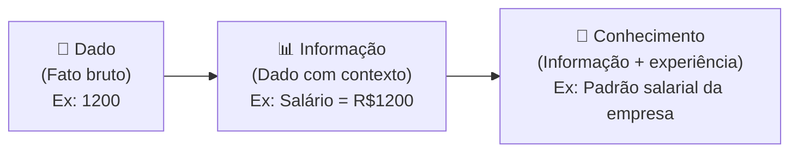
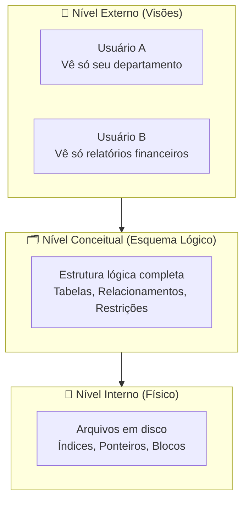

# Aula 01 — Introdução a Banco de Dados

**Disciplina:** Banco de Dados e Aplicações (IBD951)  
**Professor:** Ronan Adriel Zenatti · ronan.zenatti@cps.sp.gov.br  
**Fatec Jahu — 1º Semestre/2026**

---

## 🎯 Objetivos da Aula

Ao final desta aula você deverá ser capaz de:
- Diferenciar Sistemas de Arquivos de Sistemas de Gerenciamento de Banco de Dados (SGBD)
- Compreender a diferença entre Dado, Informação e Conhecimento
- Descrever a arquitetura de um SGBD

---

## 1. Dado, Informação e Conhecimento

Antes de estudar bancos de dados, precisamos entender o que, de fato, estamos gerenciando.

Um **dado** é um fato bruto, sem contexto — por exemplo, o número `1200`. Isolado, ele não diz nada. Quando contextualizamos esse número como "salário de R$ 1.200,00 de um funcionário chamado João", temos uma **informação** — algo que pode ser interpretado e utilizado para tomar decisões. O **conhecimento** surge quando acumulamos e relacionamos informações ao longo do tempo, criando padrões e compreensões mais profundas — como saber que funcionários com salários nessa faixa tendem a pedir reajuste anualmente.

---

## 2. Sistemas de Arquivos vs. SGBDs

Por muitos anos, os dados foram armazenados em **sistemas de arquivos** convencionais — como planilhas, arquivos `.txt` ou arquivos binários gerenciados pelos próprios programas. Esse modelo tem limitações sérias.

| Problema no Sistema de Arquivos | Como o SGBD Resolve |
|---|---|
| **Redundância de dados** — mesma informação em vários arquivos | Dado armazenado uma única vez, compartilhado |
| **Inconsistência** — versões diferentes da mesma informação | Restrições de integridade garantem consistência |
| **Dificuldade de acesso** — necessário programar buscas | Linguagem de consulta padronizada (SQL) |
| **Isolamento de dados** — formatos proprietários por aplicação | Modelo unificado acessível por múltiplas aplicações |
| **Falta de controle de acesso** | Sistema de permissões e usuários |
| **Problemas de concorrência** | Controle de transações e bloqueios |

---

## 3. O que é um SGBD?

Um **Sistema de Gerenciamento de Banco de Dados (SGBD)** é um software que serve de intermediário entre o usuário/aplicação e os dados fisicamente armazenados. Ele oferece uma interface padronizada para criar, consultar, atualizar e remover dados, garantindo ao mesmo tempo segurança, integridade e eficiência.

Exemplos de SGBDs amplamente utilizados: **MySQL**, **MariaDB**, **PostgreSQL**, **Oracle**, **SQL Server** e **SQLite**.

---

## 4. Arquitetura de um SGBD (3 Níveis — ANSI/SPARC)

A arquitetura padrão de um SGBD é organizada em três níveis independentes, o que permite que a aplicação seja protegida de mudanças físicas no armazenamento dos dados:

O **nível externo** é o que cada usuário enxerga — uma visão personalizada dos dados. O **nível conceitual** descreve toda a estrutura lógica do banco, independente de como os dados estão fisicamente armazenados. O **nível interno** cuida dos detalhes de armazenamento em disco, como índices e blocos de dados. Essa separação é chamada de **independência de dados**.

---

## 5. Componentes de um SGBD

Os principais componentes internos de um SGBD são o **processador de consultas** (que interpreta e otimiza comandos SQL), o **gerenciador de armazenamento** (que controla o acesso físico aos dados), o **gerenciador de transações** (que garante atomicidade e controle de concorrência) e o **gerenciador de buffer** (que mantém dados em memória para melhorar o desempenho).

---

## 📝 Resumo

Nesta aula aprendemos que dados são fatos brutos que se transformam em informação quando contextualizados. Vimos que sistemas de arquivos apresentam problemas sérios de redundância, inconsistência e dificuldade de acesso que os SGBDs resolvem de forma elegante. Entendemos também que a arquitetura em três níveis (externo, conceitual e interno) é o alicerce que garante independência entre a aplicação e o armazenamento físico.

---

## 🔗 Próxima Aula

➡️ [Aula 02 — Modelagem Conceitual: Entidades e Atributos](Aula_02_Modelagem_Entidades.md)

---

*Fatec Jahu · IBD951 · Prof. Ronan Adriel Zenatti · 2026*
