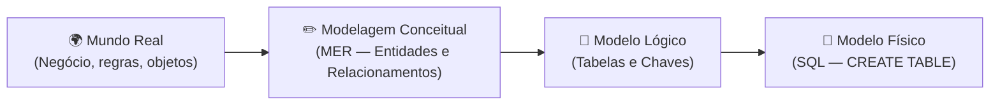
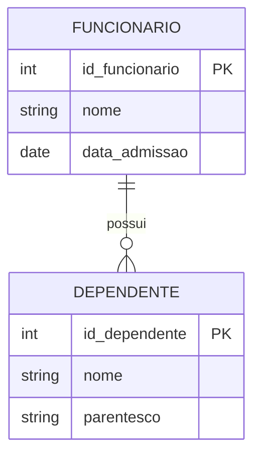
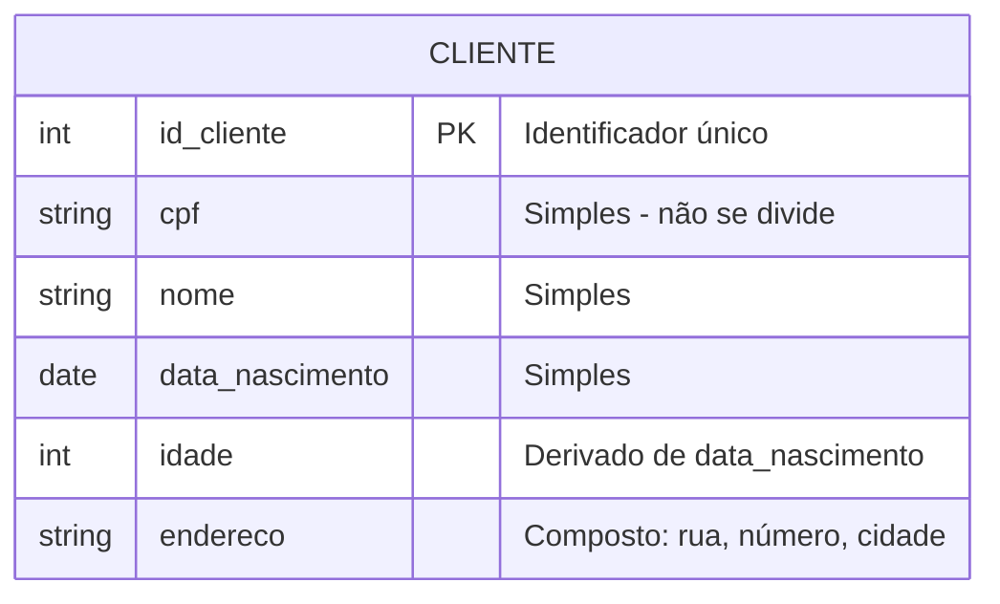
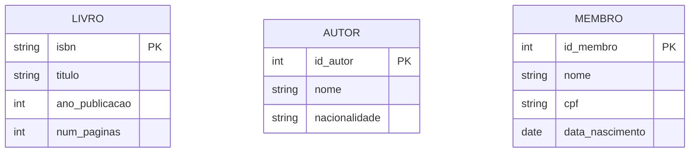

# Aula 02 — Modelagem Conceitual: Entidades e Atributos

**Disciplina:** Banco de Dados e Aplicações (IBD951)  
**Professor:** Ronan Adriel Zenatti · ronan.zenatti@cps.sp.gov.br  
**Fatec Jahu — 1º Semestre/2026**

---

## 🎯 Objetivos da Aula

Ao final desta aula você deverá ser capaz de:
- Compreender o que é modelagem conceitual e sua importância
- Identificar entidades e seus atributos no mundo real
- Representar graficamente entidades e atributos no Diagrama ER

---

## 1. O que é Modelagem Conceitual?

Antes de criar qualquer tabela ou escrever qualquer linha de SQL, precisamos **entender o negócio**. A modelagem conceitual é exatamente isso: uma etapa de análise em que traduzimos o mundo real — com suas regras, objetos e relacionamentos — para uma representação formal, independente de qualquer tecnologia.

[]

Pense na modelagem como a planta baixa de uma casa: o arquiteto não começa construindo paredes, mas sim desenhando o projeto. Da mesma forma, um bom banco de dados começa com um bom modelo conceitual.

O **Modelo Entidade-Relacionamento (MER)**, proposto por Peter Chen em 1976, é o padrão mais utilizado para a modelagem conceitual. Sua representação gráfica é chamada de **Diagrama ER (DER)**.

---

## 2. Entidades

Uma **entidade** representa um objeto do mundo real sobre o qual desejamos armazenar informações. Ela pode ser uma pessoa, um lugar, um evento, um conceito ou qualquer coisa que tenha existência própria e seja relevante para o sistema.

Exemplos de entidades em sistemas reais: `CLIENTE`, `PRODUTO`, `PEDIDO`, `FUNCIONÁRIO`, `DEPARTAMENTO`, `CURSO`, `ALUNO`.

Existem dois tipos fundamentais de entidades que precisamos distinguir desde o início. Uma **entidade forte** existe de forma independente — um `CLIENTE` existe sozinho, sem depender de nenhum outro objeto. Já uma **entidade fraca** só existe em função de outra entidade — por exemplo, um `DEPENDENTE` só faz sentido existir porque há um `FUNCIONÁRIO` ao qual ele pertence.

No diagrama acima, `FUNCIONARIO` é uma entidade forte e `DEPENDENTE` é uma entidade fraca, pois não faria sentido registrar um dependente sem um funcionário associado.

---

## 3. Atributos

Os **atributos** são as características ou propriedades que descrevem uma entidade. Se `CLIENTE` é a entidade, então `nome`, `cpf`, `email` e `data_nascimento` são seus atributos.

### 3.1 Classificação dos Atributos

Os atributos se classificam de diversas formas, e conhecer essa classificação é fundamental para construir modelos precisos.

O **atributo simples** (ou atômico) não pode ser subdividido — por exemplo, `cpf` ou `salario`. Já o **atributo composto** pode ser decomposto em partes menores com significado próprio — `endereco` pode ser dividido em `logradouro`, `numero`, `bairro`, `cidade` e `cep`.

O **atributo monovalorado** armazena um único valor por vez — como `data_nascimento`, que para uma pessoa só pode ter um valor. O **atributo multivalorado** pode ter vários valores — como `telefone`, pois uma pessoa pode ter vários números de contato.

O **atributo derivado** tem seu valor calculado a partir de outro atributo — `idade` pode ser derivado de `data_nascimento` e da data atual. Por isso, geralmente não precisamos armazená-lo.

### 3.2 Atributo Identificador (Chave)

O **atributo identificador** (ou chave) é aquele que distingue de forma única cada ocorrência de uma entidade. Na notação ER clássica, ele é sublinhado. Exemplos: `cpf` em `PESSOA`, `codigo` em `PRODUTO`, `matricula` em `ALUNO`.

É fundamental que o atributo chave seja **único** (não pode se repetir entre instâncias) e **não nulo** (toda instância precisa ter um valor para ele).

---

## 4. Exemplo Completo: Sistema de Biblioteca

Vamos praticar identificando entidades e atributos em um contexto real. Em um sistema de biblioteca, o enunciado pode ser:

*"A biblioteca possui livros, cada um com título, ISBN, ano de publicação e número de páginas. Os livros podem ter vários autores. Os membros da biblioteca são cadastrados com nome, CPF e data de nascimento."*

A partir desse texto, identificamos as seguintes entidades e seus atributos:

---

## 📝 Resumo

Nesta aula aprendemos que a modelagem conceitual é a etapa de análise que traduz o mundo real para um modelo formal usando o Modelo Entidade-Relacionamento. Vimos que entidades representam objetos do mundo real e podem ser fortes ou fracas. Os atributos descrevem as entidades e se classificam em simples, compostos, monovalorados, multivalorados e derivados. O atributo identificador (chave) é aquele que distingue unicamente cada ocorrência de uma entidade.

---

## 🔗 Navegação

⬅️ [Aula 01 — Introdução a BD](Aula_01_Introducao_BD.md) · ➡️ [Aula 03 — Relacionamentos e Cardinalidade](Aula_03_Relacionamentos_Cardinalidade.md)

---

*Fatec Jahu · IBD951 · Prof. Ronan Adriel Zenatti · 2026*
