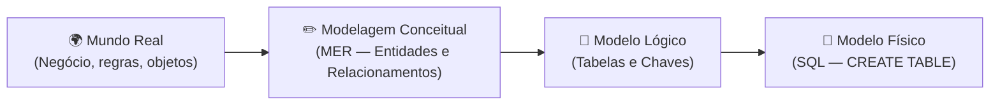
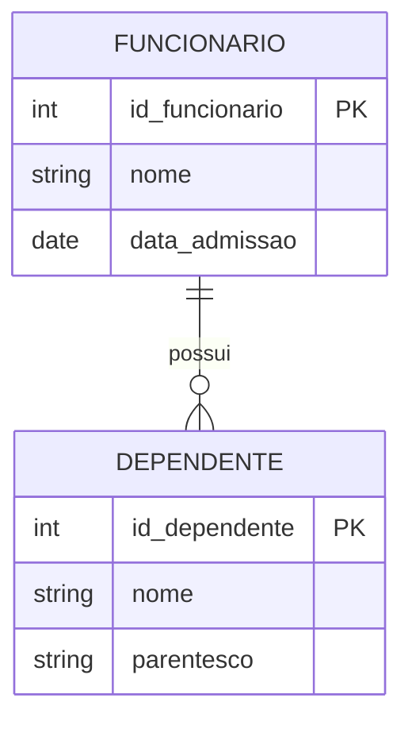
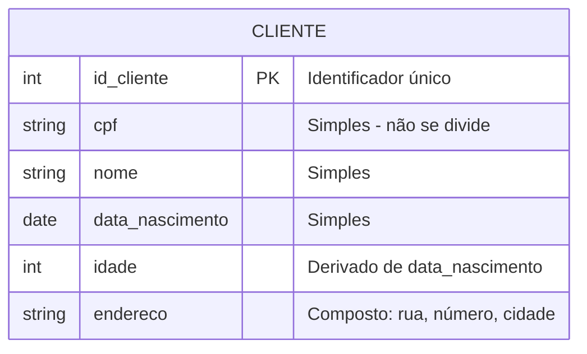
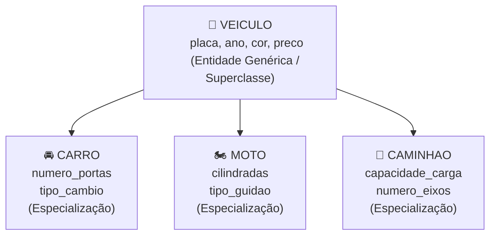
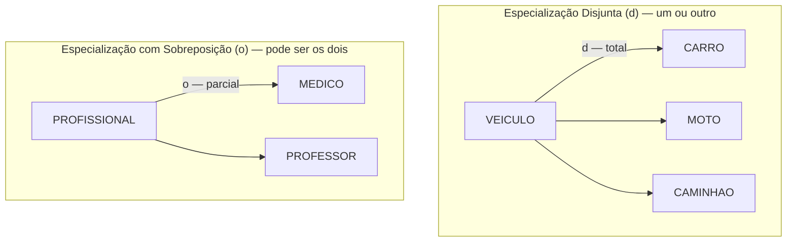
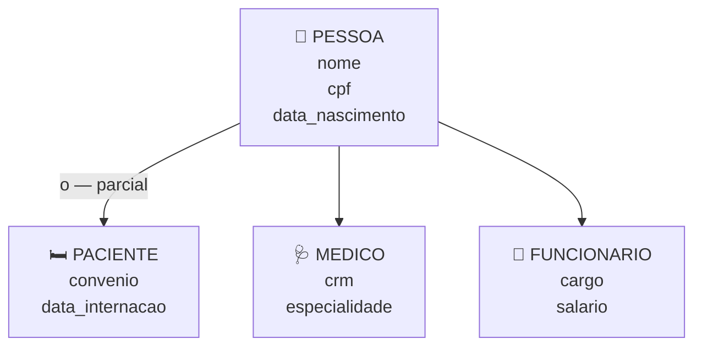
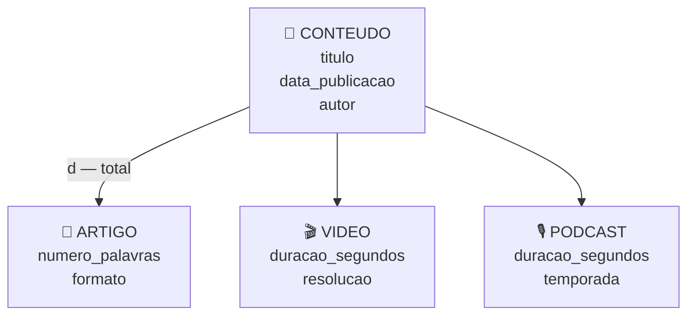
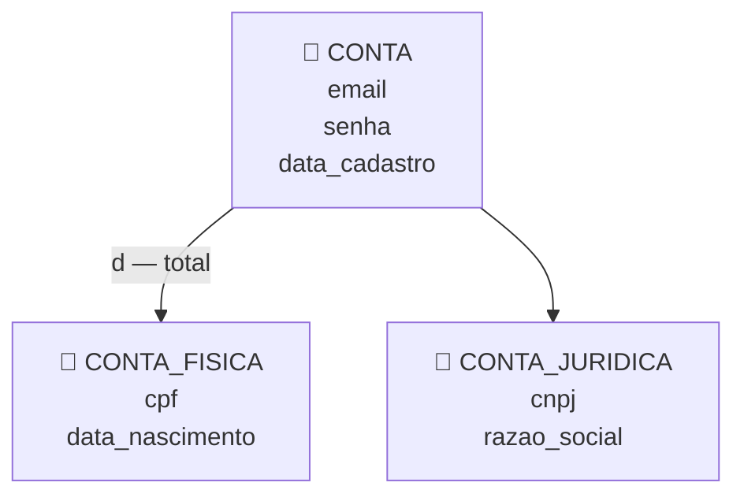
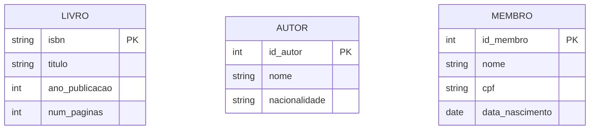

# Aula 02 — Modelagem Conceitual: Entidades e Atributos

**Disciplina:** Banco de Dados e Aplicações (IBD951)  
**Professor:** Ronan Adriel Zenatti · ronan.zenatti@cps.sp.gov.br  
**Fatec Jahu — 1º Semestre/2026**

---

## 🎯 Objetivos da Aula

Ao final desta aula você deverá ser capaz de:
- Compreender o que é modelagem conceitual e sua importância
- Identificar entidades e seus atributos no mundo real
- Representar graficamente entidades e atributos no Diagrama ER
- Reconhecer relacionamentos de herança usando generalização e especialização

---

## 1. O que é Modelagem Conceitual?

Antes de criar qualquer tabela ou escrever qualquer linha de SQL, precisamos **entender o negócio**. A modelagem conceitual é exatamente isso: uma etapa de análise em que traduzimos o mundo real — com suas regras, objetos e relacionamentos — para uma representação formal, independente de qualquer tecnologia.

Pense na modelagem como a planta baixa de uma casa: o arquiteto não começa construindo paredes, mas sim desenhando o projeto. Da mesma forma, um bom banco de dados começa com um bom modelo conceitual.

O **Modelo Entidade-Relacionamento (MER)**, proposto por Peter Chen em 1976, é o padrão mais utilizado para a modelagem conceitual. Sua representação gráfica é chamada de **Diagrama ER (DER)**.

---

## 2. Entidades

Uma **entidade** representa um objeto do mundo real sobre o qual desejamos armazenar informações. Ela pode ser uma pessoa, um lugar, um evento, um conceito ou qualquer coisa que tenha existência própria e seja relevante para o sistema.

Exemplos de entidades em sistemas reais: `CLIENTE`, `PRODUTO`, `PEDIDO`, `FUNCIONÁRIO`, `DEPARTAMENTO`, `CURSO`, `ALUNO`.

Existem dois tipos fundamentais de entidades que precisamos distinguir desde o início. Uma **entidade forte** existe de forma independente — um `CLIENTE` existe sozinho, sem depender de nenhum outro objeto. Já uma **entidade fraca** só existe em função de outra entidade — por exemplo, um `DEPENDENTE` só faz sentido existir porque há um `FUNCIONÁRIO` ao qual ele pertence.

No diagrama acima, `FUNCIONARIO` é uma entidade forte e `DEPENDENTE` é uma entidade fraca, pois não faria sentido registrar um dependente sem um funcionário associado.

---

## 3. Atributos

Os **atributos** são as características ou propriedades que descrevem uma entidade. Se `CLIENTE` é a entidade, então `nome`, `cpf`, `email` e `data_nascimento` são seus atributos.

### 3.1 Classificação dos Atributos

Os atributos se classificam de diversas formas, e conhecer essa classificação é fundamental para construir modelos precisos.

O **atributo simples** (ou atômico) não pode ser subdividido — por exemplo, `cpf` ou `salario`. Já o **atributo composto** pode ser decomposto em partes menores com significado próprio — `endereco` pode ser dividido em `logradouro`, `numero`, `bairro`, `cidade` e `cep`.

O **atributo monovalorado** armazena um único valor por vez — como `data_nascimento`, que para uma pessoa só pode ter um valor. O **atributo multivalorado** pode ter vários valores — como `telefone`, pois uma pessoa pode ter vários números de contato.

O **atributo derivado** tem seu valor calculado a partir de outro atributo — `idade` pode ser derivado de `data_nascimento` e da data atual. Por isso, geralmente não precisamos armazená-lo.

### 3.2 Atributo Identificador (Chave)

O **atributo identificador** (ou chave) é aquele que distingue de forma única cada ocorrência de uma entidade. Na notação ER clássica, ele é sublinhado. Exemplos: `cpf` em `PESSOA`, `codigo` em `PRODUTO`, `matricula` em `ALUNO`.

É fundamental que o atributo chave seja **único** (não pode se repetir entre instâncias) e **não nulo** (toda instância precisa ter um valor para ele).

---

## 4. Generalização e Especialização

Até aqui, todas as entidades que modelamos são independentes umas das outras — cada uma com seus próprios atributos, sem nenhuma relação de "herança" entre elas. Mas o mundo real frequentemente nos apresenta situações diferentes: objetos que **compartilham características comuns** mas também possuem **propriedades próprias** que os distinguem entre si.

É exatamente para modelar essas situações que o MER oferece o conceito de **Generalização e Especialização** — um dos mecanismos mais poderosos e, ao mesmo tempo, mais mal compreendidos da modelagem conceitual.

### 4.1 O Problema que Motivou o Conceito

Imagine que você está modelando o sistema de uma concessionária. Ela trabalha com **carros**, **motos** e **caminhões**. Todos eles têm `placa`, `ano_fabricacao`, `cor` e `preco`. Mas:

- **Carros** têm `numero_portas` e `tipo_cambio`
- **Motos** têm `cilindradas` e `tipo_guidao`
- **Caminhões** têm `capacidade_carga` e `numero_eixos`

Como modelar isso? Existem duas abordagens ingênuas e uma correta:

❌ **Abordagem 1 — Uma tabela só:** criar uma única tabela `VEICULO` com todos os atributos de todos os tipos. Resultado: linhas de carro com `cilindradas` nulas, linhas de moto com `numero_eixos` nulos. Desperdício, confusão e impossibilidade de aplicar restrições corretas.

❌ **Abordagem 2 — Tabelas totalmente separadas:** criar três tabelas completamente separadas, duplicando `placa`, `ano_fabricacao`, `cor` e `preco` em todas elas. Resultado: redundância, risco de inconsistência e violação das formas normais.

✅ **Abordagem correta — Generalização e Especialização:** criar uma entidade genérica `VEICULO` com os atributos comuns, e entidades especializadas `CARRO`, `MOTO` e `CAMINHAO` com apenas seus atributos exclusivos, herdando tudo que está em `VEICULO`.

### 4.2 Os Conceitos

A **generalização** é o processo de subir na hierarquia: observamos entidades com características semelhantes e abstraímos uma entidade mais geral que as representa. É um processo de abstração — do específico para o geral.

A **especialização** é o processo inverso, de descer na hierarquia: partindo de uma entidade geral, identificamos subgrupos com características ou comportamentos próprios e criamos entidades mais específicas para eles. É um processo de refinamento — do geral para o específico.

Na prática, os dois processos andam juntos: você tanto pode identificar `CARRO` e `MOTO` e depois generalizar para `VEICULO` (generalização), quanto partir de `VEICULO` e perceber que há subtipos com necessidades diferentes (especialização). O resultado no diagrama é o mesmo.

A entidade no topo da hierarquia é chamada de **superclasse** (ou entidade genérica). As entidades derivadas são chamadas de **subclasses** (ou entidades especializadas). As subclasses **herdam** todos os atributos e relacionamentos da superclasse — e acrescentam apenas o que é exclusivo delas.

### 4.3 Restrições da Especialização

A especialização não é uma estrutura livre — ela possui duas restrições importantes que precisam ser definidas no modelo:

**Restrição de participação (totalidade):**

- **Total:** toda instância da superclasse **obrigatoriamente** pertence a pelo menos uma subclasse. Não pode existir um `FUNCIONARIO` que não seja nem `HORISTA` nem `MENSALISTA`. Representado com linha dupla ou a palavra *"total"* no diagrama.
- **Parcial:** uma instância da superclasse **pode** não pertencer a nenhuma subclasse. Um `ANIMAL` pode ser genérico, sem se enquadrar em nenhuma especialização específica do modelo. Representado com linha simples ou a palavra *"parcial"*.

**Restrição de disjunção (sobreposição):**

- **Disjunta:** uma instância da superclasse pertence a **no máximo uma** subclasse. Um `VEÍCULO` é carro, moto **ou** caminhão — nunca dois ao mesmo tempo. Representado com a letra **d** no diagrama.
- **Sobreposição:** uma instância da superclasse pode pertencer a **mais de uma** subclasse simultaneamente. Um `PROFISSIONAL` pode ser ao mesmo tempo `MÉDICO` e `PROFESSOR` (médico que dá aulas). Representado com a letra **o** no diagrama.

### 4.4 Exemplos Completos

**Exemplo 1 — Sistema Hospitalar: Pessoa → Paciente / Médico / Funcionário**

Um hospital trabalha com diferentes tipos de pessoas: pacientes, médicos e outros funcionários administrativos. Todos têm `nome`, `cpf` e `data_nascimento` em comum. Mas:

- **Paciente** tem `convenio` e `data_internacao`
- **Médico** tem `crm` e `especialidade`
- **Funcionario** tem `cargo` e `salario`

Além disso, um médico **também é funcionário** do hospital — o que configura uma especialização com **sobreposição**: a mesma pessoa pode ser ao mesmo tempo `MEDICO` e `FUNCIONARIO`.

A especialização é **parcial** (uma pessoa pode ser cadastrada sem ser nenhum dos três tipos — ex: um visitante) e **com sobreposição** (um médico é também um funcionário).

---

**Exemplo 2 — Plataforma de Conteúdo: Conteúdo → Artigo / Vídeo / Podcast**

Uma plataforma de mídia armazena diferentes tipos de conteúdo. Todos os conteúdos têm `titulo`, `data_publicacao` e `autor`. Mas cada tipo tem características próprias:

- **Artigo** tem `numero_palavras` e `formato` (HTML, Markdown)
- **Vídeo** tem `duracao_segundos` e `resolucao`
- **Podcast** tem `duracao_segundos` e `temporada`

Todo conteúdo **obrigatoriamente** é de um tipo específico — não existe conteúdo "genérico" sem tipo definido. A especialização é, portanto, **total** e **disjunta** (um conteúdo é exatamente um dos três tipos).

---

**Exemplo 3 — E-commerce: Conta → Conta Física / Conta Jurídica**

Uma loja virtual permite cadastro tanto de pessoas físicas quanto jurídicas. Toda conta tem `email`, `senha` e `data_cadastro`. Mas:

- **Conta Física** (pessoa física) tem `cpf` e `data_nascimento`
- **Conta Jurídica** (empresa) tem `cnpj` e `razao_social`

Uma conta é sempre de um tipo ou do outro — nunca os dois. Especialização **total** e **disjunta**.

### 4.5 Resumo: Quando Usar Generalização/Especialização?

Use quando você encontrar uma ou mais das seguintes situações no levantamento de requisitos:

| Sinal no enunciado | O que indica |
|---|---|
| *"Existem dois tipos de X…"* | Provável especialização |
| *"Todo X é também um Y, mas tem características adicionais…"* | Hierarquia de herança |
| *"X pode ser A, B ou C"* | Especialização disjunta |
| *"X pode ser A e B ao mesmo tempo"* | Especialização com sobreposição |
| *"Alguns campos só se aplicam a certos tipos de X"* | Atributos exclusivos de subclasse |

> 💡 **Atenção:** generalização/especialização **não é** o mesmo que um relacionamento comum. A seta que conecta superclasse e subclasse representa **herança de atributos**, não uma associação entre entidades distintas. A subclasse é uma especialização da mesma entidade, não uma entidade diferente relacionada a ela.

---

## 5. Exemplo Completo: Sistema de Biblioteca

Vamos praticar identificando entidades e atributos em um contexto real. Em um sistema de biblioteca, o enunciado pode ser:

*"A biblioteca possui livros, cada um com título, ISBN, ano de publicação e número de páginas. Os livros podem ter vários autores. Os membros da biblioteca são cadastrados com nome, CPF e data de nascimento."*

A partir desse texto, identificamos as seguintes entidades e seus atributos:

---

## 📝 Resumo

Nesta aula aprendemos que a modelagem conceitual é a etapa de análise que traduz o mundo real para um modelo formal usando o Modelo Entidade-Relacionamento. Vimos que entidades representam objetos do mundo real e podem ser fortes ou fracas. Os atributos descrevem as entidades e se classificam em simples, compostos, monovalorados, multivalorados e derivados. O atributo identificador (chave) é aquele que distingue unicamente cada ocorrência de uma entidade.

Aprendemos também que a **generalização e especialização** permite modelar hierarquias de herança entre entidades, criando uma superclasse com atributos comuns e subclasses com atributos exclusivos. A especialização pode ser total ou parcial (todos ou alguns elementos da superclasse pertencem a uma subclasse) e disjunta ou com sobreposição (um elemento pertence a uma ou mais subclasses ao mesmo tempo).

---

## 🔗 Navegação

⬅️ [Aula 01 — Introdução a BD](Aula_01_Introducao_BD.md) · ➡️ [Aula 03 — Relacionamentos e Cardinalidade](Aula_03_Relacionamentos_Cardinalidade.md)

---

*Fatec Jahu · IBD951 · Prof. Ronan Adriel Zenatti · 2026*
