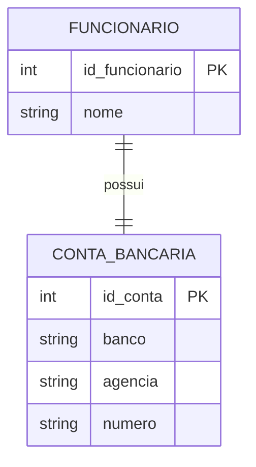
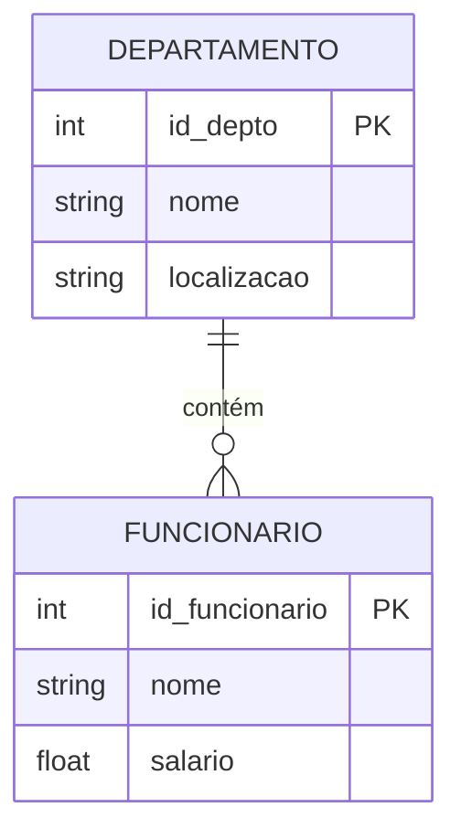
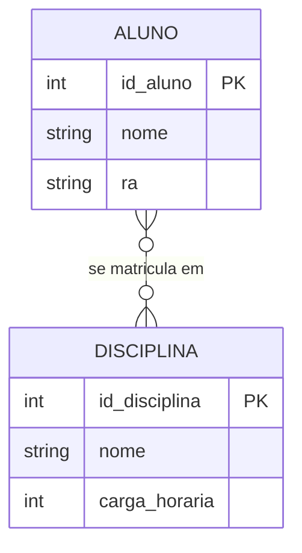
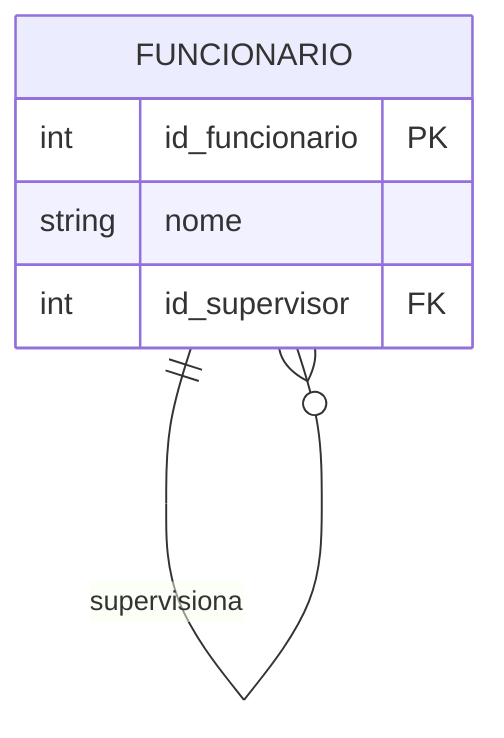
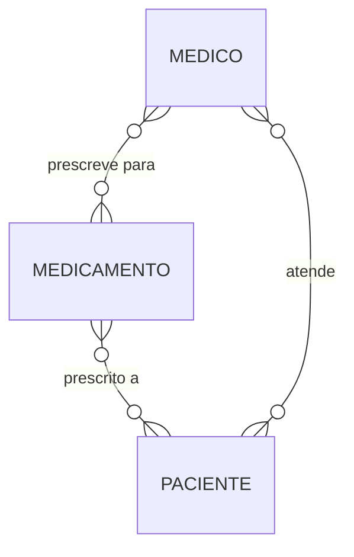

# Aula 03 — Relacionamentos e Cardinalidade

**Disciplina:** Banco de Dados e Aplicações (IBD951)  
**Professor:** Ronan Adriel Zenatti · ronan.zenatti@cps.sp.gov.br  
**Fatec Jahu — 1º Semestre/2026**

---

## 🎯 Objetivos da Aula

Ao final desta aula você deverá ser capaz de:
- Identificar relacionamentos entre entidades no modelo conceitual
- Compreender e aplicar as regras de cardinalidade (1:1, 1:N, N:M)
- Reconhecer relacionamentos ternários e auto-relacionamentos

---

## 1. O que são Relacionamentos?

Entidades raramente existem de forma isolada. No mundo real, elas interagem: um `CLIENTE` realiza `PEDIDOS`, um `ALUNO` se matricula em `DISCIPLINAS`, um `FUNCIONÁRIO` trabalha em um `DEPARTAMENTO`. Essas interações entre entidades são chamadas de **relacionamentos**.

Um relacionamento é representado no DER por um losango conectado às entidades participantes. Assim como as entidades podem ter atributos, os relacionamentos também podem — e isso é um ponto que muitos estudantes não percebem de imediato. Pense num relacionamento `ALUNO` **se matricula em** `DISCIPLINA`: a `data_matricula` não pertence ao aluno nem à disciplina em si, mas sim ao evento da matrícula — ou seja, é um **atributo do relacionamento**.

---

## 2. Cardinalidade

A **cardinalidade** descreve *quantas* instâncias de uma entidade podem se relacionar com instâncias de outra entidade. É uma das informações mais importantes do modelo conceitual, pois ela determina diretamente como as tabelas serão estruturadas no modelo lógico.

Existem três tipos principais de cardinalidade:

### 2.1 Relacionamento Um para Um (1:1)

Cada instância da entidade A se relaciona com no máximo uma instância da entidade B, e vice-versa. Na prática, relacionamentos 1:1 são menos comuns e muitas vezes indicam que as entidades poderiam ser fundidas em uma só — a menos que haja uma boa razão para separá-las (como questões de segurança ou de acesso).

**Exemplo:** Um `FUNCIONÁRIO` possui exatamente uma `CONTA_BANCÁRIA` para depósito de salário, e essa conta pertence a apenas um funcionário.

### 2.2 Relacionamento Um para Muitos (1:N)

É o tipo mais comum. Uma instância da entidade A pode se relacionar com várias instâncias da entidade B, mas cada instância de B se relaciona com no máximo uma instância de A.

**Exemplo:** Um `DEPARTAMENTO` possui vários `FUNCIONÁRIOS`, mas cada funcionário pertence a apenas um departamento.

### 2.3 Relacionamento Muitos para Muitos (N:M)

Uma instância de A pode se relacionar com várias instâncias de B, e uma instância de B pode se relacionar com várias instâncias de A. Este tipo de relacionamento, quando mapeado para o modelo relacional, **sempre gera uma tabela intermediária** (também chamada de tabela associativa ou de junção).

**Exemplo:** Um `ALUNO` pode se matricular em várias `DISCIPLINAS`, e uma disciplina pode ter vários alunos matriculados. A matrícula em si carrega atributos próprios, como `nota` e `data_matricula`.

---

## 3. Participação: Total vs. Parcial

Além da cardinalidade, precisamos indicar se a **participação** de uma entidade num relacionamento é **total** ou **parcial**. A participação total significa que toda instância da entidade precisa obrigatoriamente participar do relacionamento. A participação parcial indica que a participação é opcional.

Por exemplo: todo `PEDIDO` obrigatoriamente pertence a um `CLIENTE` (participação total do pedido). Porém, nem todo cliente precisa ter feito um pedido (participação parcial do cliente).

Na notação Crow's Foot (usada amplamente em ferramentas como o BRModelo e o MySQL Workbench), isso é representado pelos símbolos nas extremidades das linhas de relacionamento, combinando obrigatoriedade e máximo.

---

## 4. Auto-Relacionamento

Um auto-relacionamento ocorre quando uma entidade se relaciona **consigo mesma**. O exemplo clássico é a hierarquia de funcionários: um `FUNCIONÁRIO` pode ser supervisor de outros funcionários, e cada funcionário tem (ou não) um supervisor — que também é um funcionário.

---

## 5. Relacionamento Ternário

Quando três entidades participam de um único relacionamento, temos um **relacionamento ternário**. Esses relacionamentos são mais complexos e devem ser usados apenas quando o negócio realmente exige que as três entidades sejam analisadas em conjunto para definir a ocorrência.

**Exemplo:** Um `MÉDICO` prescreve um `MEDICAMENTO` para um `PACIENTE`. Aqui, a combinação das três entidades define a prescrição — não faz sentido registrar "médico prescreve medicamento" sem saber para qual paciente.

---
💡[Material completo sobre Cardinalidade](Cardinalidade_MER_Completo.md)
---

## 📝 Resumo

Nesta aula compreendemos que relacionamentos descrevem as interações entre entidades e podem ter atributos próprios. A cardinalidade (1:1, 1:N, N:M) é uma das informações mais críticas do modelo conceitual, pois impacta diretamente a estrutura das tabelas. Aprendemos ainda a distinguir participação total de parcial, e conhecemos casos especiais como o auto-relacionamento e o relacionamento ternário.

---

## 🔗 Navegação

⬅️ [Aula 02 — Modelagem Conceitual: Entidades](Aula_02_Modelagem_Entidades.md) · ➡️ [Aula 04 — Modelo Lógico Relacional](Aula_04_Modelo_Logico_Relacional.md)

---

*Fatec Jahu · IBD951 · Prof. Ronan Adriel Zenatti · 2026*
