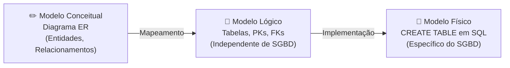
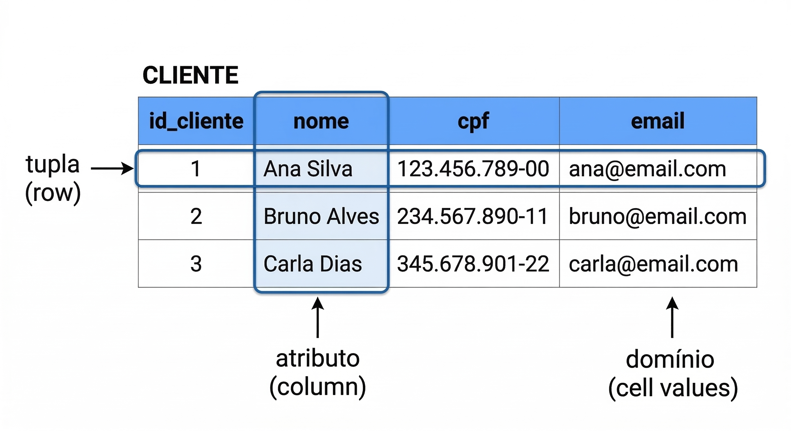
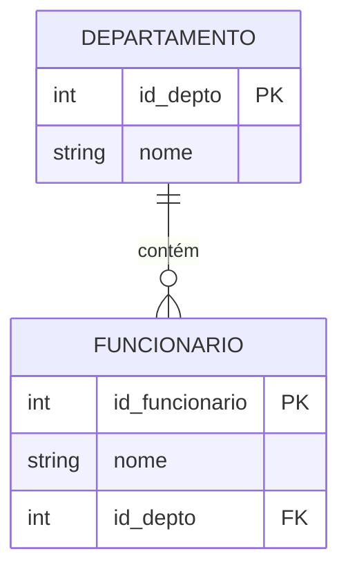
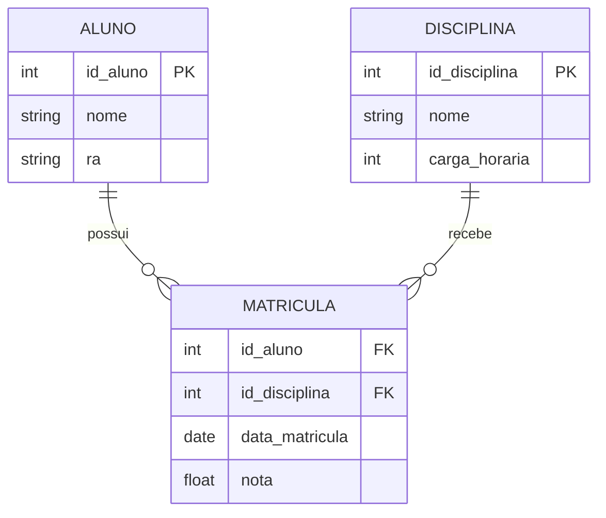
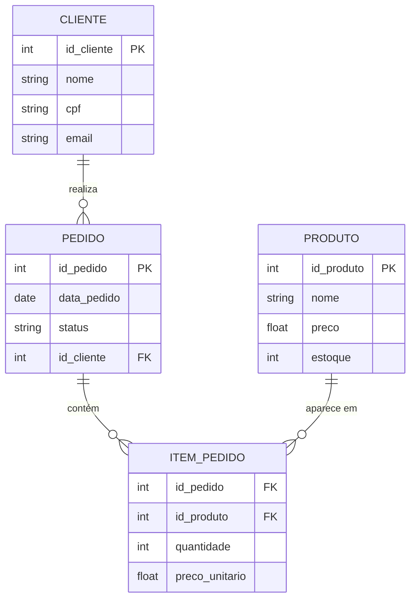

# Aula 04 — Modelo Lógico Relacional

**Disciplina:** Banco de Dados e Aplicações (IBD951)  
**Professor:** Ronan Adriel Zenatti · ronan.zenatti@cps.sp.gov.br  
**Fatec Jahu — 1º Semestre/2026**

---

## 🎯 Objetivos da Aula

Ao final desta aula você deverá ser capaz de:
- Compreender os conceitos do modelo relacional
- Mapear corretamente um Diagrama ER para tabelas relacionais
- Utilizar Chaves Primárias (PK) e Estrangeiras (FK) corretamente

---

## 1. Do Modelo Conceitual ao Modelo Lógico

Na aula anterior construímos o Diagrama ER, que representa o *o quê* do sistema — as entidades, atributos e relacionamentos. Agora vamos dar o próximo passo: transformar esse modelo conceitual em um **modelo lógico relacional**, que já se aproxima de como os dados serão, de fato, organizados no banco.

O modelo lógico ainda é **independente de tecnologia** — não falamos de MySQL, Oracle ou PostgreSQL aqui. Falamos de tabelas, colunas e chaves de forma abstrata. A tecnologia específica entra só no modelo físico.

---

## 2. Conceitos Fundamentais do Modelo Relacional

O modelo relacional, proposto por Edgar F. Codd em 1970, organiza os dados em **relações** (que na prática chamamos de tabelas). Cada relação é composta por:

**Tupla** é uma linha da tabela, representando uma instância ou ocorrência da entidade. Em uma tabela `CLIENTE`, cada linha é um cliente diferente.

**Atributo** é uma coluna da tabela, representando uma característica da entidade.

**Domínio** é o conjunto de valores válidos para um atributo. O domínio do atributo `sexo` pode ser, por exemplo, `{M, F, N}`.

**Grau** é o número de atributos (colunas) de uma relação.

**Cardinalidade** de uma relação é o número de tuplas (linhas) que ela contém em um dado momento.

[Clean table diagram showing a database table called 'CLIENTE' with column headers highlighted in blue: id_cliente, nome, cpf, email. Three rows of sample data below. Arrows pointing to labels explaining: tupla (row), atributo (column), domínio (cell values). Educational style, clean white background.]

---

## 3. Chaves no Modelo Relacional

As chaves são o mecanismo que garante a unicidade das tuplas e a integridade dos relacionamentos entre tabelas. Existem três tipos essenciais.

A **Chave Primária (PK — Primary Key)** é o atributo (ou conjunto de atributos) que identifica de forma única cada tupla de uma tabela. Ela jamais pode ser nula e não pode se repetir. Toda tabela bem projetada deve ter uma PK.

A **Chave Estrangeira (FK — Foreign Key)** é um atributo em uma tabela que referencia a Chave Primária de outra tabela. É por meio das FKs que os relacionamentos entre tabelas são implementados. Uma FK garante a **integridade referencial**: você não pode inserir um pedido com um `id_cliente` que não existe na tabela `CLIENTE`.

A **Chave Candidata** é qualquer atributo que poderia servir como PK — ou seja, que também é único e não nulo. Quando há mais de uma candidata, escolhemos uma delas como PK e as demais se tornam **chaves alternativas**.

---

## 4. Regras de Mapeamento do MER para o Modelo Relacional

Existe um conjunto de regras bem definidas para transformar cada elemento do Diagrama ER em tabelas. Vamos percorrer as mais importantes:

### 4.1 Entidade Forte → Tabela

Cada entidade forte vira uma tabela. Seus atributos viram colunas, e o atributo identificador vira a PK.

### 4.2 Relacionamento 1:N → Chave Estrangeira no lado N

No relacionamento um para muitos, a PK do lado "1" vai como FK para o lado "N". Não criamos uma nova tabela para este relacionamento.

**Exemplo:** `DEPARTAMENTO` (1) ←→ (N) `FUNCIONARIO`. A coluna `id_departamento` vai como FK na tabela `FUNCIONARIO`.

### 4.3 Relacionamento N:M → Nova Tabela Associativa

No relacionamento muitos para muitos, **sempre criamos uma nova tabela**. Essa tabela recebe as PKs das duas entidades relacionadas como FKs. A combinação dessas duas FKs costuma formar a PK composta da tabela associativa.

**Exemplo:** `ALUNO` (N) ←→ (M) `DISCIPLINA` → tabela `MATRICULA`.

### 4.4 Relacionamento 1:1 → FK em qualquer lado

No relacionamento um para um, a PK de uma entidade vai como FK na outra. Geralmente colocamos a FK na entidade com participação parcial (a que pode ou não participar do relacionamento).

### 4.5 Atributo Multivalorado → Nova Tabela

Um atributo que pode ter múltiplos valores (como `telefone`) não pode ser armazenado em uma única coluna de forma eficiente. A solução é criar uma tabela separada para esse atributo, com FK referenciando a entidade.

---

## 5. Exemplo Completo: Sistema de Vendas

Vamos mapear um cenário completo. Um cliente pode fazer vários pedidos. Cada pedido contém vários produtos, e um produto pode aparecer em vários pedidos.

Perceba que `ITEM_PEDIDO` é a tabela associativa que resolve o relacionamento N:M entre `PEDIDO` e `PRODUTO`. Ela guarda também os atributos do relacionamento: `quantidade` e `preco_unitario` (que pode diferir do preço atual do produto).

---

## 📝 Resumo

Nesta aula transformamos o modelo conceitual ER no modelo lógico relacional, aprendendo que entidades fortes viram tabelas, relacionamentos 1:N são implementados com FKs, relacionamentos N:M geram tabelas associativas e atributos multivalorados também geram tabelas separadas. Os conceitos de PK e FK são o núcleo da integridade relacional.

---

## 🔗 Navegação

⬅️ [Aula 03 — Relacionamentos](Aula_03_Relacionamentos_Cardinalidade.md) · ➡️ [Aula 05 — Normalização de Dados](Aula_05_Normalizacao.md)

---

*Fatec Jahu · IBD951 · Prof. Ronan Adriel Zenatti · 2026*
