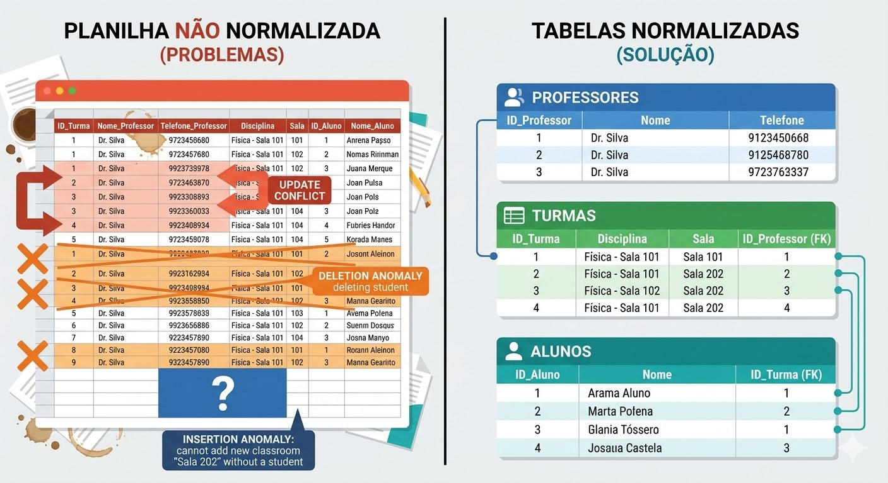
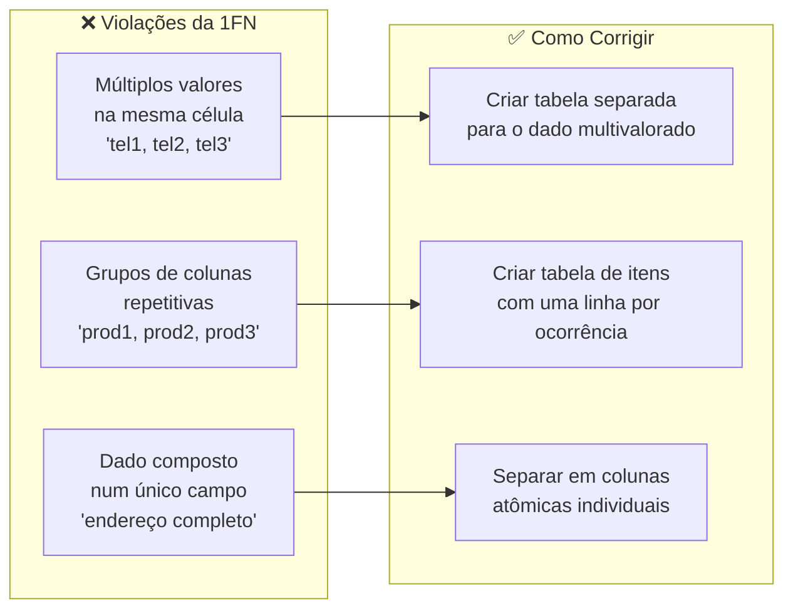
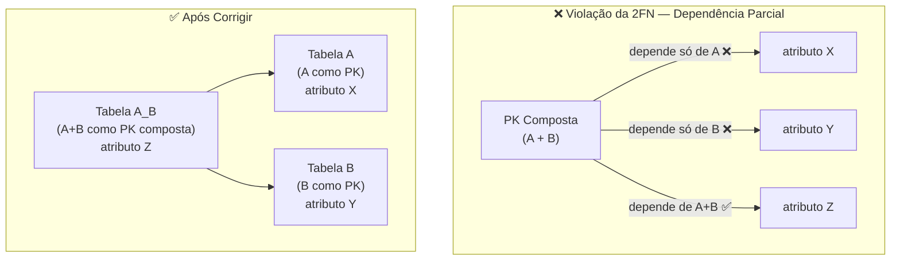
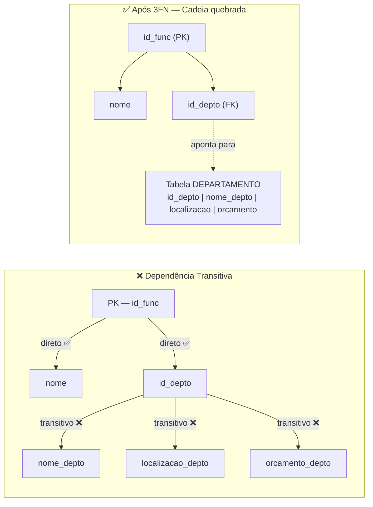
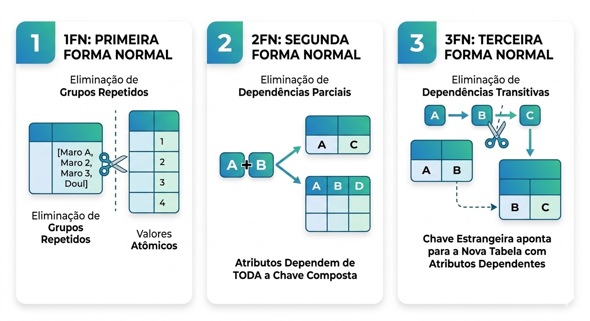
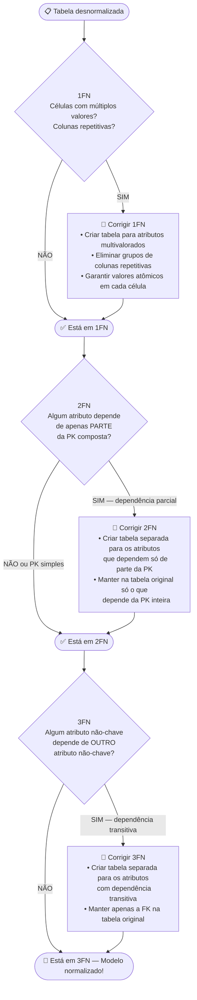
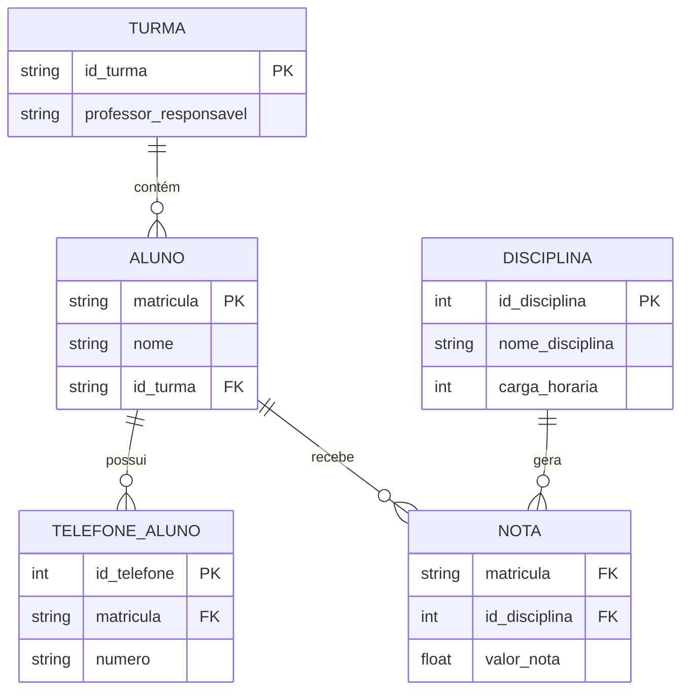

# Aula 05 — Normalização de Dados

**Disciplina:** Banco de Dados e Aplicações (IBD951)  
**Professor:** Ronan Adriel Zenatti · ronan.zenatti@cps.sp.gov.br  
**Fatec Jahu — 1º Semestre/2026**

---

## 🎯 Objetivos da Aula

Ao final desta aula você deverá ser capaz de:

- Explicar com suas próprias palavras o que é normalização e por que ela é necessária
- Identificar e corrigir violações da 1ª, 2ª e 3ª Formas Normais
- Aplicar pelo menos 3 exemplos reais de cada forma normal
- Reconhecer situações em que normalizar pode não ser a melhor escolha
- Resolver uma atividade prática de normalização passo a passo

---

## 1. O Problema: Quando os Dados Viram uma Bagunça

Antes de entrar em qualquer teoria, vamos experimentar o problema na prática. Imagine que você foi contratado como estagiário numa escola e encontrou a seguinte planilha usada para controlar as notas dos alunos:

| matricula | nome_aluno | turma | professor_turma | disc1 | nota1 | disc2 | nota2 | disc3 | nota3 | telefone1 | telefone2 |
|---|---|---|---|---|---|---|---|---|---|---|---|
| 001 | Ana Lima | 1A | Prof. Carlos | Matemática | 8.5 | Português | 7.0 | História | 9.0 | 99111-0001 | 99222-0002 |
| 002 | Bruno Melo | 1A | Prof. Carlos | Matemática | 6.0 | Português | 8.5 | História | 7.5 | 99333-0003 | — |
| 003 | Carla Souza | 1B | Prof. Marcos | Matemática | 9.0 | Português | 9.5 | História | 8.0 | 99444-0004 | 99555-0005 |

Essa tabela "funciona" para casos simples, mas agora pense nas seguintes situações:

**Situação 1:** O Prof. Carlos foi trocado por outro professor na turma 1A. Você precisaria atualizar a coluna `professor_turma` em **todas** as linhas de alunos da 1A. Se tiver 30 alunos, são 30 atualizações — e se você esquecer de atualizar uma, o banco passa a ter dois professores diferentes para a mesma turma ao mesmo tempo. Isso se chama **anomalia de atualização**.

**Situação 2:** Bruno Melo saiu da escola. Ao deletar sua linha, você perde a informação de que a turma 1A existe e quem é seu professor. Se todos os alunos de 1A saírem, a turma desaparece do banco como se nunca tivesse existido. Isso se chama **anomalia de exclusão**.

**Situação 3:** Uma nova turma 2C foi criada com o Prof. Rodrigo, mas ainda não tem alunos matriculados. Como inserir essa informação se a tabela exige `matricula` e `nome_aluno`? Você seria obrigado a criar um aluno fictício — ou simplesmente não consegue salvar a informação. Isso se chama **anomalia de inserção**.

**Situação 4:** Ana Lima ganhou um terceiro telefone. Para onde você coloca? Não tem `telefone3` na tabela. Você precisaria alterar a estrutura da tabela toda vez que alguém tiver mais telefones que o esperado.

[Illustration of a chaotic messy spreadsheet with highlighted problems: red arrows pointing to duplicate professor names showing update conflicts, orange crossed-out rows showing deletion anomaly, a question mark block showing insertion anomaly where a new classroom cannot be added without a student. Split screen with the right side showing the same data cleanly organized into multiple separate tables. Flat design educational style, warm red-orange for problems and cool blues-greens for the solution side.]

A **normalização** é exatamente o processo de reorganizar essas tabelas para eliminar esses problemas, garantindo que cada informação fique guardada **em um único lugar** e que os dados se mantenham consistentes ao longo do tempo.

---

## 2. Dependência Funcional: a Base de Tudo

Antes de aprender as formas normais, precisamos entender uma ideia simples chamada **dependência funcional**. Não deixe o nome assustar — o conceito é muito intuitivo.

> Dizemos que o atributo **B depende funcionalmente de A** quando, sabendo o valor de A, conseguimos descobrir com certeza o valor de B.

Pense assim: se eu te digo que o CPF de alguém é `123.456.789-00`, você consegue saber o nome dessa pessoa? Sim — porque para cada CPF existe **exatamente uma** pessoa. Logo: `cpf → nome` (CPF determina o nome).

Agora o contrário: se eu te digo o nome "João da Silva", você consegue saber o CPF? Não com certeza, porque pode haver várias pessoas com esse nome. Logo: `nome` **não** determina funcionalmente o `cpf`.

Outros exemplos do mundo real de dependências funcionais:

- `id_produto → nome_produto, preco` (o ID de um produto determina seu nome e preço)
- `cep → cidade, estado` (o CEP determina a cidade e o estado)
- `id_pedido + id_produto → quantidade` (a combinação pedido+produto determina a quantidade)
- `id_funcionario → id_departamento` (o ID do funcionário determina em qual departamento ele está)

Essas dependências funcionais são a "régua" que usamos para verificar se uma tabela está normalizada.

---

## 3. Primeira Forma Normal (1FN): Uma Coisa por Célula

### O que é?

Uma tabela está na **1ª Forma Normal** quando:
1. Cada célula contém **apenas um valor** (valores atômicos, ou seja, indivisíveis)
2. **Não existem grupos de colunas repetidas** (como `telefone1`, `telefone2`, `telefone3...`)
3. Cada linha é única e identificável por uma chave primária

Pense numa gaveta bem organizada: cada compartimento guarda **uma coisa só**. Quando você começa a enfiar várias coisas no mesmo compartimento, ou cria vários compartimentos para guardar a mesma categoria de coisa, a gaveta vira uma bagunça.

### Exemplo 1 — Múltiplos valores numa célula (lista de telefones)

**❌ Antes da 1FN:**

| id_cliente | nome | telefones |
|---|---|---|
| 1 | Ana Lima | (14) 99111-0001, (14) 99222-0002 |
| 2 | Bruno Melo | (14) 99333-0003 |
| 3 | Carla Souza | (14) 99444-0004, (14) 99555-0005, (14) 99666-0006 |

O problema: a coluna `telefones` tem múltiplos valores separados por vírgula. Não dá para buscar "clientes com o telefone (14) 99444-0004" de forma eficiente — o banco não entende que há mais de um número ali.

**✅ Depois da 1FN:**

Criamos uma tabela separada para os telefones:

Tabela CLIENTE:

| id_cliente | nome |
|---|---|
| 1 | Ana Lima |
| 2 | Bruno Melo |
| 3 | Carla Souza |

Tabela TELEFONE:

| id_telefone | id_cliente | numero |
|---|---|---|
| 1 | 1 | (14) 99111-0001 |
| 2 | 1 | (14) 99222-0002 |
| 3 | 2 | (14) 99333-0003 |
| 4 | 3 | (14) 99444-0004 |
| 5 | 3 | (14) 99555-0005 |
| 6 | 3 | (14) 99666-0006 |

Agora cada célula tem exatamente um valor. Carla pode ter quantos telefones quiser sem precisar alterar a estrutura da tabela.

### Exemplo 2 — Colunas repetitivas (grupos de colunas para a mesma informação)

**❌ Antes da 1FN:**

| id_pedido | cliente | produto1 | qtd1 | produto2 | qtd2 | produto3 | qtd3 |
|---|---|---|---|---|---|---|---|
| 1 | João | Camisa | 2 | Calça | 1 | — | — |
| 2 | Maria | Tênis | 1 | Meia | 3 | Boné | 2 |

O problema: `produto1`, `produto2`, `produto3` são a mesma informação repetida em colunas diferentes. E se alguém comprar 4 produtos? Precisamos criar `produto4` e `qtd4`? Isso é inviável.

**✅ Depois da 1FN:**

Tabela PEDIDO:

| id_pedido | id_cliente |
|---|---|
| 1 | 1 |
| 2 | 2 |

Tabela ITEM_PEDIDO:

| id_pedido | id_produto | quantidade |
|---|---|---|
| 1 | 101 | 2 |
| 1 | 102 | 1 |
| 2 | 103 | 1 |
| 2 | 104 | 3 |
| 2 | 105 | 2 |

Agora qualquer pedido pode ter quantos itens forem necessários — sem precisar mudar a estrutura do banco.

### Exemplo 3 — Endereço misturado numa única coluna

**❌ Antes da 1FN:**

| id_funcionario | nome | endereco_completo |
|---|---|---|
| 1 | Paulo Ramos | Rua das Flores, 123, Centro, Jahu, SP, 17200-000 |
| 2 | Lúcia Torres | Av. Brasil, 456, Jardim, Bauru, SP, 17000-000 |

O problema: `endereco_completo` mistura logradouro, número, bairro, cidade, estado e CEP em um só campo. Não é possível buscar "todos os funcionários de Bauru" sem gambiarra.

**✅ Depois da 1FN:**

| id_funcionario | nome | logradouro | numero | bairro | cidade | estado | cep |
|---|---|---|---|---|---|---|---|
| 1 | Paulo Ramos | Rua das Flores | 123 | Centro | Jahu | SP | 17200-000 |
| 2 | Lúcia Torres | Av. Brasil | 456 | Jardim | Bauru | SP | 17000-000 |

Cada informação em sua própria coluna, permitindo filtros precisos por qualquer campo.

---

## 4. Segunda Forma Normal (2FN): Sem "Carona" na Chave

### O que é?

Uma tabela está na **2ª Forma Normal** quando:
1. Já está na 1FN
2. Todos os atributos que **não fazem parte da chave** dependem da chave **inteira** — não apenas de uma parte dela

> ⚠️ A 2FN só se aplica quando a chave primária é **composta** (formada por dois ou mais atributos). Se a sua PK tem apenas uma coluna, a tabela automaticamente satisfaz a 2FN assim que estiver na 1FN.

A ideia por trás da 2FN é simples: cada tabela deve falar sobre um único assunto. Quando um atributo "pega carona" na chave composta, mas na verdade pertence a outro assunto, temos um problema.

### Exemplo 1 — Itens de pedido com dados do produto

**❌ Antes da 2FN:**

Tabela ITEM_PEDIDO com PK composta `(id_pedido, id_produto)`:

| **id_pedido** | **id_produto** | quantidade | nome_produto | preco_produto | categoria_produto |
|---|---|---|---|---|---|
| 1 | 10 | 2 | Camisa Polo | 89.90 | Vestuário |
| 1 | 20 | 1 | Calça Jeans | 149.90 | Vestuário |
| 2 | 10 | 3 | Camisa Polo | 89.90 | Vestuário |
| 3 | 30 | 1 | Tênis Running | 299.90 | Calçados |

O problema: `nome_produto`, `preco_produto` e `categoria_produto` dependem **apenas** de `id_produto` — não importa em qual pedido o produto aparece, o nome é sempre o mesmo. Esses atributos estão "pegando carona" na PK composta quando deveriam estar em outra tabela.

**✅ Depois da 2FN:**

Tabela ITEM_PEDIDO (só o que realmente pertence ao par pedido+produto):

| **id_pedido** | **id_produto** | quantidade |
|---|---|---|
| 1 | 10 | 2 |
| 1 | 20 | 1 |
| 2 | 10 | 3 |
| 3 | 30 | 1 |

Tabela PRODUTO (dados que pertencem ao produto, não ao pedido):

| **id_produto** | nome_produto | preco_produto | categoria_produto |
|---|---|---|---|
| 10 | Camisa Polo | 89.90 | Vestuário |
| 20 | Calça Jeans | 149.90 | Vestuário |
| 30 | Tênis Running | 299.90 | Calçados |

Agora, se o preço da Camisa Polo mudar, atualizamos em **um único lugar**.

### Exemplo 2 — Notas de alunos por disciplina

**❌ Antes da 2FN:**

PK composta `(id_aluno, id_disciplina)`:

| **id_aluno** | **id_disciplina** | nota | nome_disciplina | carga_horaria | nome_professor |
|---|---|---|---|---|---|
| 1 | 10 | 8.5 | Matemática | 80h | Prof. Carlos |
| 2 | 10 | 6.0 | Matemática | 80h | Prof. Carlos |
| 1 | 20 | 7.0 | Português | 60h | Prof. Beatriz |
| 3 | 20 | 9.5 | Português | 60h | Prof. Beatriz |

`nome_disciplina`, `carga_horaria` e `nome_professor` dependem só de `id_disciplina` — não do aluno. São dados da disciplina, não da matrícula.

**✅ Depois da 2FN:**

Tabela NOTA:

| **id_aluno** | **id_disciplina** | nota |
|---|---|---|
| 1 | 10 | 8.5 |
| 2 | 10 | 6.0 |
| 1 | 20 | 7.0 |
| 3 | 20 | 9.5 |

Tabela DISCIPLINA:

| **id_disciplina** | nome_disciplina | carga_horaria | nome_professor |
|---|---|---|---|
| 10 | Matemática | 80h | Prof. Carlos |
| 20 | Português | 60h | Prof. Beatriz |

### Exemplo 3 — Estoque por filial e produto

**❌ Antes da 2FN:**

PK composta `(id_filial, id_produto)`:

| **id_filial** | **id_produto** | qtd_estoque | cidade_filial | gerente_filial | nome_produto |
|---|---|---|---|---|---|
| 1 | 100 | 50 | Jahu | Sr. Roberto | Notebook |
| 1 | 200 | 30 | Jahu | Sr. Roberto | Mouse |
| 2 | 100 | 20 | Bauru | Sra. Fernanda | Notebook |

`cidade_filial` e `gerente_filial` dependem apenas de `id_filial`. `nome_produto` depende apenas de `id_produto`. Nenhum dos dois depende da PK inteira.

**✅ Depois da 2FN:**

Tabela ESTOQUE:

| **id_filial** | **id_produto** | qtd_estoque |
|---|---|---|
| 1 | 100 | 50 |
| 1 | 200 | 30 |
| 2 | 100 | 20 |

Tabela FILIAL:

| **id_filial** | cidade_filial | gerente_filial |
|---|---|---|
| 1 | Jahu | Sr. Roberto |
| 2 | Bauru | Sra. Fernanda |

Tabela PRODUTO:

| **id_produto** | nome_produto |
|---|---|
| 100 | Notebook |
| 200 | Mouse |

---

## 5. Terceira Forma Normal (3FN): Sem "Telefone Sem Fio"

### O que é?

Uma tabela está na **3ª Forma Normal** quando:
1. Já está na 2FN
2. **Nenhum atributo não-chave depende de outro atributo não-chave**

O problema que a 3FN resolve é chamado de **dependência transitiva**. É como o telefone sem fio: a chave determina A, A determina B, e daí B está "dependendo indiretamente" da chave — mas via A, não diretamente.

> 💡 **Analogia do endereço pelo CEP:** Você tem uma tabela de clientes com `id_cliente`, `nome`, `cep`, `cidade` e `estado`. A cidade e o estado dependem do CEP — não diretamente do `id_cliente`. Isso é uma dependência transitiva: `id_cliente → cep → cidade, estado`. Se o CEP mudar, a cidade muda junto — e você tem dados de cidade repetidos por nada.

### Exemplo 1 — Funcionário com dados do departamento

**❌ Antes da 3FN:**

| **id_func** | nome | id_depto | nome_depto | localizacao_depto | orcamento_depto |
|---|---|---|---|---|---|
| 1 | Ana | D1 | TI | Bloco A | R$ 50.000 |
| 2 | Bruno | D1 | TI | Bloco A | R$ 50.000 |
| 3 | Carla | D2 | RH | Bloco B | R$ 30.000 |
| 4 | Diego | D2 | RH | Bloco B | R$ 30.000 |

A cadeia: `id_func → id_depto → nome_depto, localizacao_depto, orcamento_depto`. Os dados do departamento dependem de `id_depto`, não de `id_func`. O resultado é redundância: "TI, Bloco A, R$ 50.000" se repete, e se o orçamento mudar, precisamos atualizar múltiplas linhas.

**✅ Depois da 3FN:**

Tabela FUNCIONARIO:

| **id_func** | nome | id_depto |
|---|---|---|
| 1 | Ana | D1 |
| 2 | Bruno | D1 |
| 3 | Carla | D2 |
| 4 | Diego | D2 |

Tabela DEPARTAMENTO:

| **id_depto** | nome_depto | localizacao_depto | orcamento_depto |
|---|---|---|---|
| D1 | TI | Bloco A | R$ 50.000 |
| D2 | RH | Bloco B | R$ 30.000 |

Agora o orçamento é atualizado em um único lugar.

### Exemplo 2 — Cliente com CEP e cidade

**❌ Antes da 3FN:**

| **id_cliente** | nome | cep | cidade | estado |
|---|---|---|---|---|
| 1 | Lucas | 17201-310 | Jahu | SP |
| 2 | Mariana | 17201-310 | Jahu | SP |
| 3 | Pedro | 17015-000 | Bauru | SP |
| 4 | Juliana | 17201-310 | Jahu | SP |

`cidade` e `estado` dependem do `cep`, não do `id_cliente`. Se 100 clientes moram em Jahu com o mesmo CEP, a palavra "Jahu" se repete 100 vezes na tabela.

**✅ Depois da 3FN:**

Tabela CLIENTE:

| **id_cliente** | nome | cep |
|---|---|---|
| 1 | Lucas | 17201-310 |
| 2 | Mariana | 17201-310 |
| 3 | Pedro | 17015-000 |
| 4 | Juliana | 17201-310 |

Tabela CEP:

| **cep** | cidade | estado |
|---|---|---|
| 17201-310 | Jahu | SP |
| 17015-000 | Bauru | SP |

### Exemplo 3 — Produto com dados da categoria

**❌ Antes da 3FN:**

| **id_produto** | nome | id_categoria | nome_categoria | descricao_categoria |
|---|---|---|---|---|
| 1 | Notebook Dell | C1 | Informática | Equipamentos de TI |
| 2 | Mouse Logitech | C1 | Informática | Equipamentos de TI |
| 3 | Camisa Polo | C2 | Vestuário | Roupas e acessórios |
| 4 | Calça Jeans | C2 | Vestuário | Roupas e acessórios |

`nome_categoria` e `descricao_categoria` dependem de `id_categoria`, não de `id_produto`. A descrição "Equipamentos de TI" está duplicada desnecessariamente.

**✅ Depois da 3FN:**

Tabela PRODUTO:

| **id_produto** | nome | id_categoria |
|---|---|---|
| 1 | Notebook Dell | C1 |
| 2 | Mouse Logitech | C1 |
| 3 | Camisa Polo | C2 |
| 4 | Calça Jeans | C2 |

Tabela CATEGORIA:

| **id_categoria** | nome_categoria | descricao_categoria |
|---|---|---|
| C1 | Informática | Equipamentos de TI |
| C2 | Vestuário | Roupas e acessórios |

---

## 6. O Fluxo Completo da Normalização

[Clean educational three-panel infographic. Panel 1 labeled '1FN' shows a single database cell being split into multiple atomic cells with a scissors icon. Panel 2 labeled '2FN' shows a composite key (two keys joined) with one arrow going to two separate tables, breaking partial dependency. Panel 3 labeled '3FN' shows a chain A to B to C being cut at the B-to-C link, with B becoming a foreign key pointing to a new table. Flat design, sequential numbered panels, blue-teal-green gradient palette, white background, educational infographic style.]

---

## 7. Exceções: Quando Normalizar Pode Não ser a Melhor Escolha

A normalização é, na maioria das vezes, a decisão certa. Mas como toda boa regra, ela tem exceções. Profissionais experientes precisam conhecê-las para tomar decisões conscientes — não para ignorar a normalização, mas para aplicá-la com critério.

### 7.1 Quando a normalização pode prejudicar o desempenho

Bancos altamente normalizados exigem muitas operações de JOIN para reunir os dados. Em sistemas com milhões de registros e consultas complexas envolvendo 8 ou 10 tabelas, esses JOINs podem tornar as consultas lentas.

**Exemplo real:** Um sistema de relatórios financeiros que precisa, a cada acesso, unir as tabelas `venda`, `item_venda`, `produto`, `categoria`, `cliente`, `cidade`, `estado` e `vendedor` para gerar um único relatório. Cada JOIN adiciona processamento. Com milhões de vendas, isso pode ser muito lento.

**O que fazer:** Em sistemas de **Business Intelligence (BI)** e **Data Warehouses**, é comum e aceito usar tabelas **desnormalizadas propositalmente** — em troca de consultas muito mais rápidas. Isso não é um erro, é uma escolha arquitetural consciente chamada de **desnormalização controlada**.

### 7.2 Endereço: normalizar ou não?

Criar uma tabela separada para CEP é tecnicamente correto. Mas em muitos sistemas pequenos e médios, manter `cidade` e `estado` diretamente na tabela de clientes é uma escolha prática e aceitável, desde que a equipe esteja ciente do trade-off.

**Quando manter junto:** sistemas pequenos, poucos registros, onde a simplicidade importa mais que a eliminação de redundância.

**Quando separar:** sistemas com grande volume de dados, que precisam de consultas geográficas frequentes, ou que integram com bases oficiais de endereços.

### 7.3 Dados históricos e snapshots intencionais

Imagine a tabela `ITEM_PEDIDO`. Colocamos lá o `preco_venda` (o preço no momento da compra), que pode ser diferente do `preco` atual do produto. Isso é uma **redundância intencional**.

Se um produto valia R$ 89,90 quando foi vendido e hoje vale R$ 120,00, o histórico do pedido **deve** manter o preço original. Isso é um snapshot intencional — não uma violação a ser corrigida.

### 7.4 Tabelas de log e auditoria

Tabelas de log frequentemente armazenam dados desnormalizados de propósito, para garantir que o registro histórico seja imutável, mesmo que os dados originais mudem no futuro. Uma linha de log é uma "foto" do estado dos dados naquele momento — e esse é exatamente o objetivo.

### Resumo das Exceções

| Situação | Recomendação |
|---|---|
| Sistema OLTP — operacional, muitas inserções e atualizações | Normalizar até 3FN |
| Sistema OLAP — análise, relatórios, BI | Desnormalização controlada pode ser mais eficiente |
| Dados históricos — preço de venda, nome do produto na época | Manter snapshot intencional |
| Sistema muito simples, poucos registros | Pragmatismo: pode aceitar violação leve se simplificar muito |
| Logs e auditoria | Dados desnormalizados são a norma |

> 🧠 **Regra de ouro do profissional:** "Normalize primeiro, desnormalize depois — e somente quando você puder medir e justificar o motivo."

---

## 8. Exemplo Completo: Do Caos à Normalização

Vamos pegar a planilha do início da aula e normalizá-la completamente, passo a passo.

**Tabela original:**

| matricula | nome_aluno | turma | professor_turma | disc1 | nota1 | disc2 | nota2 | telefone1 | telefone2 |
|---|---|---|---|---|---|---|---|---|---|
| 001 | Ana Lima | 1A | Prof. Carlos | Matemática | 8.5 | Português | 7.0 | 99111-0001 | 99222-0002 |
| 002 | Bruno | 1A | Prof. Carlos | Matemática | 6.0 | Português | 8.5 | 99333-0003 | — |

**Passo 1 — Aplicar 1FN:**

Problemas encontrados: colunas `disc1/nota1/disc2/nota2` são grupos repetitivos; `telefone1/telefone2` também. Criamos tabelas separadas: ALUNO, NOTA e TELEFONE_ALUNO.

**Passo 2 — Aplicar 2FN:**

Na tabela NOTA com PK composta `(matricula, id_disciplina)`: `nome_disciplina` depende só de `id_disciplina` → separar em tabela DISCIPLINA. Na tabela ALUNO: `professor_turma` depende só de `turma` → separar em tabela TURMA.

**Passo 3 — Aplicar 3FN:**

Verificamos cada tabela: ALUNO agora tem só `matricula, nome, id_turma` — sem transitivas. TURMA tem `id_turma, professor_responsavel` — sem transitivas. Modelo está em 3FN.

**Resultado final normalizado:**

De uma bagunça com 10 colunas e múltiplos problemas, chegamos a 5 tabelas limpas, sem redundância e sem anomalias.

---

## ✏️ Atividade de Aula

> Esta atividade deve ser realizada **individualmente ou em dupla**, com entrega ao professor ao final da aula ou conforme combinado.

### Contexto: Sistema de Locadora de Filmes

Uma locadora de vídeo encontrou a seguinte tabela em seu sistema antigo e pediu para você normalizá-la:

| id_loc | data_loc | nome_cliente | cpf_cliente | cidade_cliente | filme1 | genero1 | duracao1 | diaria1 | filme2 | genero2 | duracao2 | diaria2 | id_func | nome_func | salario_func |
|---|---|---|---|---|---|---|---|---|---|---|---|---|---|---|---|
| 1 | 2026-03-10 | Lucas Maia | 111.222.333-44 | Jahu | Inception | Ficção | 148min | R$6,00 | Interstellar | Ficção | 169min | R$6,00 | F01 | Bruna | R$2.200 |
| 2 | 2026-03-11 | Mariana Paz | 555.666.777-88 | Bauru | Shrek | Animação | 90min | R$4,00 | — | — | — | — | F01 | Bruna | R$2.200 |
| 3 | 2026-03-11 | Lucas Maia | 111.222.333-44 | Jahu | O Poderoso Chefão | Drama | 175min | R$8,00 | Shrek | Animação | 90min | R$4,00 | F02 | Carlos | R$2.500 |

---

**Questão 1 — Identificando violações da 1FN (2 pontos)**

Liste todas as violações da 1FN que você encontra na tabela acima. Para cada violação, explique com suas palavras por que ela é um problema prático.

---

**Questão 2 — Aplicando a 1FN (3 pontos)**

Reescreva as tabelas após aplicar a 1FN. Mostre o resultado como tabelas com os dados originais já reorganizados. Indique a PK de cada tabela criada.

---

**Questão 3 — Identificando e corrigindo a 2FN (2 pontos)**

Após a 1FN, identifique se alguma das tabelas resultantes possui dependência parcial. Se sim, corrija aplicando a 2FN e mostre as novas tabelas com dados de exemplo.

---

**Questão 4 — Identificando e corrigindo a 3FN (2 pontos)**

Verifique se há dependências transitivas nas tabelas resultantes. Se sim, corrija aplicando a 3FN e mostre o resultado.

---

**Questão 5 — Reflexão (1 ponto)**

Olhando para os dados da locadora, existe algum atributo que você escolheria manter na mesma tabela mesmo que tecnicamente fosse uma violação de normalização? Justifique sua resposta com base nas exceções estudadas.

---

> 💡 **Dica para começar:** Identifique os diferentes "assuntos" misturados na tabela — locação, cliente, filme, funcionário. Cada assunto geralmente vira uma tabela separada.

---

## 📝 Resumo da Aula

| Forma Normal | O que exige | Problema que resolve |
|---|---|---|
| **1FN** | Valores atômicos; sem grupos de colunas repetitivas | Células com listas; colunas `campo1, campo2, campo3` para mesma informação |
| **2FN** | 1FN + dependência total da PK (só para PKs compostas) | Atributos que dependem de apenas parte da chave composta |
| **3FN** | 2FN + sem dependências transitivas | Atributo não-chave que depende de outro atributo não-chave |

A normalização protege o banco das três anomalias — de inserção, de atualização e de exclusão — garantindo que cada informação exista em **um único lugar**. As exceções existem, mas devem ser decisões conscientes e justificadas — nunca descuidos.

---

## 🔗 Navegação

⬅️ [Aula 04 — Modelo Lógico Relacional](Aula_04_Modelo_Logico_Relacional.md) · ➡️ [Aula 06 — Atividade Avaliativa: Modelagem](Aula_06_Atividade_Modelagem.md)

---

*Fatec Jahu · IBD951 · Prof. Ronan Adriel Zenatti · 2026*
