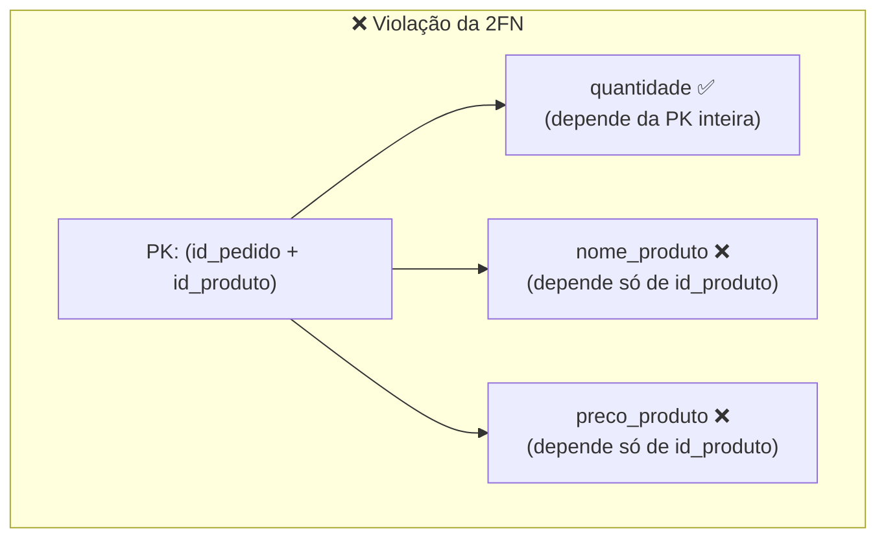
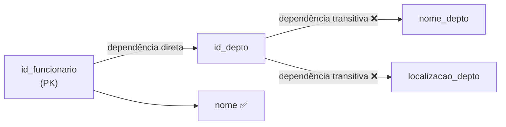
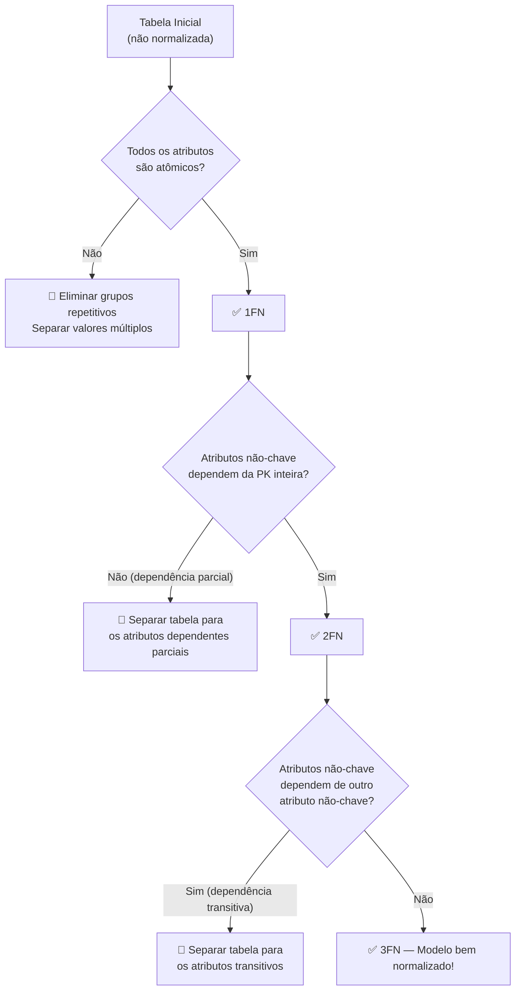
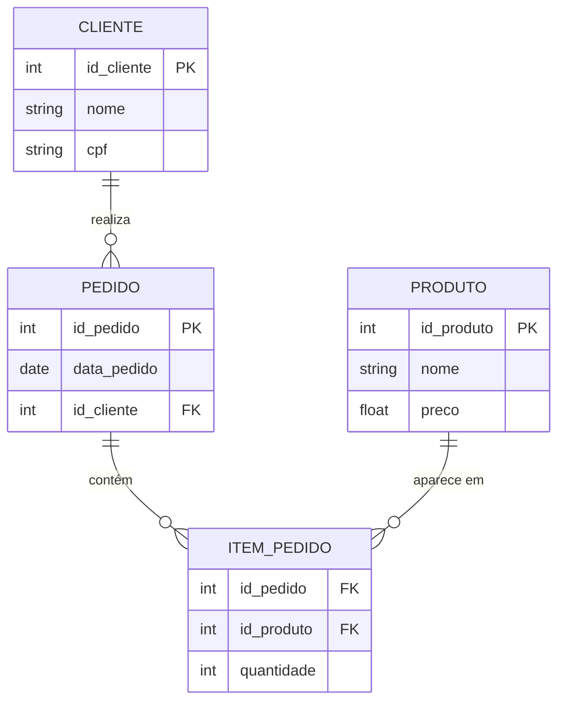

# Aula 05 — Normalização de Dados

**Disciplina:** Banco de Dados e Aplicações (IBD951)  
**Professor:** Ronan Adriel Zenatti · ronan.zenatti@cps.sp.gov.br  
**Fatec Jahu — 1º Semestre/2026**

---

## 🎯 Objetivos da Aula

Ao final desta aula você deverá ser capaz de:
- Compreender os problemas causados por redundância e anomalias em bancos de dados
- Aplicar a 1ª, 2ª e 3ª Formas Normais
- Avaliar se um modelo relacional está adequadamente normalizado

---

## 1. Por que Normalizar?

Imagine uma tabela de pedidos onde, para cada item comprado, repetimos o nome e endereço do cliente. Se esse cliente mudar de endereço, precisamos atualizar todas as linhas que o mencionam. Se esquecermos de atualizar alguma, teremos endereços diferentes para o mesmo cliente — uma **anomalia de atualização**. Se deletarmos o último pedido de um cliente, perdemos também as informações do cliente — uma **anomalia de exclusão**.

[Illustration of a messy disorganized table with duplicate data highlighted in red, arrows showing problems: update anomaly, insert anomaly, delete anomaly. On the right side, the same data cleanly organized into two separate normalized tables connected by a key. Educational style, red for problems and green for solutions.]


A **normalização** é um processo sistemático de organização das tabelas de um banco de dados para eliminar redundâncias e as anomalias que elas causam. O processo é baseado em um conceito chamado **dependência funcional**: dizemos que o atributo B depende funcionalmente de A (escrevemos A → B) quando, para cada valor de A, existe exatamente um valor de B correspondente.

---

## 2. Primeira Forma Normal (1FN)

Uma tabela está na **1ª Forma Normal** quando todos os seus atributos contêm apenas valores **atômicos** (indivisíveis) e **não há grupos repetitivos** ou listas dentro de uma célula.

**Exemplo de tabela que viola a 1FN:**

| id_pedido | cliente | telefones_cliente | itens |
|---|---|---|---|
| 1 | João | 99999-0001, 99999-0002 | Camiseta, Calça, Tênis |

Essa tabela viola a 1FN porque `telefones_cliente` tem múltiplos valores numa célula e `itens` também. Para normalizar, cada valor precisa estar em sua própria célula e cada linha deve representar um único fato.


Após aplicar a 1FN, teríamos tabelas separadas para `PEDIDO`, `TELEFONE_CLIENTE` e `ITEM_PEDIDO`, cada uma com valores simples em cada célula.

---

## 3. Segunda Forma Normal (2FN)

Uma tabela está na **2ª Forma Normal** quando já está na 1FN e todos os atributos não-chave dependem **completamente** da chave primária — e não apenas de uma parte dela. Isso só é relevante quando a PK é **composta** (formada por mais de um atributo).

**Exemplo de violação da 2FN:**

Suponha a tabela `ITEM_PEDIDO(id_pedido, id_produto, quantidade, nome_produto, preco_produto)`.

A PK composta é `(id_pedido, id_produto)`. O atributo `quantidade` depende corretamente da PK inteira — afinal, a quantidade de um produto num pedido específico depende dos dois. Mas `nome_produto` e `preco_produto` dependem **apenas** de `id_produto` — eles não mudam com o `id_pedido`. Isso é uma **dependência parcial**, que viola a 2FN.



A solução é separar os atributos dependentes parcialmente em sua própria tabela `PRODUTO(id_produto, nome_produto, preco_produto)`, deixando em `ITEM_PEDIDO` apenas o que realmente depende da PK composta.

---

## 4. Terceira Forma Normal (3FN)

Uma tabela está na **3ª Forma Normal** quando já está na 2FN e **não há dependências transitivas** — ou seja, nenhum atributo não-chave depende de outro atributo não-chave.

**Exemplo de violação da 3FN:**

Considere a tabela `FUNCIONARIO(id_funcionario, nome, id_depto, nome_depto, localizacao_depto)`.

Aqui, `nome_depto` e `localizacao_depto` dependem de `id_depto`, que por sua vez depende de `id_funcionario`. A cadeia de dependência é: `id_funcionario → id_depto → nome_depto`. Isso é uma **dependência transitiva**, que viola a 3FN.



A solução é mover `nome_depto` e `localizacao_depto` para uma tabela separada `DEPARTAMENTO(id_depto, nome_depto, localizacao_depto)`, e manter apenas `id_depto` como FK em `FUNCIONARIO`.

---

## 5. Resumo Visual das Formas Normais



---

## 6. Exemplo Completo: Normalizando do Zero

Partindo da tabela abaixo (completamente desnormalizada):

```
PEDIDO_COMPLETO(id_pedido, data_pedido, id_cliente, nome_cliente, cpf_cliente, 
                id_produto, nome_produto, preco_produto, quantidade)
```

Após aplicar 1FN, 2FN e 3FN, chegamos ao seguinte modelo normalizado:



Quatro tabelas limpas, sem redundância, sem anomalias.

---

## 📝 Resumo

A normalização é um processo que elimina redundâncias e anomalias de inserção, atualização e exclusão. A 1FN exige valores atômicos e elimina grupos repetitivos. A 2FN elimina dependências parciais em chaves compostas. A 3FN elimina dependências transitivas entre atributos não-chave. Aplicando as três formas normais chegamos a um modelo robusto e confiável.

---

## 🔗 Navegação

⬅️ [Aula 04 — Modelo Lógico Relacional](Aula_04_Modelo_Logico_Relacional.md) · ➡️ [Aula 06 — Atividade Avaliativa: Modelagem](Aula_06_Atividade_Modelagem.md)

---

*Fatec Jahu · IBD951 · Prof. Ronan Adriel Zenatti · 2026*
