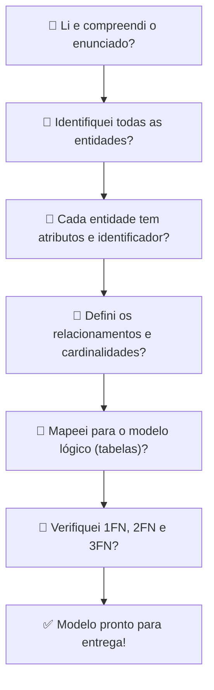

# Aula 06 — Atividade Avaliativa: Modelagem (T1)

**Disciplina:** Banco de Dados e Aplicações (IBD951)  
**Professor:** Ronan Adriel Zenatti · ronan.zenatti@cps.sp.gov.br  
**Fatec Jahu — 1º Semestre/2026**

---

## 🎯 Objetivos da Aula

Esta aula é uma **oficina prática** com objetivo de consolidar e avaliar os conhecimentos adquiridos nas aulas 2 a 5. O produto desta aula é o **Trabalho 1 (T1)**, que compõe a nota do semestre.

---

## 📋 O que será avaliado (T1)

O Trabalho 1 avalia sua capacidade de realizar uma modelagem completa a partir de um enunciado de negócio, cobrindo:

- Identificação correta de entidades (fortes e fracas)
- Levantamento e classificação de atributos (incluindo identificadores)
- Definição de relacionamentos com cardinalidade e participação corretas
- Mapeamento do modelo conceitual (MER) para o modelo lógico relacional
- Aplicação das Formas Normais (1FN, 2FN, 3FN)

> ⚠️ Veja o enunciado completo e os critérios de entrega na pasta [atividades/T1_Modelagem_Conceitual_Logica.md](../atividades/T1_Modelagem_Conceitual_Logica.md).

---

## 🔁 Revisão Rápida — Checklist de Modelagem

Use este checklist durante a oficina para garantir que seu modelo está completo:

---

## 💡 Dicas para a Oficina

Durante a elaboração do seu modelo, pense sempre nas **regras de negócio** antes de sair desenhando. Uma entidade nasce de uma pergunta: *"sobre o que o sistema precisa armazenar informações?"*. Um relacionamento nasce de outra pergunta: *"como esses objetos interagem entre si?"*. E a cardinalidade nasce de uma terceira: *"quantos podem se relacionar com quantos?"*.

Ao passar para o modelo lógico, lembre-se das regras de mapeamento: relacionamentos 1:N geram FK no lado N, enquanto relacionamentos N:M obrigatoriamente geram uma tabela associativa. E ao verificar as formas normais, foque primeiro em eliminar células com múltiplos valores (1FN), depois dependências parciais em chaves compostas (2FN) e por fim dependências transitivas (3FN).

---

## 🔗 Navegação

⬅️ [Aula 05 — Normalização](Aula_05_Normalizacao.md) · ➡️ [Aula 07 — SQL DDL](Aula_07_SQL_DDL.md)

---

*Fatec Jahu · IBD951 · Prof. Ronan Adriel Zenatti · 2026*
