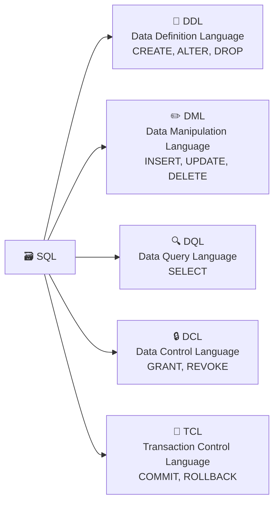

# Aula 07 — SQL: Linguagem de Definição de Dados (DDL)

**Disciplina:** Banco de Dados e Aplicações (IBD951)  
**Professor:** Ronan Adriel Zenatti · ronan.zenatti@cps.sp.gov.br  
**Fatec Jahu — 1º Semestre/2026**

---

## 🎯 Objetivos da Aula

Ao final desta aula você deverá ser capaz de:
- Compreender as subcategorias da linguagem SQL e o papel da DDL entre elas
- Aplicar convenções de nomenclatura profissionais em todo código SQL
- Escolher os tipos de dados corretos para cada situação, evitando as armadilhas mais comuns
- Utilizar `CREATE TABLE` com constraints nomeadas, ENGINE e charset adequados
- Aplicar todas as principais constraints: `PRIMARY KEY`, `FOREIGN KEY`, `UNIQUE`, `CHECK`, `NOT NULL` e `DEFAULT`
- Modificar e remover estruturas com `ALTER TABLE` e `DROP TABLE`
- Implementar fisicamente um banco de dados completo a partir do modelo lógico

---

## 1. A Linguagem SQL e suas Subcategorias

A **SQL (Structured Query Language)** é a linguagem padrão para interação com bancos de dados relacionais. Ela não é apenas uma linguagem de consulta — é um conjunto de sublinguagens, cada uma com um propósito bem definido.



Nesta aula focaremos na **DDL**, responsável por **definir a estrutura** do banco — criar bancos de dados, tabelas, alterar sua estrutura e excluir objetos. Pense na metáfora da construção: se o modelo lógico que projetamos nas aulas anteriores é a planta arquitetônica, a DDL é o ato de erguer as paredes, instalar as portas e definir as divisões do espaço. Tudo o que vier depois — inserir dados, consultar, criar lógica de negócio — depende de você ter executado a DDL corretamente primeiro.

Os três comandos centrais da DDL são `CREATE` (criar), `ALTER` (modificar) e `DROP` (remover). Eles operam sobre **objetos de banco de dados**: schemas, tabelas, índices, views, procedures, entre outros.

---

## 2. Convenções de Nomenclatura desta Disciplina

Antes de escrever uma única linha de SQL, precisamos estabelecer um conjunto de convenções que seguiremos em toda a disciplina. Convenções não são caprichos estéticos — são acordos que tornam o código legível, previsível e manutenível por qualquer pessoa do time, inclusive você mesmo daqui a seis meses. As regras a seguir serão cobradas nas avaliações.

**Regra 1 — snake_case em tudo:** todas as palavras separadas por underline, nunca por espaço, hífen ou camelCase. Exemplo: `data_nascimento`, não `DataNascimento` nem `data-nascimento`.

**Regra 2 — Sempre minúsculas para nomes criados pelo usuário:** tabelas, colunas, schemas — tudo em letras minúsculas. As únicas letras maiúsculas no seu código devem ser as palavras reservadas do SQL.

**Regra 3 — Palavras reservadas em MAIÚSCULAS:** `SELECT`, `CREATE`, `TABLE`, `INSERT`, `WHERE`, `NOT NULL`, `PRIMARY KEY` etc. Isso cria um contraste visual imediato entre o que é linguagem e o que é dado.

**Regra 4 — Nomes de tabelas sempre no plural:** a tabela armazena uma coleção de registros, então seu nome deve refletir isso. `clientes`, `pedidos`, `produtos` — nunca `cliente`, `pedido`, `produto`.

**Regra 5 — Chave primária no padrão `id_nome_tabela_singular`:** tabela `clientes` → PK `id_cliente`; tabela `pedidos` → PK `id_pedido`; tabela `categorias_produtos` → PK `id_categoria_produto`.

**Regra 6 — Chave estrangeira no padrão `tabela_referencia_id`:** o nome da FK usa o nome da tabela referenciada. Exemplo: na tabela `itens_pedidos`, a FK que aponta para `produtos` deve se chamar `produto_id`.

**Regra 7 — Chave estrangeira pelo papel semântico, não pelo nome da tabela:** quando uma FK referencia uma tabela cuja entidade pode exercer papéis diferentes no mesmo relacionamento, use o papel — não o nome da tabela. Este é o ponto mais sutil e importante:

```sql
-- ❌ ERRADO: não comunica nada sobre o papel de cada pessoa
CREATE TABLE vendas (
    pessoa1_id INT NOT NULL,
    pessoa2_id INT NOT NULL
);

-- ✅ CORRETO: use o papel semântico de cada um
CREATE TABLE vendas (
    id_venda       INT UNSIGNED  NOT NULL AUTO_INCREMENT,
    cliente_id     INT UNSIGNED  NOT NULL,  -- referencia pessoas (papel: cliente)
    funcionario_id INT UNSIGNED  NOT NULL,  -- referencia pessoas (papel: vendedor)
    data_venda     DATE          NOT NULL,

    CONSTRAINT pk_venda           PRIMARY KEY (id_venda),
    CONSTRAINT fk_venda_cliente   FOREIGN KEY (cliente_id)    REFERENCES pessoas (id_pessoa),
    CONSTRAINT fk_venda_vendedor  FOREIGN KEY (funcionario_id) REFERENCES pessoas (id_pessoa)
);
```

---

## 3. Acessando o MariaDB via Terminal (XAMPP)

Antes de criar qualquer estrutura, você precisa saber como se conectar ao banco. O XAMPP instala o MariaDB com configurações padrão que você deve conhecer.

**Configurações padrão do XAMPP:**

| Parâmetro    | Valor padrão               |
| ------------ | -------------------------- |
| Host         | `127.0.0.1` ou `localhost` |
| Porta        | `3306`                     |
| Usuário root | `root`                     |
| Senha root   | *(vazia — sem senha)*      |

```bash
# Forma mais comum — porta 3306 é assumida automaticamente
mysql -u root -p

# No Windows com XAMPP, o executável geralmente não está no PATH:
# C:\xampp\mysql\bin\mysql.exe -u root -p

# Especificando porta e host explicitamente
mysql -u root -p -P 3306 -h 127.0.0.1
```

> ⚠️ **Atenção:** no XAMPP padrão, a senha do root é **vazia**. Ao digitar `mysql -u root -p`, basta pressionar Enter sem digitar nada quando a senha for solicitada. Em um ambiente real de produção, isso seria inadmissível — sempre defina uma senha forte para o usuário administrador.

```sql
-- Após conectar, confirme a versão do SGBD:
SELECT VERSION();
-- Resultado esperado (exemplo): 10.4.32-MariaDB
```

---

## 4. Criando um Banco de Dados — Construção Gradual

Vamos construir o comando `CREATE DATABASE` de forma incremental, entendendo o motivo de cada parte.

### 4.1 Forma mínima

```sql
CREATE DATABASE loja_virtual;
```

Funciona, mas delega as configurações de caracteres ao padrão do servidor — o que pode causar problemas se o servidor estiver configurado com um charset diferente do esperado. Nunca use esta forma em projetos reais.

### 4.2 Adicionando proteção contra erro

```sql
-- IF NOT EXISTS evita erro se o banco já existir
-- Torna o script idempotente — pode ser executado múltiplas vezes sem quebrar nada
CREATE DATABASE IF NOT EXISTS loja_virtual;
```

### 4.3 Especificando o CHARACTER SET

```sql
CREATE DATABASE IF NOT EXISTS loja_virtual
    CHARACTER SET utf8mb4;
```

O `CHARACTER SET` define **como os caracteres são armazenados em bytes** no disco. É a escolha mais impactante que você fará ao criar um banco.

**Por que `utf8mb4` e não simplesmente `utf8`?** Esta é uma das armadilhas mais clássicas do MariaDB/MySQL. O tipo chamado `utf8` é, na verdade, uma implementação **incompleta** do UTF-8 — suporta apenas caracteres de até 3 bytes, o que exclui emojis e alguns caracteres de idiomas asiáticos. O `utf8mb4` é a implementação **completa e correta**, suportando todos os 1.114.112 pontos de código Unicode. **Sempre use `utf8mb4`.**

| Charset                | Bytes por caractere | Suporte                            | Quando usar                                |
| ---------------------- | ------------------- | ---------------------------------- | ------------------------------------------ |
| `latin1`               | 1                   | Apenas caracteres ocidentais       | Sistemas legados — nunca em projetos novos |
| `utf8` (MySQL/MariaDB) | 1–3                 | Unicode básico, **sem emojis**     | Nunca — use utf8mb4                        |
| `utf8mb4`              | 1–4                 | Unicode completo, emojis incluídos | **Sempre — padrão recomendado**            |
| `ascii`                | 1                   | 128 caracteres ASCII               | Colunas técnicas internas (ex: hashes)     |

### 4.4 Especificando o COLLATION

```sql
CREATE DATABASE IF NOT EXISTS loja_virtual
    CHARACTER SET utf8mb4
    COLLATE utf8mb4_unicode_ci;
```

Se o `CHARACTER SET` define *como armazenar*, o `COLLATE` define *como comparar*. A collation determina as regras de ordenação e de igualdade entre strings — afeta diretamente `WHERE`, `ORDER BY`, `GROUP BY` e índices em colunas de texto.

O sufixo `_ci` significa **Case Insensitive** (não diferencia maiúsculas de minúsculas): `'Ana'` = `'ana'`. O sufixo `_cs` é **Case Sensitive**. O sufixo `_bin` compara byte a byte.

| Collation            | Diferencia maiúsc./minúsc. | Diferencia acentos         | Quando usar                                    |
| -------------------- | -------------------------- | -------------------------- | ---------------------------------------------- |
| `utf8mb4_general_ci` | Não                        | Não                        | Performance ligeiramente melhor, menos preciso |
| `utf8mb4_unicode_ci` | Não                        | Não (agrupa `e`, `é`, `ê`) | **Recomendado para a maioria dos casos**       |
| `utf8mb4_bin`        | Sim                        | Sim                        | Comparação byte a byte — campos técnicos       |

> 💡 Para um sistema em português, `utf8mb4_unicode_ci` é a escolha mais correta — ela usa as regras do algoritmo Unicode de comparação (UCA), adequadas para letras com diacríticos.

### 4.5 Comando final completo e comentado

```sql
-- Criação completa e idiomática do banco de dados
CREATE DATABASE IF NOT EXISTS loja_virtual
    CHARACTER SET utf8mb4          -- UTF-8 completo: suporta todos os caracteres Unicode
    COLLATE utf8mb4_unicode_ci;    -- Comparação case-insensitive seguindo o padrão Unicode

-- Selecionar o banco para uso nas próximas operações
USE loja_virtual;

-- Confirmar configurações aplicadas
SHOW CREATE DATABASE loja_virtual;
```

---

## 5. Tipos de Dados — Guia Aprofundado

A escolha do tipo de dado correto é uma das decisões mais importantes do DDL. Um tipo errado desperdiça espaço em disco, compromete a performance de índices e pode causar bugs silenciosos — como truncamento de strings ou imprecisão em cálculos financeiros.

### 5.1 Tipos Numéricos Inteiros

Os tipos inteiros diferem apenas na faixa de valores que suportam e no espaço que ocupam. Escolha sempre o menor tipo que comporte os valores esperados — isso impacta diretamente o tamanho dos índices.

| Tipo              | Bytes | Faixa (sem sinal)     | Caso de uso típico                  |
| ----------------- | ----- | --------------------- | ----------------------------------- |
| `TINYINT`         | 1     | 0 a 255               | Flags, status com poucos valores    |
| `SMALLINT`        | 2     | 0 a 65.535            | Quantidades pequenas, códigos       |
| `MEDIUMINT`       | 3     | 0 a 16.777.215        | Contadores médios                   |
| `INT` / `INTEGER` | 4     | 0 a ~4,29 bilhões     | **Chaves primárias — uso geral**    |
| `BIGINT`          | 8     | 0 a ~18,4 quintilhões | IDs de alto volume, timestamps Unix |

**Armadilha clássica — `INT(11)` não é o que parece:** o número entre parênteses em `INT(11)` **não** define o tamanho de armazenamento nem a faixa de valores — ele apenas especifica a largura de exibição ao usar o flag `ZEROFILL`. Um `INT(1)` e um `INT(11)` ocupam exatamente 4 bytes e armazenam os mesmos valores. O MariaDB 10.7+ **depreciou** essa sintaxe.

```sql
-- ❌ Confuso e depreciado no MariaDB 10.7+:
id_produto INT(11) NOT NULL

-- ✅ Correto e moderno:
id_produto INT NOT NULL
```

**`UNSIGNED` — quando usar:** o modificador `UNSIGNED` elimina os valores negativos e dobra o limite positivo. Chaves primárias auto-incrementadas **nunca** serão negativas, então faz sentido usá-lo — mas atenção: operações de subtração entre dois `UNSIGNED` podem gerar erro se o resultado for negativo.

```sql
-- Chave primária sem sinal: dobra o limite de ~2 bi para ~4,29 bi
id_cliente INT UNSIGNED NOT NULL AUTO_INCREMENT
```

### 5.2 Tipos Numéricos com Ponto Flutuante e Decimais

Esta é a área onde mais ocorrem bugs silenciosos. A diferença entre `FLOAT`/`DOUBLE` e `DECIMAL` é fundamental.

| Tipo           | Armazenamento | Precisão               | Caso de uso                                         |
| -------------- | ------------- | ---------------------- | --------------------------------------------------- |
| `FLOAT`        | 4 bytes       | ~7 dígitos decimais    | Medições científicas — **nunca valores monetários** |
| `DOUBLE`       | 8 bytes       | ~15 dígitos decimais   | Cálculos científicos — **nunca valores monetários** |
| `DECIMAL(p,s)` | Variável      | Exata — até 65 dígitos | **Valores monetários, notas, medidas precisas**     |

**Por que nunca usar FLOAT ou DOUBLE para dinheiro?** Porque esses tipos usam representação de ponto flutuante binário (IEEE 754), que não consegue representar exatamente todos os decimais. `0.1 + 0.2` em ponto flutuante resulta em `0.30000000000000004`, não em `0.3`. Isso é tolerável em cálculos científicos, mas catastrófico em sistemas financeiros.

```sql
-- ❌ ERRADO para valores monetários — pode causar erros de arredondamento:
preco FLOAT NOT NULL

-- ✅ CORRETO: DECIMAL(10, 2) armazena até 10 dígitos no total, 2 após a vírgula
-- Suporta valores de -99999999.99 até 99999999.99
preco DECIMAL(10, 2) NOT NULL

-- Para sistemas com mais casas decimais (câmbio, criptomoedas):
cotacao DECIMAL(18, 8) NOT NULL
```

O `DECIMAL(p, s)` onde `p` é a **precisão** (total de dígitos) e `s` é a **escala** (dígitos após o ponto decimal).

### 5.3 Tipos de Texto

| Tipo         | Tamanho máximo | Quando usar                                      |
| ------------ | -------------- | ------------------------------------------------ |
| `CHAR(n)`    | 255 caracteres | Strings de tamanho **fixo** (CPF, CEP, siglas)   |
| `VARCHAR(n)` | 65.535 bytes   | Strings de tamanho **variável** — uso mais comum |
| `TINYTEXT`   | 255 bytes      | Textos curtos (raramente necessário)             |
| `TEXT`       | 65.535 bytes   | Descrições, comentários                          |
| `MEDIUMTEXT` | 16 MB          | Artigos, conteúdo longo                          |
| `LONGTEXT`   | 4 GB           | Logs, documentos muito longos                    |

**`CHAR` vs `VARCHAR` — a diferença que importa:** `CHAR(n)` sempre ocupa `n` bytes, preenchendo com espaços à direita quando o valor é menor. `VARCHAR(n)` ocupa apenas o espaço necessário mais 1–2 bytes de overhead para armazenar o comprimento. Use `CHAR` quando o dado sempre terá o mesmo tamanho — o acesso é ligeiramente mais rápido porque o banco sabe exatamente onde termina cada valor.

```sql
-- CHAR é ideal para campos de tamanho fixo e previsível:
cpf          CHAR(11)     NOT NULL,  -- apenas dígitos: sempre 11 caracteres
cep          CHAR(8)      NOT NULL,  -- apenas dígitos: sempre 8 caracteres
sigla_estado CHAR(2)      NOT NULL,  -- 'SP', 'RJ', 'PR': sempre 2 caracteres

-- VARCHAR para texto de comprimento variável:
nome         VARCHAR(100) NOT NULL,
email        VARCHAR(255) NOT NULL,
descricao    VARCHAR(500)            -- nullable: sem NOT NULL
```

> ⚠️ **Armadilha do `VARCHAR` no MariaDB:** o limite de `VARCHAR(n)` é calculado em bytes, não em caracteres. Com `utf8mb4`, cada caractere pode ocupar até 4 bytes. Para strings longas com caracteres especiais, prefira `TEXT`.

### 5.4 Tipos de Data e Hora

| Tipo        | Formato               | Faixa                   | Quando usar                              |
| ----------- | --------------------- | ----------------------- | ---------------------------------------- |
| `DATE`      | `YYYY-MM-DD`          | 1000-01-01 a 9999-12-31 | Datas sem hora (nascimento, vencimento)  |
| `TIME`      | `HHH:MM:SS`           | -838:59:59 a 838:59:59  | Horários, durações                       |
| `DATETIME`  | `YYYY-MM-DD HH:MM:SS` | 1000 a 9999             | Timestamps sem conversão de fuso horário |
| `TIMESTAMP` | `YYYY-MM-DD HH:MM:SS` | 1970 a 2038             | Timestamps com fuso (armazena UTC)       |
| `YEAR`      | `YYYY`                | 1901 a 2155             | Apenas anos                              |

**`DATETIME` vs `TIMESTAMP` — a diferença crítica:** o `TIMESTAMP` armazena o valor convertido para UTC e o converte para o fuso do servidor ao retornar — ótimo para sistemas distribuídos, mas pode surpreender quem não sabe. O `DATETIME` armazena o valor exatamente como foi inserido, sem conversão de fuso.

**O problema do ano 2038 com `TIMESTAMP`:** o `TIMESTAMP` usa um inteiro de 32 bits contando segundos a partir de 1970-01-01. Esse contador estoura em 19 de janeiro de 2038. Para datas além disso, use `DATETIME` ou `BIGINT`.

```sql
-- Datas de eventos passados ou futuros distantes: use DATE ou DATETIME
data_nascimento  DATE        NOT NULL,
data_vencimento  DATE        NOT NULL,

-- Registros automáticos de criação/atualização: TIMESTAMP é ideal
criado_em        TIMESTAMP   NOT NULL DEFAULT CURRENT_TIMESTAMP,
atualizado_em    TIMESTAMP   NOT NULL DEFAULT CURRENT_TIMESTAMP
                             ON UPDATE CURRENT_TIMESTAMP
```

### 5.5 Tipos Especiais

| Tipo                         | Quando usar                                                             |
| ---------------------------- | ----------------------------------------------------------------------- |
| `BOOLEAN` / `TINYINT(1)`     | Verdadeiro/falso — no MariaDB, `BOOLEAN` é apenas alias de `TINYINT(1)` |
| `ENUM('a','b','c')`          | Lista fechada de valores — use com moderação (ver aviso abaixo)         |
| `JSON`                       | Dados semiestruturados — disponível no MariaDB 10.2+                    |
| `BINARY(n)` / `VARBINARY(n)` | Dados binários, hashes                                                  |

> 💡 **Sobre `ENUM`:** embora conveniente, `ENUM` tem desvantagens — adicionar um novo valor exige um `ALTER TABLE` (que pode travar a tabela em produção) e o valor não é portável entre SGBDs. Uma alternativa mais flexível é criar uma tabela de domínio (ex: `status_pedidos`) e usar uma FK para validar os valores.

---

## 6. Criando Tabelas com `CREATE TABLE`

### 6.1 Estrutura geral

```sql
CREATE TABLE IF NOT EXISTS nome_tabela (
    -- Definição das colunas
    nome_coluna TIPO [constraints_inline],
    ...
    -- Constraints de tabela (PK, FK, UNIQUE compostos, CHECK)
    [CONSTRAINT nome_constraint] TIPO_CONSTRAINT (coluna),
    ...
) ENGINE=InnoDB DEFAULT CHARSET=utf8mb4 COLLATE=utf8mb4_unicode_ci;
```

O `ENGINE=InnoDB` é o mecanismo de armazenamento que suporta **transações**, **chaves estrangeiras** e **bloqueios a nível de linha** — sem ele, as FKs são ignoradas silenciosamente. Sempre especifique `InnoDB` explicitamente.

O `IF NOT EXISTS` torna o script **idempotente** — pode ser executado múltiplas vezes sem erro. É boa prática em scripts de setup de ambiente.

Nomear as constraints (`CONSTRAINT pk_cliente PRIMARY KEY`) é altamente recomendado: facilita mensagens de erro legíveis e o uso de `ALTER TABLE ... DROP CONSTRAINT nome` no futuro.

### 6.2 Tabela `clientes` — a base do sistema

```sql
CREATE TABLE IF NOT EXISTS clientes (
    id_cliente       INT UNSIGNED     NOT NULL AUTO_INCREMENT,
    nome             VARCHAR(100)     NOT NULL,
    cpf              CHAR(11)         NOT NULL COMMENT 'Apenas dígitos, sem formatação',
    email            VARCHAR(255)     NOT NULL,
    data_nascimento  DATE             NOT NULL,
    telefone         CHAR(11)             NULL COMMENT 'Apenas dígitos',
    criado_em        TIMESTAMP        NOT NULL DEFAULT CURRENT_TIMESTAMP,
    atualizado_em    TIMESTAMP        NOT NULL DEFAULT CURRENT_TIMESTAMP
                                               ON UPDATE CURRENT_TIMESTAMP,

    CONSTRAINT pk_cliente  PRIMARY KEY (id_cliente),
    CONSTRAINT uq_cpf      UNIQUE (cpf),
    CONSTRAINT uq_email    UNIQUE (email)

) ENGINE=InnoDB
  DEFAULT CHARSET=utf8mb4
  COLLATE=utf8mb4_unicode_ci
  COMMENT='Cadastro de clientes';
```

Observe algumas decisões de projeto: o CPF é armazenado como `CHAR(11)` apenas com dígitos, porque a formatação com pontos e traço é responsabilidade da camada de apresentação, não do banco. O `COMMENT` na tabela documenta o propósito diretamente no schema — útil em ferramentas como DBeaver e MySQL Workbench.

### 6.3 Tabela `categorias` — simples e autoexplicativa

```sql
CREATE TABLE IF NOT EXISTS categorias (
    id_categoria  INT UNSIGNED  NOT NULL AUTO_INCREMENT,
    nome          VARCHAR(80)   NOT NULL,
    descricao     TEXT              NULL,
    ativa         TINYINT(1)    NOT NULL DEFAULT 1  COMMENT '1 = ativa, 0 = inativa',

    CONSTRAINT pk_categoria  PRIMARY KEY (id_categoria),
    CONSTRAINT uq_cat_nome   UNIQUE (nome)

) ENGINE=InnoDB
  DEFAULT CHARSET=utf8mb4
  COLLATE=utf8mb4_unicode_ci;
```

### 6.4 Tabela `produtos` — com FK e CHECK

```sql
CREATE TABLE IF NOT EXISTS produtos (
    id_produto    INT UNSIGNED    NOT NULL AUTO_INCREMENT,
    categoria_id  INT UNSIGNED    NOT NULL,
    nome          VARCHAR(150)    NOT NULL,
    descricao     TEXT                NULL,
    preco         DECIMAL(10, 2)  NOT NULL,
    estoque       INT             NOT NULL DEFAULT 0,
    ativo         TINYINT(1)      NOT NULL DEFAULT 1,
    criado_em     TIMESTAMP       NOT NULL DEFAULT CURRENT_TIMESTAMP,
    atualizado_em TIMESTAMP       NOT NULL DEFAULT CURRENT_TIMESTAMP
                                           ON UPDATE CURRENT_TIMESTAMP,

    CONSTRAINT pk_produto           PRIMARY KEY (id_produto),
    CONSTRAINT fk_produto_categoria FOREIGN KEY (categoria_id)
                                    REFERENCES categorias (id_categoria)
                                    ON DELETE RESTRICT
                                    ON UPDATE CASCADE,
    CONSTRAINT ck_produto_preco     CHECK (preco >= 0),
    CONSTRAINT ck_produto_estoque   CHECK (estoque >= 0)

) ENGINE=InnoDB
  DEFAULT CHARSET=utf8mb4
  COLLATE=utf8mb4_unicode_ci;
```

> ⚠️ **Sobre `CHECK` no MariaDB:** no MySQL até a versão 8.0.15, constraints `CHECK` eram aceitas na sintaxe mas completamente ignoradas. No **MariaDB**, funcionam corretamente **desde a versão 10.2.1**. Como usamos MariaDB via XAMPP, as constraints `CHECK` funcionam normalmente — verifique sua versão com `SELECT VERSION()`.

### 6.5 Tabela `pedidos` — com FKs semânticas duplas

Este é o exemplo que demonstra a Regra 7 das convenções — duas FKs que referenciam a mesma tabela `clientes`, mas com papéis diferentes no contexto do pedido:

```sql
CREATE TABLE IF NOT EXISTS pedidos (
    id_pedido       INT UNSIGNED    NOT NULL AUTO_INCREMENT,
    cliente_id      INT UNSIGNED    NOT NULL,  -- pessoa no papel de comprador
    funcionario_id  INT UNSIGNED        NULL,  -- pessoa no papel de atendente (pode ser nulo: venda online)
    data_pedido     TIMESTAMP       NOT NULL DEFAULT CURRENT_TIMESTAMP,
    status          ENUM(
                        'pendente',
                        'confirmado',
                        'em_separacao',
                        'enviado',
                        'entregue',
                        'cancelado'
                    )               NOT NULL DEFAULT 'pendente',
    valor_total     DECIMAL(12, 2)  NOT NULL DEFAULT 0.00,
    observacoes     TEXT                NULL,

    CONSTRAINT pk_pedido              PRIMARY KEY (id_pedido),
    CONSTRAINT fk_pedido_cliente      FOREIGN KEY (cliente_id)
                                      REFERENCES clientes (id_cliente)
                                      ON DELETE RESTRICT
                                      ON UPDATE CASCADE,
    CONSTRAINT fk_pedido_funcionario  FOREIGN KEY (funcionario_id)
                                      REFERENCES clientes (id_cliente)
                                      ON DELETE SET NULL
                                      ON UPDATE CASCADE,
    CONSTRAINT ck_pedido_valor        CHECK (valor_total >= 0)

) ENGINE=InnoDB
  DEFAULT CHARSET=utf8mb4
  COLLATE=utf8mb4_unicode_ci;
```

### 6.6 Tabela `itens_pedidos` — chave composta e relacionamento N:M

```sql
-- Resolve o relacionamento N:M entre pedidos e produtos
-- Um pedido pode conter muitos produtos; um produto pode estar em muitos pedidos
CREATE TABLE IF NOT EXISTS itens_pedidos (
    pedido_id       INT UNSIGNED    NOT NULL,
    produto_id      INT UNSIGNED    NOT NULL,
    quantidade      INT UNSIGNED    NOT NULL,
    preco_unitario  DECIMAL(10, 2)  NOT NULL COMMENT 'Preço no momento da compra',
    desconto        DECIMAL(5, 2)   NOT NULL DEFAULT 0.00 COMMENT 'Percentual de desconto',

    CONSTRAINT pk_item_pedido   PRIMARY KEY (pedido_id, produto_id),

    CONSTRAINT fk_item_pedido   FOREIGN KEY (pedido_id)
                                REFERENCES pedidos (id_pedido)
                                ON DELETE CASCADE
                                ON UPDATE CASCADE,

    CONSTRAINT fk_item_produto  FOREIGN KEY (produto_id)
                                REFERENCES produtos (id_produto)
                                ON DELETE RESTRICT
                                ON UPDATE CASCADE,

    CONSTRAINT ck_item_qtd      CHECK (quantidade > 0),
    CONSTRAINT ck_item_preco    CHECK (preco_unitario >= 0),
    CONSTRAINT ck_item_desconto CHECK (desconto >= 0 AND desconto <= 100)

) ENGINE=InnoDB
  DEFAULT CHARSET=utf8mb4
  COLLATE=utf8mb4_unicode_ci;
```

> 💡 **Por que armazenar `preco_unitario` na tabela de itens?** Porque o preço do produto pode mudar depois que o pedido foi feito. Se você consultasse o preço atual da tabela `produtos`, o valor histórico do pedido mudaria retroativamente — um erro grave em qualquer sistema comercial. O `preco_unitario` é um *snapshot* (fotografia) do preço no momento da compra.

---

## 7. Constraints em Detalhe

### 7.1 PRIMARY KEY

A chave primária identifica unicamente cada linha da tabela. Ela implica automaticamente `NOT NULL` e `UNIQUE`. Pode ser simples (uma coluna) ou composta (múltiplas colunas).

```sql
-- PK simples — forma inline:
id_cliente INT UNSIGNED NOT NULL AUTO_INCREMENT PRIMARY KEY

-- PK simples — forma de constraint nomeada (recomendada — facilita ALTER TABLE):
CONSTRAINT pk_cliente PRIMARY KEY (id_cliente)

-- PK composta — apenas como constraint de tabela:
CONSTRAINT pk_item PRIMARY KEY (id_pedido, id_produto)
```

### 7.2 FOREIGN KEY com ON DELETE e ON UPDATE

A FK garante a **integridade referencial** — impede que exista um valor na coluna filho que não exista na coluna pai. As ações `ON DELETE` e `ON UPDATE` definem o comportamento quando o registro pai é excluído ou tem sua PK alterada.

| Ação          | Comportamento                                          | Quando usar                                                    |
| ------------- | ------------------------------------------------------ | -------------------------------------------------------------- |
| `RESTRICT`    | Impede a operação no pai se houver filhos              | Padrão mais seguro — quando a exclusão deve ser explícita      |
| `NO ACTION`   | Similar ao RESTRICT (verificado ao final da transação) | Padrão do SQL padrão                                           |
| `CASCADE`     | Propaga a operação para os filhos                      | Quando o filho não faz sentido sem o pai (ex: itens de pedido) |
| `SET NULL`    | Define a FK como NULL nos filhos                       | Quando a associação é opcional (ex: funcionário desligado)     |
| `SET DEFAULT` | Define a FK como seu valor DEFAULT                     | Raro — pouco suportado na prática                              |

```sql
-- CASCADE em DELETE: excluir um pedido remove seus itens automaticamente
CONSTRAINT fk_item_pedido FOREIGN KEY (pedido_id)
    REFERENCES pedidos (id_pedido)
    ON DELETE CASCADE
    ON UPDATE CASCADE,

-- RESTRICT em DELETE: não deixa excluir uma categoria que tem produtos
CONSTRAINT fk_produto_categoria FOREIGN KEY (categoria_id)
    REFERENCES categorias (id_categoria)
    ON DELETE RESTRICT
    ON UPDATE CASCADE,

-- SET NULL em DELETE: se o funcionário for desligado, os pedidos
-- que ele atendeu ficam sem atendente registrado (funcionario_id = NULL)
CONSTRAINT fk_pedido_funcionario FOREIGN KEY (funcionario_id)
    REFERENCES clientes (id_cliente)
    ON DELETE SET NULL
    ON UPDATE CASCADE
```

### 7.3 NOT NULL e DEFAULT

`NOT NULL` impede que uma coluna armazene o valor `NULL`. `DEFAULT` define o valor aplicado quando nenhum é fornecido no `INSERT`.

```sql
-- NOT NULL sem DEFAULT: o INSERT deve sempre fornecer um valor
nome VARCHAR(100) NOT NULL,

-- NOT NULL com DEFAULT: se não fornecido, usa o valor padrão
ativo        TINYINT(1)  NOT NULL DEFAULT 1,
criado_em    TIMESTAMP   NOT NULL DEFAULT CURRENT_TIMESTAMP,
estoque      INT         NOT NULL DEFAULT 0,

-- NULL explícito: o campo é opcional
observacoes  TEXT NULL,
-- ou simplesmente (NULL é o padrão quando não especificado):
observacoes  TEXT,
```

> 💡 **Sobre `NULL` em bancos de dados:** `NULL` não significa zero, string vazia ou falso — significa *ausência de valor* ou *valor desconhecido*. Isso tem implicações importantes: `NULL = NULL` é `FALSE` em SQL (use `IS NULL` ou `IS NOT NULL` para comparar). Colunas que permitem NULL aumentam a complexidade das queries, então use `NOT NULL` sempre que possível.

### 7.4 UNIQUE e CHECK

`UNIQUE` garante que não existam dois registros com o mesmo valor em uma coluna (ou combinação de colunas). Diferente da PK, uma coluna com `UNIQUE` pode conter `NULL` — e múltiplos `NULL`s são permitidos (porque `NULL ≠ NULL` em SQL).

```sql
-- UNIQUE em coluna única:
CONSTRAINT uq_cpf   UNIQUE (cpf),
CONSTRAINT uq_email UNIQUE (email),

-- UNIQUE composto: a combinação das duas colunas deve ser única
-- (cada aluno pode estar matriculado em cada disciplina apenas uma vez por semestre)
CONSTRAINT uq_matricula UNIQUE (id_aluno, id_disciplina, semestre)
```

`CHECK` valida se os valores inseridos satisfazem uma expressão booleana. Qualquer linha que viole o CHECK é rejeitada:

```sql
-- Restrições de domínio com CHECK:
CONSTRAINT ck_preco_positivo   CHECK (preco >= 0),
CONSTRAINT ck_desconto_valido  CHECK (desconto >= 0 AND desconto <= 100),
CONSTRAINT ck_nota_valida      CHECK (nota >= 0 AND nota <= 10),
CONSTRAINT ck_email_formato    CHECK (email LIKE '%@%.%'),
CONSTRAINT ck_data_valida      CHECK (data_fim >= data_inicio)
```

---

## 8. Modificando Tabelas — `ALTER TABLE`

O `ALTER TABLE` permite modificar a estrutura de uma tabela existente sem perder os dados. É o comando que você usará quando os requisitos do sistema mudarem depois que o banco já foi populado.

```sql
-- Adicionar uma nova coluna ao final da tabela:
ALTER TABLE produtos
    ADD COLUMN peso DECIMAL(8, 3) NULL COMMENT 'Peso em quilogramas';

-- Adicionar coluna em posição específica (recurso exclusivo do MariaDB/MySQL):
ALTER TABLE produtos
    ADD COLUMN codigo_barras VARCHAR(13) NULL AFTER nome;

-- Adicionar coluna como a primeira da tabela:
ALTER TABLE produtos
    ADD COLUMN codigo_interno VARCHAR(20) NOT NULL FIRST;

-- Modificar o tipo ou constraints de uma coluna existente (MODIFY redefine a coluna inteira):
ALTER TABLE clientes
    MODIFY COLUMN telefone VARCHAR(20) NULL;

-- Renomear E redefinir uma coluna ao mesmo tempo (CHANGE):
-- Sintaxe: CHANGE nome_antigo novo_nome tipo_novo [constraints]
ALTER TABLE clientes
    CHANGE COLUMN telefone celular CHAR(11) NULL;

-- Remover uma coluna:
ALTER TABLE produtos
    DROP COLUMN codigo_interno;

-- Adicionar uma FK após a criação da tabela:
ALTER TABLE produtos
    ADD CONSTRAINT fk_produto_fornecedor
        FOREIGN KEY (fornecedor_id)
        REFERENCES fornecedores (id_fornecedor)
        ON DELETE RESTRICT
        ON UPDATE CASCADE;

-- Remover uma FK pelo nome:
ALTER TABLE produtos
    DROP FOREIGN KEY fk_produto_fornecedor;

-- Remover uma constraint UNIQUE (armazenada como índice no MariaDB/MySQL):
ALTER TABLE clientes
    DROP INDEX uq_email;

-- Renomear a tabela:
ALTER TABLE itens_pedidos RENAME TO itens_pedido;
-- Sintaxe alternativa equivalente:
RENAME TABLE itens_pedidos TO itens_pedido;
```

> ⚠️ **Cuidado com `ALTER TABLE` em tabelas com dados:** modificar o tipo de uma coluna que já tem dados pode causar truncamento ou conversão implícita. Por exemplo, reduzir um `VARCHAR(255)` para `VARCHAR(50)` truncará silenciosamente valores maiores que 50 caracteres em algumas versões. **Sempre faça backup antes de executar `ALTER TABLE` em produção.**

---

## 9. Removendo Objetos — `DROP`

O `DROP` remove permanentemente um objeto do banco. **Não há desfazer** — sempre faça backup antes.

```sql
-- Remover uma tabela (e todos os seus dados e índices):
DROP TABLE IF EXISTS itens_pedidos;

-- Remover múltiplas tabelas de uma vez — atenção à ordem (filhos antes dos pais):
DROP TABLE IF EXISTS itens_pedidos, pedidos, produtos, categorias, clientes;

-- Remover o banco de dados inteiro:
DROP DATABASE IF EXISTS loja_virtual;
```

**O problema da ordem ao dropar:** se você tentar remover uma tabela que é referenciada por uma FK em outra tabela, o MariaDB rejeitará a operação. Você deve sempre dropar os "filhos" antes dos "pais", ou desabilitar temporariamente a verificação de FK:

```sql
-- Sequência segura para dropar o schema completo:
SET FOREIGN_KEY_CHECKS = 0;  -- desabilita verificação temporariamente

DROP TABLE IF EXISTS itens_pedidos;  -- filhos primeiro
DROP TABLE IF EXISTS pedidos;
DROP TABLE IF EXISTS produtos;
DROP TABLE IF EXISTS categorias;
DROP TABLE IF EXISTS clientes;

SET FOREIGN_KEY_CHECKS = 1;  -- sempre reabilite após o uso
```

---

## 10. Comandos Utilitários Essenciais

Estes comandos não são DDL propriamente ditos, mas você os usará constantemente durante o desenvolvimento:

```sql
-- Listar todos os databases disponíveis:
SHOW DATABASES;

-- Selecionar o banco para uso:
USE loja_virtual;

-- Verificar qual banco está selecionado:
SELECT DATABASE();

-- Listar tabelas do banco atual:
SHOW TABLES;

-- Ver a estrutura de uma tabela:
DESCRIBE produtos;
-- Forma abreviada equivalente:
DESC produtos;

-- Ver o CREATE TABLE completo (com todas as constraints como foram definidas):
SHOW CREATE TABLE produtos;

-- Ver todos os índices de uma tabela (PKs, UNIQUEs e FKs geram índices):
SHOW INDEX FROM produtos;

-- Ver as constraints de FK de uma tabela específica via information_schema:
SELECT
    constraint_name,
    column_name,
    referenced_table_name,
    referenced_column_name
FROM
    information_schema.key_column_usage
WHERE
    table_schema    = 'loja_virtual'
    AND table_name  = 'produtos'
    AND referenced_table_name IS NOT NULL;
```

---

## 11. Script Completo — Sistema de Vendas

O script abaixo reúne tudo que foi apresentado nesta aula em um arquivo coeso, seguindo todas as convenções. Este é o padrão esperado para as entregas da disciplina:

```sql
-- =============================================================================
-- Schema: loja_virtual
-- Disciplina: IBD951 — Banco de Dados e Aplicações
-- Professor: Ronan Adriel Zenatti — FATEC Jahu
-- Descrição: DDL completo de um sistema de vendas simplificado
-- SGBD: MariaDB 10.4+ (XAMPP)
-- =============================================================================

DROP DATABASE IF EXISTS loja_virtual;

CREATE DATABASE loja_virtual
    CHARACTER SET utf8mb4
    COLLATE utf8mb4_unicode_ci;

USE loja_virtual;

-- -----------------------------------------------------------------------------
-- Tabela: clientes
-- -----------------------------------------------------------------------------
CREATE TABLE IF NOT EXISTS clientes (
    id_cliente       INT UNSIGNED    NOT NULL AUTO_INCREMENT,
    nome             VARCHAR(100)    NOT NULL,
    cpf              CHAR(11)        NOT NULL COMMENT 'Apenas dígitos, sem formatação',
    email            VARCHAR(255)    NOT NULL,
    data_nascimento  DATE            NOT NULL,
    telefone         CHAR(11)            NULL COMMENT 'Apenas dígitos',
    criado_em        TIMESTAMP       NOT NULL DEFAULT CURRENT_TIMESTAMP,
    atualizado_em    TIMESTAMP       NOT NULL DEFAULT CURRENT_TIMESTAMP
                                             ON UPDATE CURRENT_TIMESTAMP,

    CONSTRAINT pk_cliente  PRIMARY KEY (id_cliente),
    CONSTRAINT uq_cpf      UNIQUE (cpf),
    CONSTRAINT uq_email    UNIQUE (email)

) ENGINE=InnoDB
  DEFAULT CHARSET=utf8mb4
  COLLATE=utf8mb4_unicode_ci
  COMMENT='Cadastro de clientes';

-- -----------------------------------------------------------------------------
-- Tabela: categorias
-- -----------------------------------------------------------------------------
CREATE TABLE IF NOT EXISTS categorias (
    id_categoria  INT UNSIGNED  NOT NULL AUTO_INCREMENT,
    nome          VARCHAR(80)   NOT NULL,
    descricao     TEXT              NULL,
    ativa         TINYINT(1)    NOT NULL DEFAULT 1,

    CONSTRAINT pk_categoria  PRIMARY KEY (id_categoria),
    CONSTRAINT uq_cat_nome   UNIQUE (nome)

) ENGINE=InnoDB
  DEFAULT CHARSET=utf8mb4
  COLLATE=utf8mb4_unicode_ci;

-- -----------------------------------------------------------------------------
-- Tabela: produtos
-- Referencia categorias (N:1)
-- -----------------------------------------------------------------------------
CREATE TABLE IF NOT EXISTS produtos (
    id_produto    INT UNSIGNED    NOT NULL AUTO_INCREMENT,
    categoria_id  INT UNSIGNED    NOT NULL,
    nome          VARCHAR(150)    NOT NULL,
    descricao     TEXT                NULL,
    preco         DECIMAL(10, 2)  NOT NULL,
    estoque       INT             NOT NULL DEFAULT 0,
    ativo         TINYINT(1)      NOT NULL DEFAULT 1,
    criado_em     TIMESTAMP       NOT NULL DEFAULT CURRENT_TIMESTAMP,
    atualizado_em TIMESTAMP       NOT NULL DEFAULT CURRENT_TIMESTAMP
                                           ON UPDATE CURRENT_TIMESTAMP,

    CONSTRAINT pk_produto           PRIMARY KEY (id_produto),
    CONSTRAINT fk_produto_categoria FOREIGN KEY (categoria_id)
                                    REFERENCES categorias (id_categoria)
                                    ON DELETE RESTRICT
                                    ON UPDATE CASCADE,
    CONSTRAINT ck_preco             CHECK (preco >= 0),
    CONSTRAINT ck_estoque           CHECK (estoque >= 0)

) ENGINE=InnoDB
  DEFAULT CHARSET=utf8mb4
  COLLATE=utf8mb4_unicode_ci;

-- -----------------------------------------------------------------------------
-- Tabela: pedidos
-- Demonstra FKs semânticas: cliente_id e funcionario_id referenciam clientes
-- -----------------------------------------------------------------------------
CREATE TABLE IF NOT EXISTS pedidos (
    id_pedido      INT UNSIGNED    NOT NULL AUTO_INCREMENT,
    cliente_id     INT UNSIGNED    NOT NULL,   -- pessoa no papel de comprador
    funcionario_id INT UNSIGNED        NULL,   -- pessoa no papel de atendente
    data_pedido    TIMESTAMP       NOT NULL DEFAULT CURRENT_TIMESTAMP,
    status         ENUM(
                       'pendente',
                       'confirmado',
                       'em_separacao',
                       'enviado',
                       'entregue',
                       'cancelado'
                   )               NOT NULL DEFAULT 'pendente',
    valor_total    DECIMAL(12, 2)  NOT NULL DEFAULT 0.00,
    observacoes    TEXT                NULL,

    CONSTRAINT pk_pedido             PRIMARY KEY (id_pedido),
    CONSTRAINT fk_pedido_cliente     FOREIGN KEY (cliente_id)
                                     REFERENCES clientes (id_cliente)
                                     ON DELETE RESTRICT
                                     ON UPDATE CASCADE,
    CONSTRAINT fk_pedido_funcionario FOREIGN KEY (funcionario_id)
                                     REFERENCES clientes (id_cliente)
                                     ON DELETE SET NULL
                                     ON UPDATE CASCADE,
    CONSTRAINT ck_valor_total        CHECK (valor_total >= 0)

) ENGINE=InnoDB
  DEFAULT CHARSET=utf8mb4
  COLLATE=utf8mb4_unicode_ci;

-- -----------------------------------------------------------------------------
-- Tabela: itens_pedidos
-- Resolve o N:M entre pedidos e produtos
-- Armazena snapshot do preço no momento da compra
-- -----------------------------------------------------------------------------
CREATE TABLE IF NOT EXISTS itens_pedidos (
    pedido_id      INT UNSIGNED    NOT NULL,
    produto_id     INT UNSIGNED    NOT NULL,
    quantidade     INT UNSIGNED    NOT NULL,
    preco_unitario DECIMAL(10, 2)  NOT NULL COMMENT 'Preço no momento da compra',
    desconto       DECIMAL(5, 2)   NOT NULL DEFAULT 0.00 COMMENT 'Percentual de desconto',

    CONSTRAINT pk_item_pedido   PRIMARY KEY (pedido_id, produto_id),
    CONSTRAINT fk_item_pedido   FOREIGN KEY (pedido_id)
                                REFERENCES pedidos (id_pedido)
                                ON DELETE CASCADE
                                ON UPDATE CASCADE,
    CONSTRAINT fk_item_produto  FOREIGN KEY (produto_id)
                                REFERENCES produtos (id_produto)
                                ON DELETE RESTRICT
                                ON UPDATE CASCADE,
    CONSTRAINT ck_item_qtd      CHECK (quantidade > 0),
    CONSTRAINT ck_item_preco    CHECK (preco_unitario >= 0),
    CONSTRAINT ck_item_desconto CHECK (desconto >= 0 AND desconto <= 100)

) ENGINE=InnoDB
  DEFAULT CHARSET=utf8mb4
  COLLATE=utf8mb4_unicode_ci;
```

---

## 📝 Exercícios de Fixação

**Exercício 1 — Identifique os erros:** o trecho abaixo possui diversas violações das convenções desta disciplina. Liste todos os erros encontrados e reescreva o código corretamente.

```sql
CREATE TABLE Produto (
    idProduto INT(11) PRIMARY KEY,
    NomeProduto varchar(100),
    Preco FLOAT,
    ID_CATEGORIA int,
    FOREIGN KEY (ID_CATEGORIA) REFERENCES Categoria(id)
);
```

**Gabarito:** os erros são: nome da tabela em singular e com inicial maiúscula (deve ser `produtos`); `idProduto` usa camelCase (deve ser `id_produto`); `INT(11)` está depreciado (use `INT`); `NomeProduto` mistura maiúsculas (deve ser `nome`); `Preco` com maiúscula (deve ser `preco`); `FLOAT` inapropriado para preço (use `DECIMAL(10,2)`); `ID_CATEGORIA` mistura maiúsculas (deve ser `categoria_id` conforme Regra 6); faltam `NOT NULL` nas colunas obrigatórias; a constraint FK não é nomeada; faltam `ENGINE=InnoDB` e `DEFAULT CHARSET`.

Versão corrigida:

```sql
CREATE TABLE IF NOT EXISTS produtos (
    id_produto   INT UNSIGNED    NOT NULL AUTO_INCREMENT,
    categoria_id INT UNSIGNED    NOT NULL,
    nome         VARCHAR(100)    NOT NULL,
    preco        DECIMAL(10, 2)  NOT NULL,

    CONSTRAINT pk_produto          PRIMARY KEY (id_produto),
    CONSTRAINT fk_produto_categoria FOREIGN KEY (categoria_id)
                                    REFERENCES categorias (id_categoria)
                                    ON DELETE RESTRICT
                                    ON UPDATE CASCADE,
    CONSTRAINT ck_preco            CHECK (preco >= 0)

) ENGINE=InnoDB
  DEFAULT CHARSET=utf8mb4
  COLLATE=utf8mb4_unicode_ci;
```

**Exercício 2 — Criação guiada:** crie o DDL completo para um sistema de biblioteca com as entidades: `autores`, `livros`, `usuarios`, `emprestimos`. Siga todas as convenções desta disciplina. Um livro pode ter múltiplos autores; um usuário pode ter múltiplos empréstimos; cada empréstimo é de um único livro.

**Exercício 3 — ALTER TABLE:** dada a tabela `produtos` criada nesta aula, escreva os comandos `ALTER TABLE` para: (a) adicionar a coluna `peso DECIMAL(8, 3) NULL`; (b) renomear a coluna `ativo` para `disponivel` mantendo o mesmo tipo e constraint; (c) adicionar uma constraint CHECK que garanta que `peso > 0` quando não for NULL.

---

## 📚 Referências

- ELMASRI, R.; NAVATHE, S. B. *Sistemas de Banco de Dados*. 7 ed. Cap. 6 — SQL Básico. São Paulo: Pearson, 2018.
- Documentação oficial do MariaDB — [CREATE TABLE](https://mariadb.com/kb/en/create-table/)
- Documentação oficial do MariaDB — [Data Types](https://mariadb.com/kb/en/data-types/)
- Documentação oficial do MariaDB — [ALTER TABLE](https://mariadb.com/kb/en/alter-table/)

---

## 🔗 Navegação

⬅️ [Aula 06 — Atividade de Modelagem](Aula_06_Atividade_Modelagem.md) · ➡️ [Aula 08 — Restrições de Integridade](Aula_08_Restricoes_Integridade.md)

---

*Fatec Jahu · IBD951 · Prof. Ronan Adriel Zenatti · 2026*
