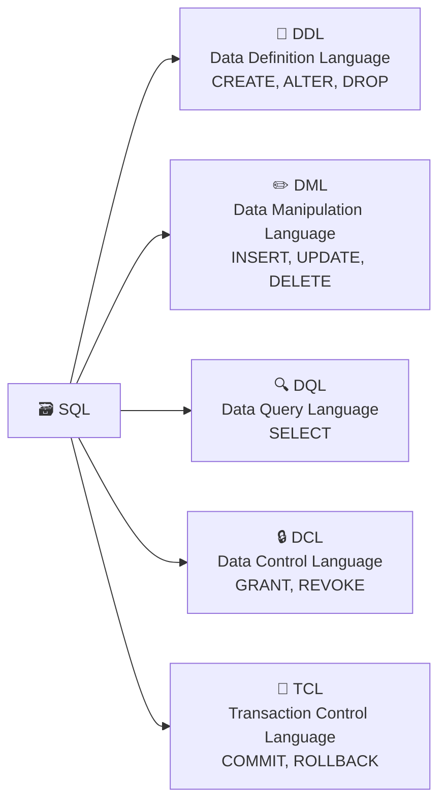

# Aula 07 — SQL: Linguagem de Definição de Dados (DDL)

**Disciplina:** Banco de Dados e Aplicações (IBD951)  
**Professor:** Ronan Adriel Zenatti · ronan.zenatti@cps.sp.gov.br  
**Fatec Jahu — 1º Semestre/2026**

---

## 🎯 Objetivos da Aula

Ao final desta aula você deverá ser capaz de:
- Compreender as subcategorias da linguagem SQL
- Utilizar o comando `CREATE TABLE` com tipos de dados adequados
- Implementar fisicamente um banco de dados a partir do modelo lógico

---

## 1. A Linguagem SQL e suas Subcategorias

A **SQL (Structured Query Language)** é a linguagem padrão para interação com bancos de dados relacionais. Ela não é apenas uma linguagem de consulta — é um conjunto de sublinguagens, cada uma com um propósito bem definido.



Nesta aula focaremos na **DDL**, que é a parte responsável por **definir a estrutura** do banco — criar bancos de dados, tabelas, alterar sua estrutura e excluir objetos.

---

## 2. Criando um Banco de Dados

O primeiro passo antes de criar qualquer tabela é criar (ou selecionar) o banco de dados onde elas serão armazenadas.

```sql
-- Cria o banco de dados
CREATE DATABASE loja_virtual
    CHARACTER SET utf8mb4       -- Suporte a caracteres especiais e emojis
    COLLATE utf8mb4_unicode_ci; -- Regras de comparação de strings

-- Seleciona o banco para uso
USE loja_virtual;
```

---

## 3. Tipos de Dados Essenciais

Antes de criar tabelas, precisamos conhecer os tipos de dados disponíveis. A escolha do tipo correto impacta diretamente o desempenho, o espaço em disco e a integridade dos dados.

[Clean infographic showing SQL data types organized in categories: Numeric types (INT, DECIMAL, FLOAT) represented by numbers, Text types (VARCHAR, CHAR, TEXT) represented by letters and strings, Date/Time types (DATE, DATETIME, TIMESTAMP) represented by a calendar icon. Modern flat design, color coded by category, white background.]


Os **tipos numéricos inteiros** mais usados são `TINYINT` (1 byte, para valores pequenos como flags 0/1), `INT` (4 bytes, para IDs e contagens gerais) e `BIGINT` (8 bytes, para contadores que podem crescer muito). Para valores decimais, use `DECIMAL(p, s)` — onde `p` é a precisão total e `s` são as casas decimais — especialmente para valores monetários, pois evita erros de arredondamento. O `FLOAT` e `DOUBLE` são para cálculos científicos onde a precisão exata é menos crítica.

Os **tipos de texto** se dividem principalmente entre `CHAR(n)` (comprimento fixo, ideal para CEP, CPF e outros dados de tamanho constante), `VARCHAR(n)` (comprimento variável, ideal para nomes e descrições) e `TEXT` (para textos longos sem limite prático de tamanho).

Os **tipos de data e hora** incluem `DATE` (apenas data: `AAAA-MM-DD`), `TIME` (apenas hora: `HH:MM:SS`), `DATETIME` (data e hora combinadas) e `TIMESTAMP` (similar ao DATETIME, mas automaticamente convertido para UTC — útil para registrar quando um registro foi criado ou atualizado).

---

## 4. Criando Tabelas com CREATE TABLE

O comando `CREATE TABLE` implementa fisicamente uma tabela no banco de dados. Vamos implementar o modelo de sistema de vendas que projetamos na Aula 04.

```sql
-- Tabela de clientes
CREATE TABLE cliente (
    id_cliente  INT             NOT NULL AUTO_INCREMENT,
    nome        VARCHAR(100)    NOT NULL,
    cpf         CHAR(11)        NOT NULL,
    email       VARCHAR(150),
    telefone    VARCHAR(15),
    data_nasc   DATE,
    CONSTRAINT pk_cliente PRIMARY KEY (id_cliente),
    CONSTRAINT uq_cpf     UNIQUE (cpf)
);
```

Observe alguns detalhes importantes nesse comando. O `AUTO_INCREMENT` faz o banco gerar automaticamente valores sequenciais para a PK, dispensando a necessidade de informar esse valor em cada INSERT. O `NOT NULL` garante que as colunas obrigatórias sempre tenham um valor. O `CONSTRAINT` com nome nomeado é uma boa prática — facilita mensagens de erro e a manutenção posterior.

```sql
-- Tabela de produtos
CREATE TABLE produto (
    id_produto  INT             NOT NULL AUTO_INCREMENT,
    nome        VARCHAR(100)    NOT NULL,
    descricao   TEXT,
    preco       DECIMAL(10, 2)  NOT NULL,
    estoque     INT             NOT NULL DEFAULT 0,
    CONSTRAINT pk_produto PRIMARY KEY (id_produto)
);

-- Tabela de pedidos (referencia cliente)
CREATE TABLE pedido (
    id_pedido   INT             NOT NULL AUTO_INCREMENT,
    data_pedido DATETIME        NOT NULL DEFAULT CURRENT_TIMESTAMP,
    status      VARCHAR(20)     NOT NULL DEFAULT 'PENDENTE',
    id_cliente  INT             NOT NULL,
    CONSTRAINT pk_pedido  PRIMARY KEY (id_pedido),
    CONSTRAINT fk_pedido_cliente FOREIGN KEY (id_cliente)
        REFERENCES cliente (id_cliente)
        ON DELETE RESTRICT
        ON UPDATE CASCADE
);
```

A cláusula `ON DELETE RESTRICT` impede que um cliente seja excluído se ele tiver pedidos vinculados. Já o `ON UPDATE CASCADE` garante que, se o `id_cliente` mudar na tabela `cliente`, essa mudança se propague automaticamente para `pedido`. Essas são as **ações referenciais**, e escolhê-las corretamente é parte do projeto do banco.

```sql
-- Tabela associativa de itens do pedido (N:M entre pedido e produto)
CREATE TABLE item_pedido (
    id_pedido       INT             NOT NULL,
    id_produto      INT             NOT NULL,
    quantidade      INT             NOT NULL,
    preco_unitario  DECIMAL(10, 2)  NOT NULL,
    CONSTRAINT pk_item_pedido  PRIMARY KEY (id_pedido, id_produto),
    CONSTRAINT fk_item_pedido  FOREIGN KEY (id_pedido)
        REFERENCES pedido (id_pedido),
    CONSTRAINT fk_item_produto FOREIGN KEY (id_produto)
        REFERENCES produto (id_produto)
);
```

---

## 5. Alterando e Removendo Estruturas

O `ALTER TABLE` permite modificar uma tabela já existente — adicionar ou remover colunas, alterar tipos de dados e adicionar constraints.

```sql
-- Adicionar coluna
ALTER TABLE cliente ADD COLUMN cidade VARCHAR(80);

-- Alterar tipo de coluna
ALTER TABLE cliente MODIFY COLUMN telefone VARCHAR(20);

-- Remover coluna
ALTER TABLE cliente DROP COLUMN cidade;

-- Adicionar constraint FK depois da criação
ALTER TABLE pedido
    ADD CONSTRAINT fk_pedido_cliente
    FOREIGN KEY (id_cliente) REFERENCES cliente(id_cliente);
```

O `DROP TABLE` remove uma tabela completamente — incluindo todos os seus dados. Use com extremo cuidado em ambiente de produção! Note que se houver FKs apontando para a tabela, o banco irá bloquear a exclusão.

```sql
DROP TABLE item_pedido; -- Exclui a tabela e todos os dados
```

---

## 📝 Resumo

Nesta aula implementamos fisicamente nosso modelo lógico usando a DDL (Data Definition Language). Aprendemos que o `CREATE TABLE` deve especificar os tipos de dados corretos para cada coluna, que `NOT NULL` e `DEFAULT` garantem valores iniciais adequados, e que as FKs com ações referenciais (CASCADE, RESTRICT) são a implementação física da integridade referencial. O `ALTER TABLE` permite evoluir a estrutura sem perder dados.

---

## 🔗 Navegação

⬅️ [Aula 06 — Atividade de Modelagem](Aula_06_Atividade_Modelagem.md) · ➡️ [Aula 08 — Restrições de Integridade](Aula_08_Restricoes_Integridade.md)

---

*Fatec Jahu · IBD951 · Prof. Ronan Adriel Zenatti · 2026*
