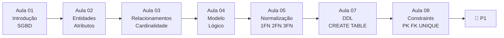

# Aula 09 — Avaliação Bimestral P1

**Disciplina:** Banco de Dados e Aplicações (IBD951)  
**Professor:** Ronan Adriel Zenatti · ronan.zenatti@cps.sp.gov.br  
**Fatec Jahu — 1º Semestre/2026**

---

## 🎯 Sobre esta Avaliação

A **Avaliação Bimestral P1** cobre todo o conteúdo do primeiro bloco: modelagem conceitual (MER), modelagem lógica relacional, normalização e implementação com DDL (SQL).

## 📚 Conteúdo Avaliado

A P1 abrange os tópicos estudados nas aulas 1 a 8. Você deve ser capaz de analisar um enunciado de negócio e identificar entidades, atributos e relacionamentos; construir um Diagrama ER com cardinalidades corretas; mapear o modelo conceitual para o modelo lógico relacional com PKs e FKs adequadas; verificar e aplicar as formas normais (1FN, 2FN, 3FN); e implementar o banco de dados usando comandos DDL com tipos de dados e constraints apropriados.

## 🔁 Roteiro de Revisão

## 💡 Dicas de Estudo

Revise os exemplos práticos das aulas anteriores. Treine lendo enunciados e extraindo entidades e relacionamentos antes de verificar a resposta. Ao normalizar, sempre siga a ordem: 1FN → 2FN → 3FN, verificando uma forma de cada vez. Ao escrever DDL, defina as tabelas sem FK primeiro, depois as tabelas com FK (para não violar integridade referencial durante a criação).

---

## 🔗 Navegação

⬅️ [Aula 08 — Restrições de Integridade](Aula_08_Restricoes_Integridade.md) · ➡️ [Aula 10 — SQL DML](Aula_10_SQL_DML.md)

---

*Fatec Jahu · IBD951 · Prof. Ronan Adriel Zenatti · 2026*
