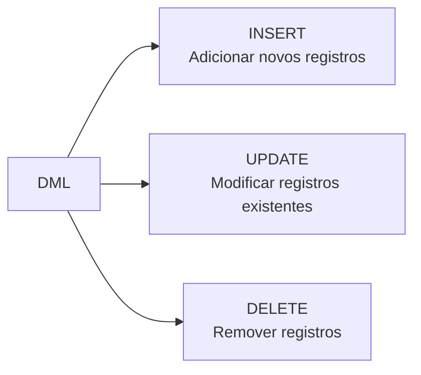

# Aula 10 — SQL: Manipulação de Dados (DML)

**Disciplina:** Banco de Dados e Aplicações (IBD951)  
**Professor:** Ronan Adriel Zenatti · ronan.zenatti@cps.sp.gov.br  
**Fatec Jahu — 1º Semestre/2026**

---

## 🎯 Objetivos da Aula

Ao final desta aula você deverá ser capaz de inserir, atualizar e excluir dados usando os comandos DML; compreender a ordem correta de inserção respeitando integridade referencial; e usar os comandos com segurança, especialmente o `UPDATE` e o `DELETE`.

---

## 1. A Subcategoria DML

Enquanto a DDL define a **estrutura** do banco, a **DML (Data Manipulation Language)** é responsável pelos dados em si — inserir novas informações, atualizá-las quando mudam e removê-las quando necessário. Os três comandos DML são `INSERT`, `UPDATE` e `DELETE`.



---

## 2. INSERT — Inserindo Dados

O `INSERT` adiciona novas linhas a uma tabela. Existem duas sintaxes principais.

```sql
-- Sintaxe completa: especificando as colunas (recomendada)
INSERT INTO cliente (nome, cpf, email)
VALUES ('Ana Paula Silva', '12345678901', 'ana@email.com');

-- Inserindo múltiplas linhas de uma vez (mais eficiente)
INSERT INTO produto (nome, preco, estoque) VALUES
    ('Camiseta Básica',  49.90, 100),
    ('Calça Jeans',     129.90,  50),
    ('Tênis Casual',    199.90,  30);
```

A ordem de inserção importa quando há FKs. Você sempre deve inserir primeiro os registros das tabelas referenciadas. Por isso, insira `cliente` antes de `pedido`, e `pedido` antes de `item_pedido`.

---

## 3. UPDATE — Atualizando Dados

O `UPDATE` modifica os valores de colunas em registros existentes. A cláusula `WHERE` é **extremamente importante** aqui — sem ela, **todos** os registros da tabela serão atualizados.

```sql
-- Atualizar o e-mail de um cliente específico
UPDATE cliente
SET email = 'novoemail@email.com'
WHERE id_cliente = 1;

-- Atualizar múltiplas colunas ao mesmo tempo
UPDATE produto
SET preco = 59.90,
    estoque = 80
WHERE id_produto = 1;

-- ⚠️ PERIGO: Sem WHERE atualiza TODOS os registros!
-- UPDATE produto SET preco = 0; -- NUNCA faça isso sem intenção!
```

---

## 4. DELETE — Removendo Dados

O `DELETE` remove linhas de uma tabela. Assim como o `UPDATE`, o `WHERE` é crítico.

```sql
-- Remover um registro específico
DELETE FROM cliente
WHERE id_cliente = 5;

-- Remover todos os pedidos cancelados
DELETE FROM pedido
WHERE status = 'CANCELADO';
```

Se a tabela tiver registros dependentes via FK com `ON DELETE RESTRICT`, o banco irá bloquear a exclusão. Você precisará remover os registros filhos primeiro, ou usar `ON DELETE CASCADE` (que remove automaticamente os dependentes).

---

## 5. Exemplo Completo: Populando o Banco de Vendas

```sql
-- 1. Inserir clientes primeiro (tabela sem dependências)
INSERT INTO cliente (nome, cpf, email) VALUES
    ('Carlos Mendes',  '11122233344', 'carlos@email.com'),
    ('Beatriz Souza',  '55566677788', 'beatriz@email.com');

-- 2. Inserir produtos
INSERT INTO produto (nome, preco, estoque) VALUES
    ('Notebook', 3499.90, 10),
    ('Mouse USB',   49.90, 50);

-- 3. Inserir pedido (depende de cliente)
INSERT INTO pedido (id_cliente, status) VALUES (1, 'PENDENTE');

-- 4. Inserir itens do pedido (depende de pedido e produto)
INSERT INTO item_pedido (id_pedido, id_produto, quantidade, preco_unitario) VALUES
    (1, 1, 1, 3499.90),
    (1, 2, 2,   49.90);

-- 5. Atualizar status do pedido
UPDATE pedido SET status = 'CONFIRMADO' WHERE id_pedido = 1;
```

---

## 📝 Resumo

A DML é o conjunto de comandos que movimenta os dados do banco. `INSERT` adiciona registros respeitando a ordem das dependências de FK. `UPDATE` e `DELETE` exigem atenção especial com a cláusula `WHERE` — sem ela, afetam todos os registros da tabela, o que raramente é a intenção.

---

## 🔗 Navegação

⬅️ [Aula 09 — Avaliação P1](Aula_09_Avaliacao_P1.md) · ➡️ [Aula 11 — Consultas Básicas DQL](Aula_11_Consultas_Basicas_DQL.md)

---

*Fatec Jahu · IBD951 · Prof. Ronan Adriel Zenatti · 2026*
