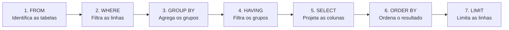

# Aula 11 — Consultas Básicas (DQL): SELECT

**Disciplina:** Banco de Dados e Aplicações (IBD951)  
**Professor:** Ronan Adriel Zenatti · ronan.zenatti@cps.sp.gov.br  
**Fatec Jahu — 1º Semestre/2026**

---

## 🎯 Objetivos da Aula

Ao final desta aula você deverá ser capaz de escrever consultas básicas com `SELECT`; utilizar projeção de colunas, alias e expressões; e compreender a estrutura e a ordem de execução de uma consulta SQL.

---

## 1. O Comando SELECT

O `SELECT` é o comando mais poderoso e mais usado da SQL. Ele recupera dados armazenados nas tabelas e nos permite escolher exatamente quais colunas ver, quais linhas filtrar, como ordenar os resultados e muito mais.


---

## 2. Estrutura Básica

```sql
-- Selecionar todas as colunas de uma tabela
SELECT * FROM cliente;

-- Projeção: selecionar apenas as colunas desejadas
SELECT nome, email FROM cliente;

-- Alias: renomear colunas no resultado
SELECT
    nome        AS "Nome do Cliente",
    email       AS "E-mail",
    data_nasc   AS "Data de Nascimento"
FROM cliente;
```

O asterisco `*` seleciona todas as colunas, mas em sistemas reais evite usá-lo — especifique as colunas que você precisa para melhorar o desempenho e a legibilidade.

---

## 3. Expressões e Colunas Calculadas

O `SELECT` pode calcular valores diretamente na consulta, sem precisar armazená-los no banco:

```sql
SELECT
    nome,
    preco                                   AS "Preço Original",
    preco * 0.9                             AS "Preço com 10% de Desconto",
    preco * 1.1                             AS "Preço com 10% de Acréscimo",
    CONCAT('R$ ', FORMAT(preco, 2, 'pt_BR')) AS "Preço Formatado"
FROM produto;
```

---

## 4. DISTINCT — Eliminando Duplicatas

O `DISTINCT` remove linhas duplicadas do resultado:

```sql
-- Quais cidades distintas temos na nossa base de clientes?
SELECT DISTINCT cidade FROM cliente;

-- Quais status de pedido existem?
SELECT DISTINCT status FROM pedido;
```

---

## 5. LIMIT — Controlando a Quantidade de Linhas

```sql
-- Retornar apenas os 5 primeiros produtos
SELECT * FROM produto LIMIT 5;

-- Paginação: pular os primeiros 10 e mostrar os próximos 5
SELECT * FROM produto LIMIT 5 OFFSET 10;
```

---

## 6. Ordem de Execução da Query

Algo que confunde muitos iniciantes é que a ordem em que escrevemos a query **não é** a ordem em que o banco a executa. Internamente, a execução segue esta sequência:



Entender essa ordem ajuda a evitar erros comuns, como tentar usar um alias definido no `SELECT` dentro do `WHERE` — o que não funciona porque o `WHERE` é executado antes do `SELECT`.

---

## 📝 Resumo

O `SELECT` é a base da recuperação de dados. A projeção de colunas melhora desempenho e clareza. Expressões calculadas evitam redundância no armazenamento. `DISTINCT` filtra duplicatas e `LIMIT` controla o volume de resultados. Compreender a ordem de execução interna da query é fundamental para escrever SQL correto e eficiente.

---

## 🔗 Navegação

⬅️ [Aula 10 — SQL DML](Aula_10_SQL_DML.md) · ➡️ [Aula 12 — Filtragem Avançada](Aula_12_Filtragem_Avancada.md)

---

*Fatec Jahu · IBD951 · Prof. Ronan Adriel Zenatti · 2026*
