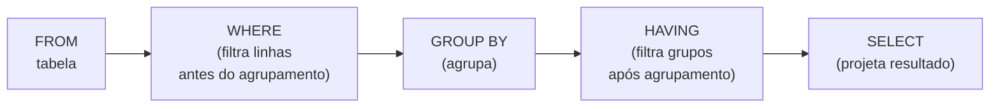

# Aula 13 — Agregação de Dados: GROUP BY e Funções de Grupo

**Disciplina:** Banco de Dados e Aplicações (IBD951)  
**Professor:** Ronan Adriel Zenatti · ronan.zenatti@cps.sp.gov.br  
**Fatec Jahu — 1º Semestre/2026**

---

## 🎯 Objetivos da Aula

Ao final desta aula você deverá ser capaz de usar funções de agregação (`COUNT`, `SUM`, `AVG`, `MIN`, `MAX`); agrupar resultados com `GROUP BY`; e filtrar grupos com `HAVING`.

---

## 1. Funções de Agregação

As funções de agregação calculam um único valor a partir de um conjunto de linhas. São essenciais para gerar relatórios, totalizadores e indicadores.

[Infographic showing five aggregate functions with icons: COUNT showing a counter icon, SUM showing a sigma symbol, AVG showing a balance scale, MIN showing a downward arrow, MAX showing an upward arrow. Each with a brief description in Portuguese. Clean flat design, blue and green palette.]


```sql
-- COUNT: conta registros
SELECT COUNT(*)             AS total_clientes FROM cliente;
SELECT COUNT(email)         AS clientes_com_email FROM cliente; -- ignora NULLs

-- SUM: soma valores
SELECT SUM(preco * estoque) AS valor_total_estoque FROM produto;

-- AVG: média aritmética
SELECT AVG(preco)           AS preco_medio FROM produto;

-- MIN e MAX: menor e maior valor
SELECT MIN(preco) AS mais_barato,
       MAX(preco) AS mais_caro
FROM produto;
```

---

## 2. GROUP BY — Agrupando por Categoria

O `GROUP BY` divide as linhas em grupos com base em um ou mais atributos, e então aplica a função de agregação para cada grupo separadamente.

```sql
-- Quantos pedidos existem por status?
SELECT status, COUNT(*) AS quantidade
FROM pedido
GROUP BY status;

-- Valor total vendido por mês
SELECT
    YEAR(data_pedido)   AS ano,
    MONTH(data_pedido)  AS mes,
    SUM(preco_unitario * quantidade) AS total_vendas
FROM pedido
JOIN item_pedido USING (id_pedido)
GROUP BY YEAR(data_pedido), MONTH(data_pedido)
ORDER BY ano, mes;
```

Uma regra importante: toda coluna no `SELECT` que **não** é uma função de agregação **deve** aparecer no `GROUP BY`.

---

## 3. HAVING — Filtrando Grupos

O `HAVING` é o `WHERE` dos grupos. Enquanto o `WHERE` filtra linhas individuais **antes** da agregação, o `HAVING` filtra os grupos **após** a agregação. Use-o quando a condição envolver uma função de agregação.

```sql
-- Clientes que fizeram mais de 3 pedidos
SELECT
    c.nome,
    COUNT(p.id_pedido) AS total_pedidos
FROM cliente c
JOIN pedido p ON c.id_cliente = p.id_cliente
GROUP BY c.id_cliente, c.nome
HAVING COUNT(p.id_pedido) > 3
ORDER BY total_pedidos DESC;

-- Produtos com valor médio de venda acima de R$ 100
SELECT
    pr.nome,
    AVG(ip.preco_unitario) AS preco_medio_vendido
FROM produto pr
JOIN item_pedido ip ON pr.id_produto = ip.id_produto
GROUP BY pr.id_produto, pr.nome
HAVING AVG(ip.preco_unitario) > 100;
```

---

## 4. WHERE vs. HAVING — A Diferença Crucial



Dica prática: se você consegue escrever a condição sem usar uma função de agregação, use `WHERE`. Se a condição envolve `COUNT`, `SUM`, `AVG` etc., use `HAVING`.

---

## 📝 Resumo

As funções de agregação (`COUNT`, `SUM`, `AVG`, `MIN`, `MAX`) calculam estatísticas sobre conjuntos de linhas. O `GROUP BY` divide os dados em categorias para aplicar essas funções separadamente em cada grupo. O `HAVING` filtra os grupos resultantes — diferente do `WHERE`, que filtra linhas individuais antes do agrupamento.

---

## 🔗 Navegação

⬅️ [Aula 12 — Filtragem Avançada](Aula_12_Filtragem_Avancada.md) · ➡️ [Aula 14 — Inner Join](Aula_14_Inner_Join.md)

---

*Fatec Jahu · IBD951 · Prof. Ronan Adriel Zenatti · 2026*
