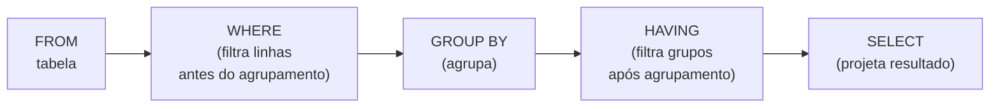

# Aula 13 — Agregação de Dados: GROUP BY e Funções de Grupo

**Disciplina:** Banco de Dados e Aplicações (IBD951)  
**Professor:** Ronan Adriel Zenatti · ronan.zenatti@cps.sp.gov.br  
**Fatec Jahu — 1º Semestre/2026**

---

## 🎯 Objetivos da Aula

Ao final desta aula você deverá ser capaz de usar funções de agregação (`COUNT`, `SUM`, `AVG`, `MIN`, `MAX`); agrupar resultados com `GROUP BY`; filtrar grupos com `HAVING`; usar `GROUP_CONCAT` para consolidar listas; aplicar `CASE` dentro de agregações; e combinar funções de data com agrupamento para relatórios temporais.

---

## 1. Funções de Agregação

As funções de agregação calculam um único valor a partir de um conjunto de linhas. São essenciais para gerar relatórios, totalizadores e indicadores.

```sql
-- COUNT: conta registros
SELECT COUNT(*)             AS total_clientes FROM clientes;
SELECT COUNT(email)         AS clientes_com_email FROM clientes; -- ignora NULLs

-- SUM: soma valores
SELECT SUM(preco * estoque) AS valor_total_estoque FROM produtos;

-- AVG: média aritmética
SELECT AVG(preco)           AS preco_medio FROM produtos;

-- MIN e MAX: menor e maior valor
SELECT MIN(preco) AS mais_barato,
       MAX(preco) AS mais_caro
FROM produtos;
```

> `COUNT(*)` conta todas as linhas, incluindo nulos. `COUNT(coluna)` conta
> apenas as linhas em que aquela coluna não é `NULL`. Essa diferença importa
> quando a coluna pode conter valores ausentes.

---

## 2. Formatando Resultados de Agregação

Resultados numéricos de agregações podem (e devem) ser formatados para leitura humana.

```sql
-- Formatar valores monetários e arredondar médias
SELECT
    FORMAT(SUM(preco * estoque), 2, 'pt_BR')   AS "Valor em Estoque (R$)",
    FORMAT(AVG(preco), 2, 'pt_BR')             AS "Preço Médio (R$)",
    ROUND(AVG(nota_avaliacao), 1)              AS "Nota Média"
FROM produtos
WHERE ativo = 1;
```

---

## 3. GROUP BY — Agrupando por Categoria

O `GROUP BY` divide as linhas em grupos com base em um ou mais atributos, e então aplica a função de agregação para cada grupo separadamente.

```sql
-- Quantos pedidos existem por status?
SELECT status, COUNT(*) AS quantidade
FROM pedidos
GROUP BY status;

-- Faturamento total por categoria de produto
SELECT
    cat.nome                                  AS "Categoria",
    COUNT(DISTINCT p.id_produto)              AS "Qtd. Produtos",
    FORMAT(SUM(ip.quantidade * ip.preco_unitario), 2, 'pt_BR') AS "Faturamento (R$)"
FROM categorias cat
JOIN produtos p   ON p.id_categoria    = cat.id_categoria
JOIN itens_pedido ip ON ip.id_produto  = p.id_produto
GROUP BY cat.id_categoria, cat.nome
ORDER BY SUM(ip.quantidade * ip.preco_unitario) DESC;
```

Uma regra importante: toda coluna no `SELECT` que **não** é uma função de agregação **deve** aparecer no `GROUP BY`.

---

## 4. Agrupamento por Períodos de Tempo

Combinar `GROUP BY` com funções de data é uma das formas mais comuns de gerar relatórios gerenciais. As funções `YEAR()`, `MONTH()` e `DATE_FORMAT()` são as mais usadas para isso.

```sql
-- Valor total vendido por mês (ano + mês para evitar misturar anos)
SELECT
    YEAR(p.data_pedido)                         AS "Ano",
    MONTH(p.data_pedido)                        AS "Mês",
    DATE_FORMAT(p.data_pedido, '%m/%Y')         AS "Período",
    COUNT(DISTINCT p.id_pedido)                 AS "Pedidos",
    FORMAT(SUM(ip.preco_unitario * ip.quantidade), 2, 'pt_BR') AS "Total (R$)"
FROM pedidos p
JOIN itens_pedido ip ON ip.id_pedido = p.id_pedido
WHERE p.status = 'ENTREGUE'
GROUP BY YEAR(p.data_pedido), MONTH(p.data_pedido)
ORDER BY YEAR(p.data_pedido), MONTH(p.data_pedido);

-- Clientes cadastrados por ano
SELECT
    YEAR(data_cadastro)  AS "Ano",
    COUNT(*)             AS "Novos Clientes"
FROM clientes
GROUP BY YEAR(data_cadastro)
ORDER BY YEAR(data_cadastro);
```

> O agrupamento deve incluir **todas** as partes da data usadas na seleção.
> Se você exibe `YEAR` e `MONTH` no `SELECT`, ambos devem estar no `GROUP BY`.

---

## 5. GROUP_CONCAT — Consolidando Listas em Uma Linha

O `GROUP_CONCAT` agrega múltiplos valores de texto de um grupo em uma única string separada por delimitador. É muito útil para exibir listas dentro de um resultado agrupado.

```sql
-- Listar os produtos de cada pedido em uma única coluna
SELECT
    p.id_pedido,
    DATE_FORMAT(p.data_pedido, '%d/%m/%Y')              AS "Data",
    GROUP_CONCAT(pr.nome ORDER BY pr.nome SEPARATOR ', ') AS "Itens do Pedido",
    FORMAT(SUM(ip.preco_unitario * ip.quantidade), 2, 'pt_BR') AS "Total (R$)"
FROM pedidos p
JOIN itens_pedido ip ON ip.id_pedido = p.id_pedido
JOIN produtos pr     ON pr.id_produto = ip.id_produto
GROUP BY p.id_pedido, p.data_pedido
ORDER BY p.data_pedido DESC
LIMIT 10;

-- Listar categorias associadas a cada produto (relacionamento N:N)
SELECT
    p.nome                                                 AS "Produto",
    GROUP_CONCAT(c.nome ORDER BY c.nome SEPARATOR ' | ')  AS "Categorias"
FROM produtos p
JOIN produto_categoria pc ON pc.id_produto = p.id_produto
JOIN categorias c         ON c.id_categoria = pc.id_categoria
GROUP BY p.id_produto, p.nome;
```

> Consulte os detalhes e opções do `GROUP_CONCAT` (incluindo `DISTINCT` dentro
> dele e o parâmetro `group_concat_max_len`) na seção 1 do arquivo
> [funcoes_mysql.md](funcoes_mysql.md).

---

## 6. HAVING — Filtrando Grupos

O `HAVING` é o `WHERE` dos grupos. Enquanto o `WHERE` filtra linhas individuais **antes** da agregação, o `HAVING` filtra os grupos **após** a agregação. Use-o quando a condição envolver uma função de agregação.

```sql
-- Clientes que fizeram mais de 3 pedidos
SELECT
    c.nome,
    COUNT(p.id_pedido) AS total_pedidos
FROM clientes c
JOIN pedidos p ON p.id_cliente = c.id_cliente
GROUP BY c.id_cliente, c.nome
HAVING COUNT(p.id_pedido) > 3
ORDER BY total_pedidos DESC;

-- Categorias com faturamento acima de R$ 10.000
SELECT
    cat.nome                                              AS "Categoria",
    FORMAT(SUM(ip.preco_unitario * ip.quantidade), 2, 'pt_BR') AS "Faturamento"
FROM categorias cat
JOIN produtos p       ON p.id_categoria = cat.id_categoria
JOIN itens_pedido ip  ON ip.id_produto  = p.id_produto
GROUP BY cat.id_categoria, cat.nome
HAVING SUM(ip.preco_unitario * ip.quantidade) > 10000
ORDER BY SUM(ip.preco_unitario * ip.quantidade) DESC;
```

---

## 7. WHERE vs. HAVING — A Diferença Crucial



Dica prática: se você consegue escrever a condição sem usar uma função de agregação, use `WHERE`. Se a condição envolve `COUNT`, `SUM`, `AVG` etc., use `HAVING`.

```sql
-- WHERE filtra antes: só considera pedidos entregues para calcular o total
-- HAVING filtra depois: só exibe clientes que gastaram mais de R$ 500
SELECT
    c.nome,
    FORMAT(SUM(p.valor_total), 2, 'pt_BR') AS "Total Gasto"
FROM clientes c
JOIN pedidos p ON p.id_cliente = c.id_cliente
WHERE p.status = 'ENTREGUE'                     -- WHERE filtra linhas
GROUP BY c.id_cliente, c.nome
HAVING SUM(p.valor_total) > 500                 -- HAVING filtra grupos
ORDER BY SUM(p.valor_total) DESC;
```

---

## 8. CASE em Agregações — Contagem Condicional

O `CASE` dentro de uma função de agregação permite contar ou somar apenas os registros que satisfazem uma condição, sem precisar de múltiplas subconsultas.

```sql
-- Contar pedidos por status em colunas separadas (pivot simples)
SELECT
    YEAR(data_pedido)                                         AS "Ano",
    COUNT(*)                                                  AS "Total",
    COUNT(CASE WHEN status = 'ENTREGUE'   THEN 1 END)        AS "Entregues",
    COUNT(CASE WHEN status = 'CANCELADO'  THEN 1 END)        AS "Cancelados",
    COUNT(CASE WHEN status = 'EM_TRANSITO' THEN 1 END)       AS "Em Trânsito"
FROM pedidos
GROUP BY YEAR(data_pedido)
ORDER BY YEAR(data_pedido);

-- Calcular ticket médio separado por faixa de valor
SELECT
    cat.nome                                                  AS "Categoria",
    FORMAT(AVG(CASE WHEN p.preco < 100 THEN p.preco END), 2, 'pt_BR') AS "Ticket Médio até R$100",
    FORMAT(AVG(CASE WHEN p.preco >= 100 THEN p.preco END), 2, 'pt_BR') AS "Ticket Médio acima R$100"
FROM categorias cat
JOIN produtos p ON p.id_categoria = cat.id_categoria
GROUP BY cat.id_categoria, cat.nome;
```

> A sintaxe completa do `CASE` (incluindo `CASE WHEN` simples e pesquisado) está
> na seção 5 do arquivo [funcoes_mysql.md](funcoes_mysql.md).

---

## 9. Funções Estatísticas Avançadas

Para além de `AVG`, o MariaDB oferece funções de desvio padrão e variância que são úteis em análises mais detalhadas.

```sql
-- Análise estatística de preços por categoria
SELECT
    cat.nome                             AS "Categoria",
    FORMAT(AVG(p.preco), 2, 'pt_BR')    AS "Média (R$)",
    FORMAT(MIN(p.preco), 2, 'pt_BR')    AS "Mínimo (R$)",
    FORMAT(MAX(p.preco), 2, 'pt_BR')    AS "Máximo (R$)",
    FORMAT(STDDEV(p.preco), 2, 'pt_BR') AS "Desvio Padrão (R$)"
FROM categorias cat
JOIN produtos p ON p.id_categoria = cat.id_categoria
GROUP BY cat.id_categoria, cat.nome
ORDER BY STDDEV(p.preco) DESC;
```

> As funções `STD`, `STDDEV`, `VARIANCE`, `VAR_POP` e `VAR_SAMP` estão
> documentadas na seção 4 do arquivo [funcoes_mysql.md](funcoes_mysql.md).

---

## 📚 Referência de Funções

Para aprofundar nos recursos usados nesta aula, consulte o material de apoio:

**[funcoes_mysql.md](funcoes_mysql.md)**
- Seção 1: Funções de String (`GROUP_CONCAT` e parâmetros avançados)
- Seção 3: Funções de Data e Hora (`YEAR`, `MONTH`, `DATE_FORMAT`)
- Seção 4: Funções de Agregação (`COUNT`, `SUM`, `AVG`, `MIN`, `MAX`, `STDDEV`, `VARIANCE`)
- Seção 5: Funções Condicionais (`CASE`, `IF`, `IFNULL`, `COALESCE`)

---

## 📝 Resumo

As funções de agregação (`COUNT`, `SUM`, `AVG`, `MIN`, `MAX`) calculam estatísticas sobre conjuntos de linhas. O `GROUP BY` divide os dados em categorias para aplicar essas funções separadamente em cada grupo. Combinado com funções de data, o `GROUP BY` gera relatórios por período. O `GROUP_CONCAT` consolida múltiplos valores de um grupo em uma única string legível. O `HAVING` filtra os grupos resultantes após a agregação, diferente do `WHERE`, que filtra linhas individuais antes do agrupamento. O `CASE` dentro de agregações permite criar pivôs e contagens condicionais de forma elegante.

---

## 🔗 Navegação

⬅️ [Aula 12 — Filtragem Avançada](Aula_12_Filtragem_Avancada.md) · ➡️ [Aula 14 — Inner Join](Aula_14_Inner_Join.md)

---

*Fatec Jahu · IBD951 · Prof. Ronan Adriel Zenatti · 2026*
