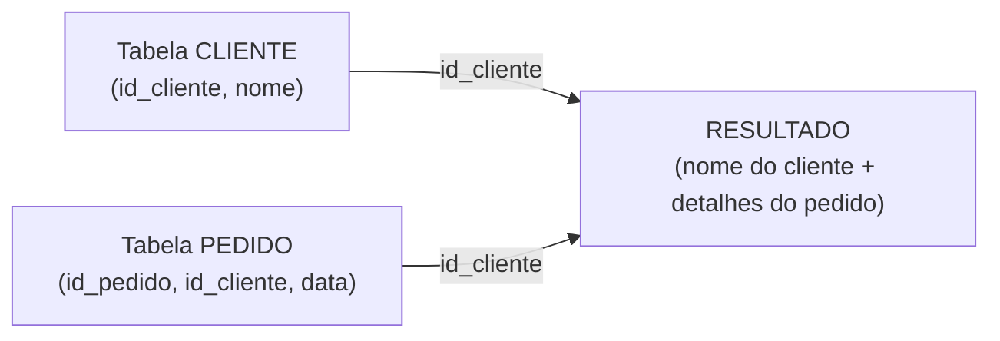

# Aula 14 — Junção de Tabelas: INNER JOIN

**Disciplina:** Banco de Dados e Aplicações (IBD951)  
**Professor:** Ronan Adriel Zenatti · ronan.zenatti@cps.sp.gov.br  
**Fatec Jahu — 1º Semestre/2026**

---

## 🎯 Objetivos da Aula

Ao final desta aula você deverá ser capaz de compreender por que e quando usar JOINs; escrever consultas com `INNER JOIN` combinando duas ou mais tabelas; e interpretar o resultado de um JOIN.

---

## 1. Por que usar JOINs?

Um banco relacional bem normalizado distribui os dados em múltiplas tabelas para evitar redundância. Mas na prática, os usuários precisam de informações que estão espalhadas por essas tabelas. O `JOIN` é o mecanismo que **reúne** dados de tabelas diferentes em uma única consulta, usando a relação entre PKs e FKs como elo de ligação.



---

## 2. INNER JOIN — Apenas o que Existe nos Dois Lados

O `INNER JOIN` retorna apenas as linhas em que existe **correspondência nos dois lados** da junção. Se um cliente não tiver nenhum pedido, ele **não aparece** no resultado. Se um pedido tiver um `id_cliente` inválido (o que não deveria acontecer com FK correta), ele também não aparece.

[Venn diagram showing two overlapping circles: left circle labeled 'CLIENTE', right circle labeled 'PEDIDO', center intersection highlighted in blue labeled 'INNER JOIN - apenas registros com correspondência nos dois lados'. Clean educational diagram, white background.]


```sql
-- Sintaxe padrão com ON
SELECT
    c.nome         AS cliente,
    p.id_pedido    AS pedido,
    p.data_pedido,
    p.status
FROM cliente c
INNER JOIN pedido p ON c.id_cliente = p.id_cliente;

-- Sintaxe com USING (quando as colunas têm o mesmo nome nos dois lados)
SELECT c.nome, p.id_pedido, p.status
FROM cliente c
INNER JOIN pedido p USING (id_cliente);
```

---

## 3. JOIN com Múltiplas Tabelas

Podemos encadear quantos JOINs forem necessários:

```sql
-- Cliente → Pedido → Item → Produto (4 tabelas)
SELECT
    c.nome                  AS cliente,
    p.id_pedido,
    p.data_pedido,
    pr.nome                 AS produto,
    ip.quantidade,
    ip.preco_unitario,
    ip.quantidade * ip.preco_unitario AS subtotal
FROM cliente c
INNER JOIN pedido     p  ON c.id_cliente  = p.id_cliente
INNER JOIN item_pedido ip ON p.id_pedido   = ip.id_pedido
INNER JOIN produto    pr ON ip.id_produto  = pr.id_produto
WHERE p.status = 'ENTREGUE'
ORDER BY c.nome, p.data_pedido;
```

---

## 4. Alias de Tabela — Por que usar?

Perceba o uso de `c`, `p`, `ip`, `pr` nos exemplos acima. São **aliases de tabela**, que têm dois benefícios importantes: tornam a query mais legível (especialmente com nomes longos de tabela) e são obrigatórios quando a mesma tabela aparece mais de uma vez no `FROM` (como em auto-joins).

```sql
-- Exemplo de auto-join: buscar funcionário e seu supervisor
SELECT
    f.nome          AS funcionario,
    s.nome          AS supervisor
FROM funcionario f
INNER JOIN funcionario s ON f.id_supervisor = s.id_funcionario;
```

---

## 📝 Resumo

O `INNER JOIN` combina linhas de duas ou mais tabelas com base em uma condição de junção (geralmente PK = FK), retornando apenas os registros que têm correspondência em todos os lados. É o tipo de JOIN mais comum e o ponto de partida para qualquer consulta que cruza dados de múltiplas tabelas.

---

## 🔗 Navegação

⬅️ [Aula 13 — Agregação de Dados](Aula_13_Agregacao_Dados.md) · ➡️ [Aula 15 — Outer Join](Aula_15_Outer_Join.md)

---

*Fatec Jahu · IBD951 · Prof. Ronan Adriel Zenatti · 2026*
