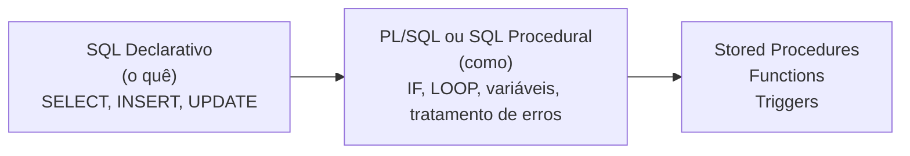

# Aula 16 — Introdução ao PL/SQL: Procedimentos Armazenados

**Disciplina:** Banco de Dados e Aplicações (IBD951)  
**Professor:** Ronan Adriel Zenatti · ronan.zenatti@cps.sp.gov.br  
**Fatec Jahu — 1º Semestre/2026**

---

## 🎯 Objetivos da Aula

Ao final desta aula você deverá ser capaz de compreender o que é programação procedural no banco de dados; entender o conceito de Stored Procedures, Functions e Triggers; e escrever procedimentos simples.

---

## 1. Além do SQL Declarativo

O SQL que aprendemos até aqui é **declarativo**: dizemos *o que* queremos, e o banco cuida do *como*. Mas existem situações em que precisamos de lógica mais complexa — condicionais, loops, tratamento de erros, múltiplas operações encadeadas em uma transação. É aqui que entra a **programação procedural dentro do banco**.



Cada SGBD tem sua própria extensão procedural: Oracle usa PL/SQL, SQL Server usa T-SQL, e MySQL/MariaDB usa simplesmente o dialeto procedural do MySQL, que muitos chamam informalmente de PL/SQL também.

---

## 2. Stored Procedure — Procedimento Armazenado

Uma **stored procedure** é um bloco de código SQL + lógica procedural armazenado no banco de dados com um nome. Pode ser chamada por aplicações, outros procedures ou consultas, evitando que a lógica de negócio fique espalhada em múltiplas camadas.

```sql
-- Criando um procedimento que registra um novo pedido
DELIMITER $$

CREATE PROCEDURE registrar_pedido(
    IN  p_cliente_id  BIGINT UNSIGNED,
    IN  p_status      VARCHAR(20),
    OUT p_id_pedido   BIGINT UNSIGNED
)
BEGIN
    -- Insere o pedido
    INSERT INTO pedidos (cliente_id, data_pedido, status)
    VALUES (p_cliente_id, CURDATE(), p_status);

    -- Retorna o ID gerado
    SET p_id_pedido = LAST_INSERT_ID();
END$$

DELIMITER ;

-- Chamando o procedimento
CALL registrar_pedido(1, 'pendente', @novo_id);
SELECT @novo_id AS pedido_criado;
```

---

## 3. Function — Função Armazenada

Uma **function** é similar a uma procedure, mas **sempre retorna um valor** e pode ser usada dentro de uma consulta SQL como qualquer outra função embutida.

```sql
DELIMITER $$

CREATE FUNCTION calcular_desconto(preco DECIMAL(10, 2), percentual INT)
RETURNS DECIMAL(10, 2)
DETERMINISTIC
BEGIN
    RETURN preco - (preco * percentual / 100);
END$$

DELIMITER ;

-- Usando a função em uma consulta
SELECT nome, preco, calcular_desconto(preco, 10) AS preco_com_desconto
FROM produtos;
```

---

## 4. Trigger — Gatilho Automático

Um **trigger** é executado automaticamente quando um evento específico ocorre em uma tabela (`INSERT`, `UPDATE` ou `DELETE`). São úteis para auditoria, validações complexas e manutenção automática de dados derivados.

```sql
-- Trigger que registra um log toda vez que um pedido muda de status
DELIMITER $$

CREATE TRIGGER after_pedido_update
AFTER UPDATE ON pedidos
FOR EACH ROW
BEGIN
    IF OLD.status != NEW.status THEN
        INSERT INTO logs_pedidos (pedido_id, status_anterior, status_novo, criado_em)
        VALUES (NEW.id_pedido, OLD.status, NEW.status, NOW());
    END IF;
END$$

DELIMITER ;
```

---

## 5. Vantagens e Cuidados

O uso de programação procedural no banco centraliza a lógica de negócio, reduz o tráfego de rede (uma chamada executa múltiplas operações), melhora a segurança (aplicações chamam o procedure sem acesso direto às tabelas) e facilita a manutenção. Por outro lado, exige atenção especial: código no banco é mais difícil de versionar, testar e depurar. Use com moderação e sempre documente bem.

---

## 📝 Resumo

A programação procedural no banco de dados expande o SQL com estruturas de controle de fluxo, variáveis e tratamento de erros. Stored Procedures encapsulam lógica reutilizável. Functions retornam valores e podem ser usadas em queries. Triggers automatizam ações em resposta a eventos nas tabelas. Juntos, eles permitem implementar regras de negócio complexas diretamente no banco.

---

## 🔗 Navegação

⬅️ [Aula 15 — Outer Join](Aula_15_Outer_Join.md) · ➡️ [Aula 17 — Atividade Prática SQL](Aula_17_Atividade_SQL.md)

---

*Fatec Jahu · IBD951 · Prof. Ronan Adriel Zenatti · 2026*
