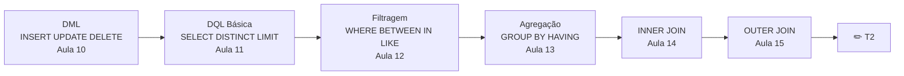

# Aula 17 — Atividade Prática: SQL (T2)

**Disciplina:** Banco de Dados e Aplicações (IBD951)  
**Professor:** Ronan Adriel Zenatti · ronan.zenatti@cps.sp.gov.br  
**Fatec Jahu — 1º Semestre/2026**

---

## 🎯 Sobre esta Atividade

Esta aula é dedicada à resolução do **Trabalho 2 (T2)** — a atividade prática de SQL que integra Joins, Filtros e Agregações, cobrindo o conteúdo das aulas 10 a 16.

> ⚠️ Veja o enunciado completo na pasta [atividades/T2_Pratica_SQL.md](../atividades/T2_Pratica_SQL.md).

---

## 🔁 Roteiro de Revisão para o T2

## 💡 Dicas para a Resolução

Antes de escrever qualquer query complexa, identifique quais tabelas precisam ser consultadas e qual o relacionamento entre elas. Comece sempre pela query mais simples e vá adicionando complexidade: primeiro o `FROM` e o `JOIN`, depois o `WHERE`, depois o `GROUP BY` e só por último o `HAVING` e o `ORDER BY`.

Ao usar `GROUP BY`, lembre-se de que toda coluna no `SELECT` que não é uma função de agregação deve estar no `GROUP BY`. Ao usar `HAVING`, verifique se a condição realmente precisa ser após o agrupamento — se não envolver função de agregação, o `WHERE` é mais eficiente.

---

## 🔗 Navegação

⬅️ [Aula 16 — Introdução ao PL/SQL](Aula_16_Introducao_PLSQL.md) · ➡️ [Aula 18 — Avaliação P2](Aula_18_Avaliacao_P2.md)

---

*Fatec Jahu · IBD951 · Prof. Ronan Adriel Zenatti · 2026*
