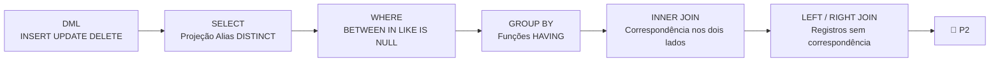

# Aula 18 — Avaliação Bimestral P2

**Disciplina:** Banco de Dados e Aplicações (IBD951)  
**Professor:** Ronan Adriel Zenatti · ronan.zenatti@cps.sp.gov.br  
**Fatec Jahu — 1º Semestre/2026**

---

## 🎯 Sobre esta Avaliação

A **Avaliação Bimestral P2** avalia a competência técnica em manipulação e consulta de dados, cobrindo o conteúdo das aulas 10 a 16: DML, DQL, filtragem avançada, agregação, Inner Join e Outer Join.

## 📚 Conteúdo Avaliado

Para se sair bem na P2, você deve dominar a inserção de dados respeitando a ordem das dependências de FK; o uso de `UPDATE` e `DELETE` com cláusulas `WHERE` precisas; consultas com `SELECT`, `WHERE`, `ORDER BY` e `LIMIT`; funções de agregação com `GROUP BY` e `HAVING`; e junções com `INNER JOIN`, `LEFT JOIN` e `RIGHT JOIN`.

## 🔁 Resumo Visual do Bloco 2

---

## 🔗 Navegação

⬅️ [Aula 17 — Atividade Prática SQL](Aula_17_Atividade_SQL.md) · ➡️ [Aula 19 — Avaliação Substitutiva](Aula_19_Avaliacao_Substitutiva.md)

---

*Fatec Jahu · IBD951 · Prof. Ronan Adriel Zenatti · 2026*
