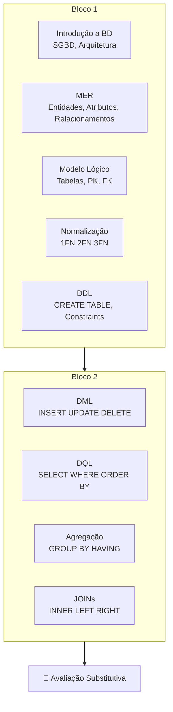

# Aula 19 — Avaliação Substitutiva

**Disciplina:** Banco de Dados e Aplicações (IBD951)  
**Professor:** Ronan Adriel Zenatti · ronan.zenatti@cps.sp.gov.br  
**Fatec Jahu — 1º Semestre/2026**

---

## 🎯 Sobre a Avaliação Substitutiva

A **Avaliação Substitutiva (R)** cobre **todo o conteúdo semestral** e tem como objetivo recuperar nota ou fixar conteúdo não consolidado ao longo do semestre.

O aluno que realizar a substitutiva terá sua nota substituída pela nota obtida nesta avaliação, caso seja superior à nota que está substituindo.

## 📚 Conteúdo Coberto

A avaliação substitutiva pode abordar qualquer conteúdo do semestre: introdução a SGBDs, modelagem conceitual (MER), modelo lógico relacional, formas normais, DDL com constraints, DML, DQL com filtragem e ordenação, agregação com GROUP BY e HAVING, e junções (INNER, LEFT, RIGHT JOIN).

## 🔁 Mapa de Revisão Completo

---

## 🔗 Navegação

⬅️ [Aula 18 — Avaliação P2](Aula_18_Avaliacao_P2.md) · ➡️ [Aula 20 — Encerramento](Aula_20_Encerramento.md)

---

*Fatec Jahu · IBD951 · Prof. Ronan Adriel Zenatti · 2026*
