# Cardinalidade no Modelo Entidade-Relacionamento

> **IBD015 — Banco de Dados Relacional** · Fatec Jahu · Prof. Ronan Adriel Zenatti
> [← Voltar à Aula 01](./Aula_01_Revisao_Modelagem_Conceitual.md) · [← Voltar ao README](../README.md)

---

## Por que a Cardinalidade é tão difícil?

Se você perguntar para qualquer professor de banco de dados qual é o conceito que mais confunde os alunos, a resposta quase sempre será a mesma: **cardinalidade**. E o motivo não é falta de inteligência — é que a dificuldade tem uma causa muito específica e identificável.

O problema está na **posição** da notação. Na maioria das representações visuais, o símbolo que indica a cardinalidade de uma entidade fica do lado *oposto* a ela — ou seja, a cardinalidade do Aluno é anotada perto da Disciplina, e vice-versa. Isso contraria o instinto humano de associar o número ao objeto mais próximo, e é exatamente aí que mora a confusão.

Este material foi construído para atacar esse ponto com precisão. Vamos construir o entendimento de forma progressiva, com perguntas-chave, exemplos concretos e múltiplas formas de visualização, até que a leitura de um diagrama de cardinalidade se torne natural e automática para você.

---

## 🎥 Vídeo de Apoio

- 📺 [Cardinalidade em Banco de Dados — do básico ao avançado](https://www.youtube.com/watch?v=Q_KTYFgvu1s) — Bóson Treinamentos
- 📺 [Relacionamentos e Cardinalidade no MER](https://www.youtube.com/watch?v=rMnvCaP_oF4) — Curso em Vídeo

---

## 1. O que é Cardinalidade?

A cardinalidade descreve **quantas instâncias** de uma entidade podem se associar a **quantas instâncias** de outra entidade, dentro de um relacionamento. Pense nela como uma **regra de negócio expressa graficamente** — ela não é uma decisão técnica, mas sim um reflexo de como o mundo real funciona.

Por exemplo: uma empresa decide que cada funcionário pertence a exatamente um departamento, mas que um departamento pode ter muitos funcionários. Essa decisão — que veio do negócio, não do programador — é o que a cardinalidade representa no diagrama.

A cardinalidade é composta por dois valores: o **mínimo** e o **máximo**. Juntos, eles formam o que a literatura chama de **razão de cardinalidade** ou **restrição de cardinalidade**.

O **mínimo** responde: *"uma instância desta entidade precisa obrigatoriamente participar deste relacionamento?"* Se o mínimo for 0, a participação é opcional. Se for 1, é obrigatória.

O **máximo** responde: *"quantas instâncias da outra entidade uma instância desta pode se associar, no máximo?"* Se for 1, é exclusiva. Se for N (ou ∞), podem ser muitas.

---

## 2. As Três Perguntas-Chave

Antes de qualquer diagrama, antes de qualquer símbolo, existe um método infalível para determinar a cardinalidade entre duas entidades. Você fará **três perguntas** — sempre nos dois sentidos do relacionamento.

Vamos usar um exemplo concreto: o relacionamento entre **Cliente** e **Pedido**.

---

**Pergunta 1 — O mínimo (de A olhando para B):**
> *"Um [A] precisa obrigatoriamente ter pelo menos um [B]?"*

No nosso caso: *"Um Cliente precisa obrigatoriamente ter pelo menos um Pedido?"*
A resposta é **não** — um cliente pode ser cadastrado e nunca ter feito nenhum pedido. Logo, o mínimo do lado de Pedido (enxergado a partir de Cliente) é **0**.

---

**Pergunta 2 — O máximo (de A olhando para B):**
> *"Um [A] pode estar associado a mais de um [B]?"*

No nosso caso: *"Um Cliente pode ter mais de um Pedido?"*
A resposta é **sim** — um cliente pode fazer muitos pedidos ao longo do tempo. Logo, o máximo do lado de Pedido (enxergado a partir de Cliente) é **N**.

---

**Pergunta 3 — Repita nos dois sentidos:**
Agora invertemos: *"Um Pedido precisa obrigatoriamente pertencer a pelo menos um Cliente?"* → **Sim**, sempre. Mínimo = **1**.
E: *"Um Pedido pode pertencer a mais de um Cliente?"* → **Não**, na nossa regra de negócio. Máximo = **1**.

---

Resultado: a cardinalidade entre Cliente e Pedido é **(0,N) — (1,1)**, que lemos como: *"Um cliente pode ter zero ou muitos pedidos; cada pedido pertence a exatamente um cliente."*

> 💡 **Memorize este método.** Sempre que tiver dúvida, pare o diagrama, volte ao texto das regras de negócio e faça as três perguntas. A cardinalidade sempre virá das respostas — nunca de intuição.

---

## 3. As Duas Notações Mais Usadas

É fundamental que você conheça as duas principais notações, pois vai encontrar ambas na literatura e nas ferramentas profissionais.

### 3.1 Notação de Min-Max (ou Notação (min, max))

Proposta por Elmasri e Navathe — autores do livro-texto desta disciplina — essa notação escreve explicitamente o par **(mínimo, máximo)** ao lado de cada entidade, **próximo à entidade que está sendo caracterizada**.

> ⚠️ **Atenção crítica:** nesta notação, o par (min, max) fica do lado da entidade a que se refere. Isso é diferente da notação Crow's Foot, como veremos a seguir.

```
CLIENTE  (0,N)————————(1,1)  PEDIDO
```

Leitura: do lado do PEDIDO está anotado **(1,1)** — isso descreve o PEDIDO em relação ao CLIENTE: cada pedido pertence a no mínimo 1 e no máximo 1 cliente. Do lado do CLIENTE está **(0,N)** — isso descreve o CLIENTE em relação ao PEDIDO: cada cliente tem no mínimo 0 e no máximo N pedidos.

### 3.2 Notação Crow's Foot (Pé de Galinha)

Esta é a notação padrão de mercado, usada em MySQL Workbench, dbdiagram.io, Lucidchart, entre outras ferramentas. Os símbolos ficam nas **extremidades das linhas**, próximos à entidade oposta — e é aqui que mora a confusão clássica.


A tabela a seguir resume cada símbolo e seu significado:

| Símbolo na ponta da linha | Significado | Leitura |
|---|---|---|
| `|` (uma barra vertical) | Exatamente um | Mínimo 1, Máximo 1 |
| `O` (círculo) | Zero | Mínimo 0 |
| `<` ou `{` (pé de galinha) | Muitos | Máximo N |
| `O|` (círculo + barra) | Zero ou um | Mínimo 0, Máximo 1 |
| `||` (duas barras) | Um e somente um | Mínimo 1, Máximo 1 |
| `O{` (círculo + pé de galinha) | Zero ou muitos | Mínimo 0, Máximo N |
| `|{` (barra + pé de galinha) | Um ou muitos | Mínimo 1, Máximo N |

---

## 4. O Segredo da Posição — A Maior Dificuldade

Vamos dedicar uma seção inteira a esse ponto, porque ele é responsável pela maioria dos erros. Observe com atenção o diagrama abaixo e a explicação que o acompanha.

```
         você lê daqui ──────────────────────────────────► para cá
         
CLIENTE  ──────────────────────────────────────────────── PEDIDO
         O{                                          ||
         ▲                                           ▲
         │                                           │
         Este símbolo está                    Este símbolo está
         próximo a CLIENTE,                   próximo a PEDIDO,
         mas descreve PEDIDO                  mas descreve CLIENTE
         (a entidade do outro lado)           (a entidade do outro lado)
```


**Como ler corretamente, passo a passo:**

Passo 1: coloque o dedo sobre a entidade **CLIENTE**.
Passo 2: deslize o olhar pela linha em direção a **PEDIDO**, até chegar ao símbolo que está do **lado de CLIENTE** (no início da linha, próximo a ele).
Passo 3: esse símbolo descreve quantos **PEDIDOS** um CLIENTE pode ter.

No exemplo: o símbolo `O{` está próximo a CLIENTE → logo, um CLIENTE pode ter **zero ou muitos** PEDIDOS.

Passo 4: agora vá até o símbolo no **lado de PEDIDO** (no final da linha, próximo a ele).
Passo 5: esse símbolo descreve quantos **CLIENTES** um PEDIDO pode ter.

No exemplo: o símbolo `||` está próximo a PEDIDO → logo, um PEDIDO pertence a **exatamente um** CLIENTE.

> 🔑 **A regra de ouro:** o símbolo próximo à entidade A descreve a entidade B (e vice-versa). Sempre leia o símbolo do lado *oposto* à entidade que você está descrevendo. Quando esta regra estiver automatizada no seu raciocínio, a notação Crow's Foot se torna completamente intuitiva.

---

## 5. Os Três Tipos de Relacionamento — Com Exemplos Detalhados

### 5.1 Relacionamento Um para Um (1:1)

Um relacionamento 1:1 ocorre quando uma instância de A se associa com **no máximo uma** instância de B, e uma instância de B se associa com **no máximo uma** instância de A. É o tipo mais raro na prática, mas importante de reconhecer.

**Como identificar rapidamente:** se você fizer a pergunta *"pode ter mais de um?"* nos dois sentidos e a resposta for **não** nas duas direções, é um relacionamento 1:1.

---

**Exemplo 1 — Funcionário e Crachá:**

Regra de negócio: cada funcionário possui exatamente um crachá de identificação, e cada crachá pertence a exatamente um funcionário.

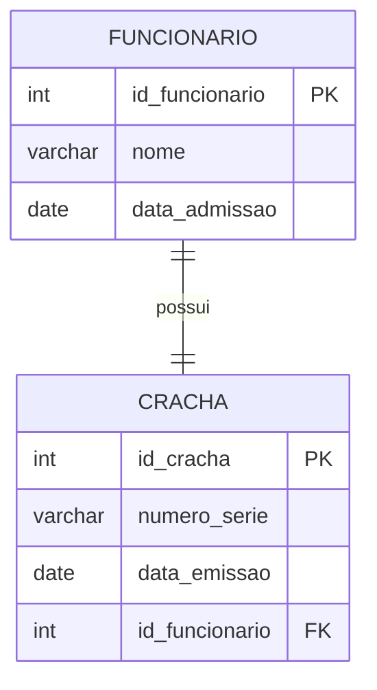

Perguntas-chave aplicadas: *"Um funcionário pode ter mais de um crachá?"* → Não. *"Um crachá pode pertencer a mais de um funcionário?"* → Não. Logo, 1:1.

Notação Min-Max: FUNCIONARIO **(1,1)**————**(1,1)** CRACHA — aqui ambos os lados têm participação total e máximo 1.

---

**Exemplo 2 — País e Capital:**

Regra de negócio: cada país tem exatamente uma capital, e cada capital pertence a exatamente um país.

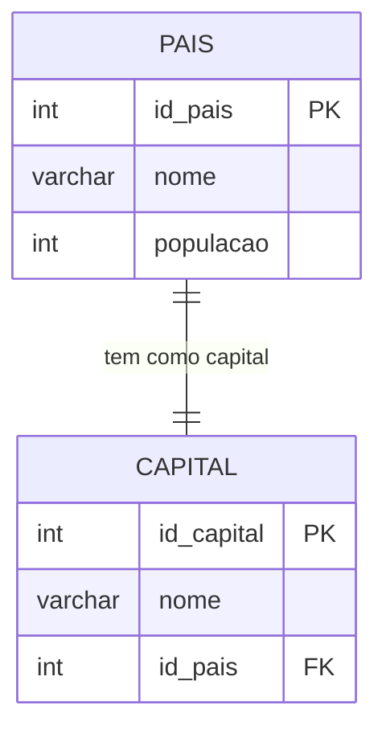

Observação pedagógica: note que, neste caso, a capital **não existe sem o país** (participação total de ambos os lados). É uma relação simétrica e indivisível — se o país existe, a capital existe; se a capital é registrada, é de um país específico.

---

**Exemplo 3 — Pessoa e CNH:**

Regra de negócio: uma pessoa pode ou não ter CNH (é opcional), mas se tiver, possui apenas uma. E uma CNH pertence a exatamente uma pessoa.

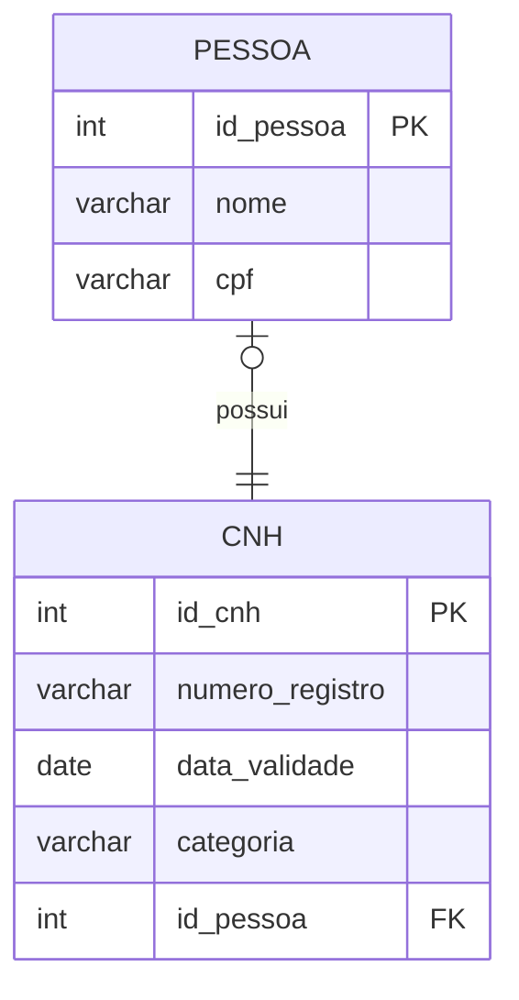

Este é um 1:1 com participação **parcial do lado de PESSOA** (o `|o` indica que uma pessoa pode existir sem CNH — mínimo 0) e **total do lado de CNH** (cada CNH obrigatoriamente pertence a uma pessoa — mínimo 1).

Notação Min-Max: PESSOA **(0,1)**————**(1,1)** CNH.

> 📌 **Dica de projeto:** em relacionamentos 1:1, a chave estrangeira (FK) geralmente vai para a entidade com participação parcial, ou para aquela que "depende" conceitualmente da outra. No exemplo, `id_pessoa` vai na tabela CNH porque a CNH depende da pessoa, não o contrário.

---

### 5.2 Relacionamento Um para Muitos (1:N)

Este é de longe o tipo mais comum em qualquer banco de dados real. Ocorre quando uma instância de A pode se associar a **muitas** instâncias de B, mas cada instância de B se associa a **apenas uma** de A.

**Como identificar rapidamente:** faça a pergunta *"pode ter mais de um?"* nos dois sentidos. Se a resposta for **sim em apenas um sentido**, é 1:N. O lado em que a resposta foi "sim" é o lado N.

---

**Exemplo 1 — Departamento e Funcionários:**

Regra de negócio: um departamento pode ter muitos funcionários, mas cada funcionário pertence a exatamente um departamento. Todo funcionário deve pertencer a algum departamento; um departamento pode existir mesmo sem funcionários (recém-criado).

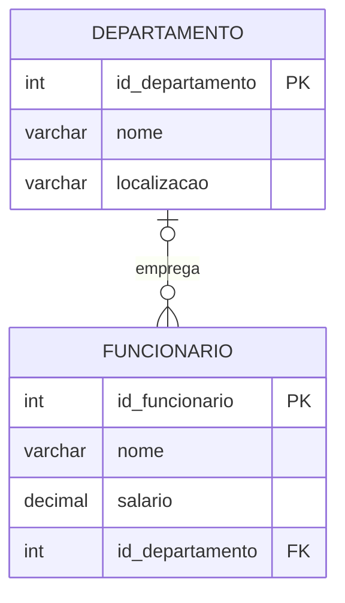

Notação Min-Max: DEPARTAMENTO **(0,N)**————**(1,1)** FUNCIONARIO.

Perguntas aplicadas: *"Um departamento pode ter mais de um funcionário?"* → Sim (lado N). *"Um funcionário pode pertencer a mais de um departamento?"* → Não (lado 1). Logo, 1:N com o N do lado de FUNCIONARIO.

---

**Exemplo 2 — Categoria e Produtos:**

Regra de negócio: uma categoria (como "Eletrônicos" ou "Vestuário") pode conter muitos produtos. Cada produto pertence a exatamente uma categoria. Um produto não pode existir sem categoria; uma categoria pode existir sem produtos cadastrados.

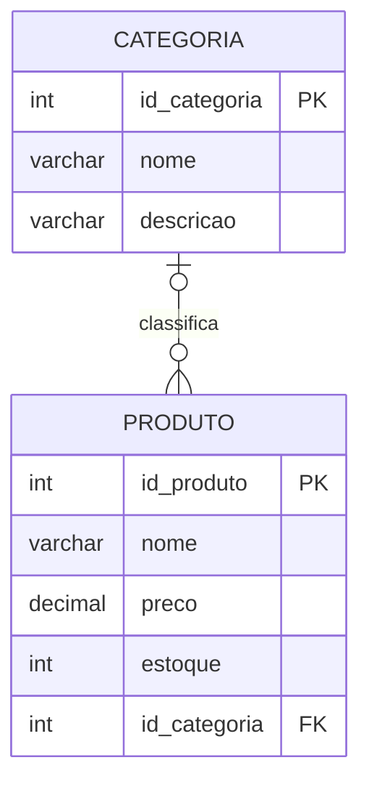

Notação Min-Max: CATEGORIA **(0,N)**————**(1,1)** PRODUTO.

Este exemplo é clássico em sistemas de e-commerce e ilustra bem como a **chave estrangeira sempre vai para o lado N** — no caso, `id_categoria` é atributo da tabela PRODUTO.

---

**Exemplo 3 — Pedido e Nota Fiscal:**

Regra de negócio: um pedido pode gerar várias notas fiscais (exemplo: pedido parcelado em entregas separadas, cada uma com sua nota). Cada nota fiscal está vinculada a exatamente um pedido.

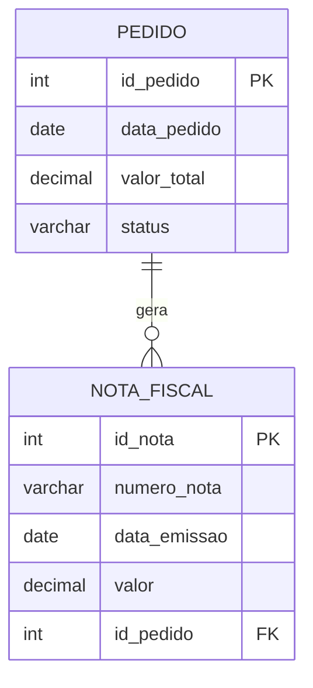

Notação Min-Max: PEDIDO **(0,N)**————**(1,1)** NOTA_FISCAL.

Este exemplo é útil porque mostra que mesmo em domínios onde intuitivamente esperaríamos 1:1 (um pedido, uma nota), as regras de negócio podem exigir 1:N. **A cardinalidade sempre vem da regra de negócio, nunca da suposição.**

> 📌 **Regra prática de implementação:** em todo relacionamento 1:N, a chave estrangeira (FK) **sempre fica na tabela do lado N**. Neste caso, `id_pedido` fica em NOTA_FISCAL — a entidade do lado "muitos".

---

### 5.3 Relacionamento Muitos para Muitos (N:M)

Ocorre quando uma instância de A pode se associar a **muitas** instâncias de B, e uma instância de B pode se associar a **muitas** instâncias de A. É o tipo que mais gera dúvidas na implementação, porque **não pode ser representado diretamente em um banco relacional** — ele precisa ser decomposto em uma tabela intermediária.

**Como identificar rapidamente:** faça a pergunta *"pode ter mais de um?"* nos dois sentidos. Se a resposta for **sim nos dois sentidos**, é N:M.

---

**Exemplo 1 — Aluno e Disciplina:**

Regra de negócio: um aluno pode se matricular em várias disciplinas no mesmo semestre. Uma disciplina pode ter muitos alunos matriculados. A matrícula tem atributos próprios: nota e situação.

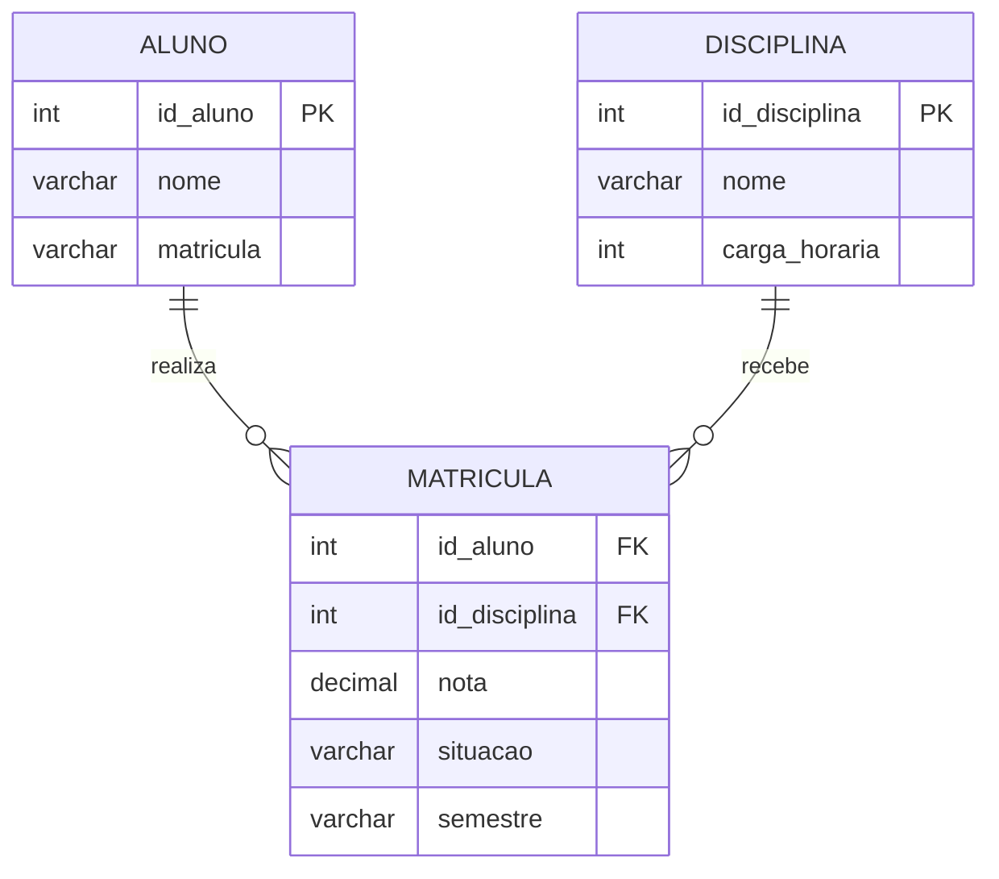

Observe que o relacionamento N:M entre Aluno e Disciplina foi **decomposto** em dois relacionamentos 1:N através da entidade intermediária MATRICULA. Essa entidade possui seus próprios atributos — `nota`, `situacao`, `semestre` — o que a caracteriza como uma **entidade associativa** (também chamada de *entidade de relacionamento* ou *tabela de junção com atributos*).

Notação Min-Max original (antes da decomposição): ALUNO **(0,N)**————**(0,N)** DISCIPLINA.

---

**Exemplo 2 — Autor e Livro:**

Regra de negócio: um livro pode ter vários autores (obra coletiva). Um autor pode ter escrito vários livros. A relação entre eles registra qual foi a contribuição de cada autor no livro.

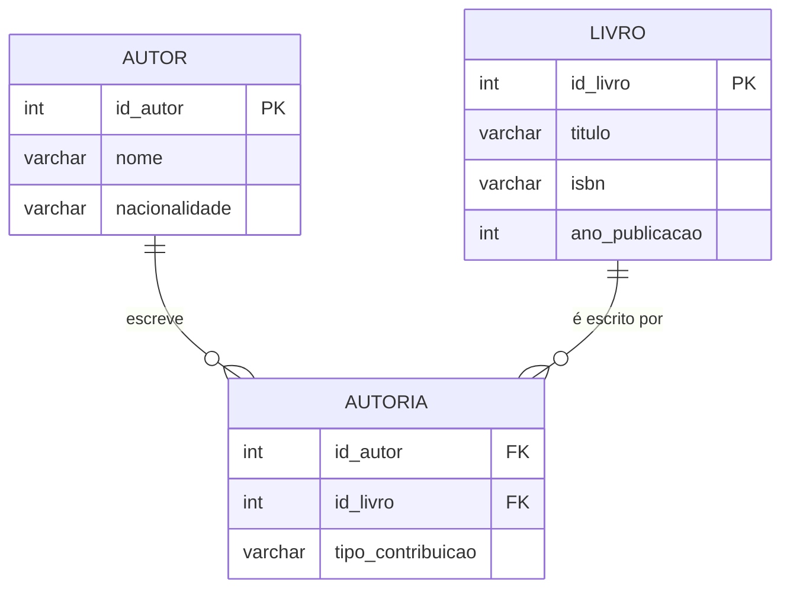

A entidade AUTORIA armazena o atributo `tipo_contribuicao` (autor principal, coautor, organizador etc.), o que justifica sua existência como entidade intermediária com atributo próprio.

---

**Exemplo 3 — Médico e Paciente:**

Regra de negócio: um médico atende muitos pacientes ao longo do tempo. Um paciente pode ser atendido por vários médicos (clínico geral, especialista, etc.). Cada atendimento tem data, diagnóstico e prescrição.

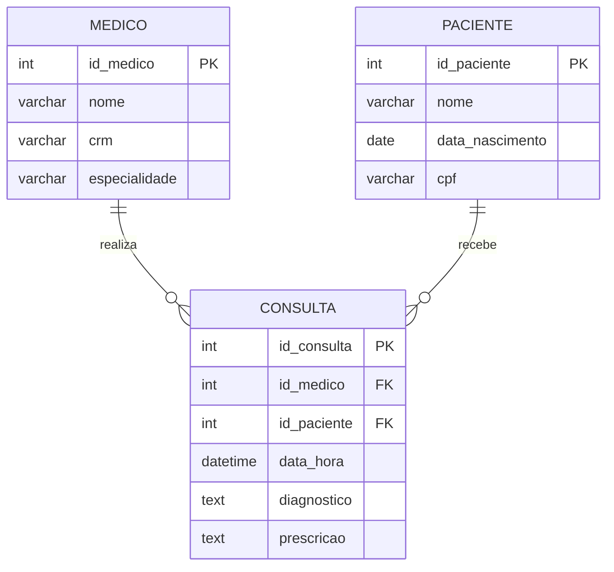

Este exemplo é particularmente rico porque a entidade intermediária CONSULTA tem muitos atributos próprios — ela não existe apenas para "resolver" o N:M, mas carrega informações vitais do negócio. Em casos assim, é muito claro que a entidade associativa tem vida própria.

> 📌 **Regra prática de implementação:** para todo N:M, cria-se uma tabela intermediária cuja chave primária é composta pelas FKs das duas entidades originais (ou uma nova PK sintética, dependendo do caso). As FKs `id_medico` e `id_paciente` ficam na tabela CONSULTA.

---

## 6. Participação: Mínimo 0 versus Mínimo 1

A participação — também chamada de modalidade — é determinada exclusivamente pelo **mínimo** da cardinalidade. Entender isso claramente elimina metade das confusões.

**Participação Total (mínimo = 1):** a entidade *deve* obrigatoriamente participar do relacionamento. Na notação Crow's Foot, representa-se com uma **barra vertical** (|). Na notação Min-Max, o mínimo é 1. Isso significa que não pode existir uma instância dessa entidade sem estar vinculada ao relacionamento.

**Participação Parcial (mínimo = 0):** a entidade *pode* existir sem participar do relacionamento. Na notação Crow's Foot, representa-se com um **círculo** (O). Na notação Min-Max, o mínimo é 0.


Para fixar: volte ao exemplo Cliente-Pedido e pense nas consequências práticas. Se tentarmos inserir um pedido sem informar o cliente, o banco de dados deve rejeitar essa operação — isso é o que a participação total de PEDIDO (mínimo 1) representa em termos de restrições de integridade referencial.

---

## 7. Guia Visual de Leitura Rápida — Crow's Foot

O quadro abaixo funciona como um cartão de referência que você pode consultar sempre que estiver lendo ou construindo um diagrama.

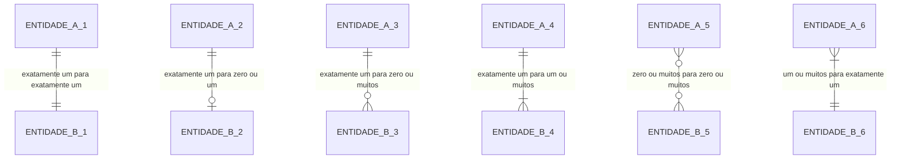

Para cada linha acima, pratique o método de leitura: coloque o dedo em A, deslize para B, leia o símbolo próximo a A (que descreve B), depois leia o símbolo próximo a B (que descreve A).

---

## 8. Correspondência entre Notações

É essencial que você consiga transitar entre as duas notações, pois livros acadêmicos usam a Min-Max enquanto ferramentas de mercado usam Crow's Foot. A tabela abaixo é o seu dicionário de tradução:

| Leitura | Notação Min-Max | Crow's Foot (próximo à entidade descrita) |
|---|---|---|
| Zero ou um | (0,1) | `O\|` |
| Exatamente um | (1,1) | `\|\|` |
| Zero ou muitos | (0,N) | `O{` |
| Um ou muitos | (1,N) | `\|{` |

> 💡 **Exercício mental:** pegue qualquer par da tabela acima e tente desenhar no papel o símbolo Crow's Foot correspondente, depois traduza para a notação (min, max). Repita até ser automático — isso é exatamente o que as avaliações pedem.

---

## 9. Método Completo de Determinação de Cardinalidade (Passo a Passo)

Aqui está o processo completo, consolidado em um fluxo que você pode aplicar a qualquer par de entidades:

**Passo 1 — Identifique as duas entidades** e o relacionamento entre elas. Dê um nome de verbo ao relacionamento (ex: "realiza", "pertence a", "contém").

**Passo 2 — Aplique as perguntas do lado A para B:**
- *"Um [A] pode existir sem nenhum [B]?"* → Se sim: mínimo de B (do lado de A) = 0. Se não: mínimo = 1.
- *"Um [A] pode ter mais de um [B]?"* → Se sim: máximo de B (do lado de A) = N. Se não: máximo = 1.

**Passo 3 — Aplique as perguntas do lado B para A:**
- *"Um [B] pode existir sem nenhum [A]?"* → mínimo de A (do lado de B).
- *"Um [B] pode ter mais de um [A]?"* → máximo de A (do lado de B).

**Passo 4 — Escreva a cardinalidade** na notação Min-Max: A **(min_B, max_B)**————**(min_A, max_A)** B.

**Passo 5 — Classifique o tipo de relacionamento** com base nos máximos:
- Máximo 1 dos dois lados → **1:1**
- Máximo N de apenas um lado → **1:N**
- Máximo N dos dois lados → **N:M**

**Passo 6 — Desenhe na notação Crow's Foot**, lembrando que os símbolos ficam do lado *oposto* à entidade que descrevem.

---

## 10. Exercícios Práticos com Gabarito

### Exercício 1 — Leitura de Diagrama

Analise o diagrama abaixo e responda às perguntas que se seguem.

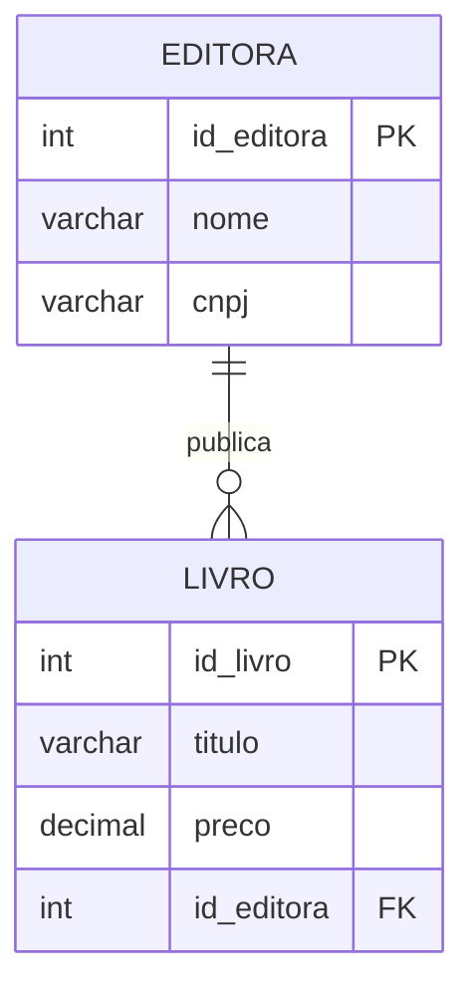

**Perguntas:**

a) Uma editora pode existir sem ter publicado nenhum livro?

b) Um livro pode existir sem estar vinculado a uma editora?

c) Uma editora pode publicar mais de um livro?

d) Um livro pode ser publicado por mais de uma editora?

e) Escreva a cardinalidade na notação Min-Max.

**Gabarito:**

a) Sim — o símbolo `O{` próximo a EDITORA (descrevendo LIVRO) começa com círculo (O), indicando mínimo 0. Uma editora pode ter zero livros.

b) Não — o símbolo `||` próximo a LIVRO (descrevendo EDITORA) começa com barra dupla, indicando mínimo 1. Todo livro deve ter uma editora.

c) Sim — o `{` indica máximo N. Uma editora pode publicar muitos livros.

d) Não — o segundo `|` indica máximo 1. Um livro é publicado por exatamente uma editora.

e) EDITORA **(0,N)**————**(1,1)** LIVRO.

---

### Exercício 2 — Construção de Diagrama

Dadas as regras de negócio abaixo, construa o diagrama ER com a cardinalidade correta:

> *"Um professor pode orientar vários alunos de TCC. Um aluno tem exatamente um orientador. Um aluno pode não ter escolhido orientador ainda (no início do semestre). Um professor pode não ter nenhum orientando."*

**Gabarito:**

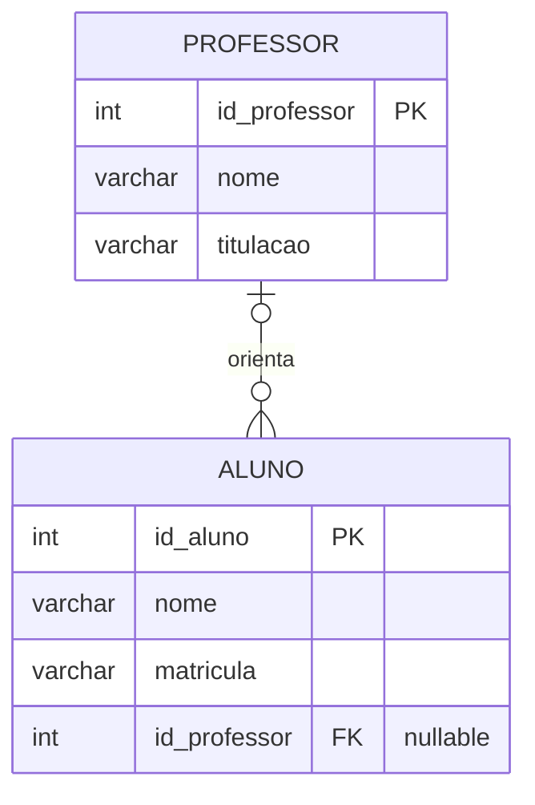

Notação Min-Max: PROFESSOR **(0,N)**————**(0,1)** ALUNO.

Raciocínio: um professor pode ter zero ou muitos orientandos (O{). Um aluno pode ter zero ou um orientador — não dois, porque a regra diz "exatamente um orientador", mas permite que ainda não tenha sido escolhido (O|).

---

### Exercício 3 — Identificação do Tipo e Decomposição

Para cada situação abaixo, identifique o tipo de relacionamento (1:1, 1:N ou N:M) e, se for N:M, proponha a entidade intermediária com seus atributos:

**a)** Um produto pode estar em vários carrinhos de compra. Um carrinho pode conter vários produtos. Cada produto em um carrinho tem uma quantidade.

**b)** Um contrato de trabalho pertence a exatamente um funcionário, e um funcionário tem exatamente um contrato ativo.

**c)** Uma turma tem muitos alunos. Um aluno pode estar em apenas uma turma por vez.

**Gabarito:**

a) **N:M** — a entidade intermediária seria ITEM_CARRINHO, com atributos `id_carrinho` (FK), `id_produto` (FK) e `quantidade`.

b) **1:1** — participação total dos dois lados (todo funcionário tem um contrato; todo contrato pertence a um funcionário).

c) **1:N** — TURMA (1) para ALUNO (N). A FK `id_turma` vai na tabela ALUNO.

---

## 11. Armadilhas Clássicas e Como Evitá-las

**Armadilha 1 — Inverter os símbolos:** colocar o símbolo de "muitos" no lado errado é o erro mais comum. Lembre-se sempre: o pé de galinha fica do lado da entidade que aparece em quantidade. Se muitos ALUNOS pertencem a uma TURMA, o pé de galinha fica do lado de ALUNO.

**Armadilha 2 — Confundir participação com cardinalidade máxima:** a participação (total ou parcial) é determinada pelo **mínimo**, não pelo máximo. Um relacionamento pode ser 1:N com participação parcial (mínimo 0 de um lado), e isso é completamente válido.

**Armadilha 3 — Modelar como 1:N quando é N:M:** isso acontece quando analisamos o relacionamento em apenas um sentido. Sempre faça as perguntas **nos dois sentidos** antes de decidir.

**Armadilha 4 — Esquecer de decompor o N:M:** na modelagem conceitual, o N:M é válido e correto. Mas na passagem para o modelo lógico (e depois para o DDL), ele *obrigatoriamente* precisa ser transformado em duas relações 1:N com uma tabela intermediária. Nunca tente implementar um N:M "diretamente" em SQL.

**Armadilha 5 — Trocar a posição dos pares (min, max) na notação Elmasri-Navathe:** nessa notação, o par fica próximo à entidade que ele **descreve** — o oposto da Crow's Foot. Se você misturar as convenções, o diagrama ficará semanticamente errado mesmo que visualmente coerente.

---

## 📚 Referências desta Seção

- ELMASRI, R.; NAVATHE, S. B. *Sistemas de Banco de Dados*. 7 ed. Cap. 3 (seções 3.3 a 3.5) — Restrições de Mapeamento e Cardinalidade. São Paulo: Pearson, 2018.
- SILBERSCHATZ, A.; KORTH, H. F.; SUNDARSHAN, S. *Sistema de banco de dados*. 6 ed. Cap. 6.3 — Restrições. Rio de Janeiro: Elsevier, 2016.
- DATE, C. J. *Introdução a sistemas de bancos de dados*. 8 ed. Cap. 14. Rio de Janeiro: Elsevier/Campus, 2004.

---

<div align="center">
  <sub>Fatec Jahu · IBD015 — Banco de Dados Relacional · Prof. Ronan Adriel Zenatti · 2026</sub>
</div>
